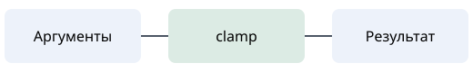

---
categories:
  - Контракты
  - Граничные значения
  - Тестирование
---

# Контракт программы {#sec-contracts}

::: {course-role="objectives"}
После темы вы сможете сформулировать предусловие и постусловие функции,
отличить граничный случай от недопустимого входа и обосновать выбранные примеры.
:::

Предусловие определяет допустимый вход, постусловие — гарантированный результат.
Для ограничения числа диапазоном требуется `lower <= upper`.

{#fig-contract width="6cm"}

Обсуждение: @lectures:sec-contracts. Практика: @practice:sec-clamp.

::: {course-role="reading" requirement="recommended"}
Разберите @sec-contract-demo и сопоставьте объяснение с @fig-contract.
:::

::: {course-role="misconception"}
Несколько успешных примеров не доказывают выполнение контракта для всех входов.
:::

::: {course-role="limitation"}
В этом примере все аргументы имеют тип `int`; сравнение вещественных чисел
и политика для `NaN` требуют отдельного контракта.
:::

::: {course-role="takeaway"}
Сначала определите допустимые входы и гарантии, затем выбирайте реализацию.
:::


