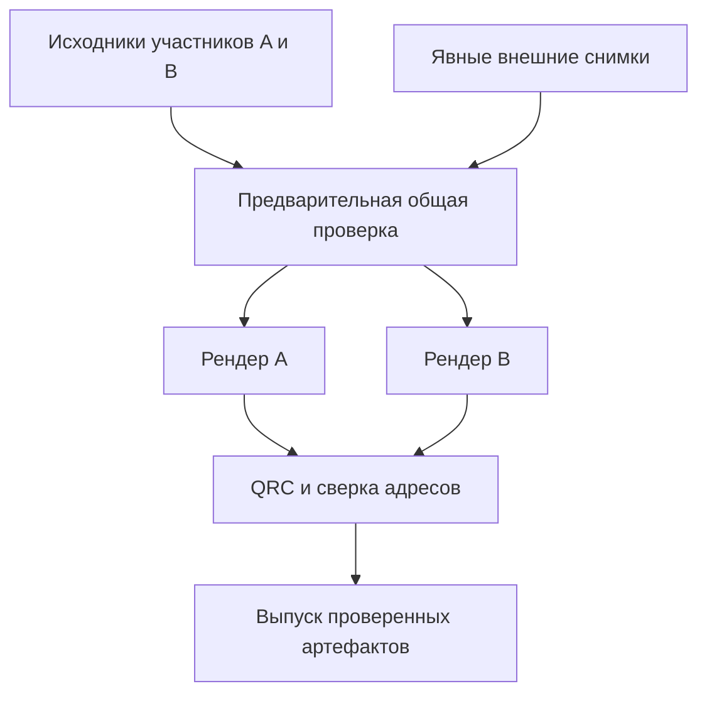

> Исторический материал общего каталога. Актуальный маршрут: [план от 8 октября 2026](../quarto-course/docs/plans/2026-10-08-course-tools-implementation.md).
> Этот каталог не Git-репозиторий: нужные решения и исходные снимки сохранить у владельцев до очистки.
> Старые версии, ограничения публикации и статусы реализации не являются действующим контрактом.

# План развития общих инструментов Quarto

Текущий статус реализации: §18 и последний checkpoint фиксируют актуальные PR/CI; §17 сохраняет восстановление; §16 сохраняет прежний checkpoint, §14 — первую поставку, §15 — продолжение после создания новых репозиториев. Утверждения об отсутствии испытаний в исходной ревизии описывают состояние до этих поставок; фактически закрытые проверки и оставшиеся границы перечислены отдельно. Пользовательские требования сохраняются; технический маршрут Print уточнён по результату реализации.

Архитектурная и техническая ревизия: 1 октября 2026 года. Принятые решения о пяти частях курса, каталогах, QRC, совместном выпуске, смысловых группах файлов, сворачиваемой группе справочника, владельце всех exr и содержании практических слайдов внесены в основной текст. Последнее интервью закрепило одну оцениваемую работу на QMD, общий необязательный формат ответов, способ ручной сдачи рядом с условием, автоматическое извлечение ресурсов и отдельную адаптерную конфигурацию assessments. Приняты локальный YAML answer-spec, упорядоченные multipart-части, общий банк matching с закрытым ключом и самостоятельным публичным AST. Платформенная перестановка банка допустима; ограничения повторного выбора отложены до тестов. Дорисовка пока только ручная; другие режимы перенесены в TODO. Принято строго бумажное выполнение оцениваемой печатной работы. Принята раздатка как краткий материал занятия с опорными тезисами, связями с презентацией/темами и выбранными задачами; прямая печать глав вместо раздатки исключена. Поля ответа всегда внутри бланка, шапка структурирована с автоматической темой и служебными полями. Хранится только актуальный PDF, архивирование и преподавательский PDF исключены; ответы входят в full web. Материализация PDF при сборке и адресный preview сохраняются. Явный список выбора задач принят; повтор условий рядом с ответами в full web настраивается. Совместные бланки и командные шапки исключены из текущего этапа. Выбранные данные/стартовый проект для скачивания и матрица ответственности инструментов сохраняются. Вопросы организационной структуры закрыты; технические проверки осуществимости P0 и импорта в целевые установки остаются обязательными и не считаются выполненными этой редакцией. Документ содержит актуальные требования, результаты проверки их согласованности и порядок реализации. Требования и рекомендуемая архитектура отделены от уже реализованных возможностей; примеры нового контракта не означают, что текущая поставка их поддерживает.

Цель — специфичная учебная модель внутри книг Quarto и слайдов: темы, задачи, подготовка, планы, решения и ссылки. Курс в одном репозитории выпускается совместно как теоретическая книга, книга задач, слайды практической работы, слайды лекции и технический справочник с общей входной страницей. Материалы должны самостоятельно отображаться без Moodle, PrairieLearn, карты, сервера приложения и учёта прогресса. Самостоятельное отображение не означает отдельную сборку или независимый выпуск частей этого курса. Платформенные адаптеры и интерактивные представления подключаются явно. Реализация инструментов и изменения репозиториев этой ревизией не выполнялись; Virtualization и Operations-Research не изменялись.

## 1. Итог ревизии и границы проекта

Модель предметной области реалистична. Основное ядро небольшое: однозначные объявления, исходные факты с происхождением, проверка CUE, общая модель тем/задач и согласованные проекции student/full. В прежнем плане были существенные противоречия порядка обработки, неопределённые области идентичности и дублирование требований. Они устранены на уровне предлагаемой архитектуры. Техническая осуществимость раннего AST-анализа и минимальной диагностики на документированных интерфейсах должна быть подтверждена до разработки интерфейса карты. Точные координаты каждого узла и полный source map не являются условием первой полезной поставки.

| Проверяемая область | Вывод и исправление |
| - | - |
| Внутренняя согласованность | Один нормативный набор правил вместо повторяющихся разделов. Проверка полной исходной модели предшествует проекции; операционные сбои не смешиваются с недопустимостью модели |
| Общие концепции | Общая идентичность, происхождение фактов, словарь обязательности, профильная политика и диагностика переиспользуются. Разные отношения сохраняют свои контекстные ограничения |
| Абстрактность и самостоятельное отображение | Учебная задача, включение в план и оцениваемая работа независимы от LMS. Условия, решения, планы и подготовка остаются Markdown; формальный ключ и обработчик необязательны |
| Минимальность разметки | Нативные IDs, Div/Span, ссылки, таблицы, YAML и профили Quarto. Нет реестра задач-дублёра, селектора блоков по ID, языка процедур, универсального установщика или конструктора вариантов |
| Диагностика и новичок | Устойчивые коды, причина и полезная подсказка; входной документ, объект/поле и связанные источники по доступным данным. Строки, колонки и контекст include выводятся только при подтверждённой точности. STYLE-предупреждения отделены от ошибок и hint |
| Граф и публикация | Учебный DAG отделён от порядка рендера проектов. Сначала собираются объявления всех локальных участников, затем проверяются связи; реальные адреса окончательно связываются после рендера |
| Локальная разработка | Те же извлечение, CUE, каталоги и проверки, что в CI. Явные локальные снимки внешних источников; ошибочный профиль и устаревший результат не выглядят успешной текущей сборкой |
| Статус среды для студента | Публичный снимок нативных проверок конкретного выпуска, с датой и конфигурацией. Успех контейнерной сборки книги не подменяет проверку основной ОС студента |
| Реалистичный объём | Сначала идентичность, происхождение, проекции, ссылки и поставка; затем каталог и карта. LMS, live-виджет и расширенные ключи не задерживают самостоятельную книгу |

### Принятые границы

- Только один текущий контракт; обратная совместимость старых авторских схем не поддерживается. Документация, спецификации и примеры русские, с обычной терминологией IT.
- Первая поставка — инструменты и предметно-нейтральный шаблон. Примеры: «Курс A», «Курс B», «Тема», «Подтема», «Условие», обычный текст; программный пример ограничивается Hello World. Реальные дисциплины используются для анализа требований, а не содержания шаблона.
- Пять частей курса и общая входная страница находятся в одном репозитории; поддерживается только совместная сборка и согласованный выпуск. Книга задач содержит все канонические exr, включая демонстрационные, и явно составленные планы для разных специальностей. Теоретическая книга содержит exm и QRC-ссылки на задачи. Теория не зависит от конкретного плана аудитории. Публикация readonly, без личных профилей, прогресса и отметок студента; маршруты — обычные таблицы, не генератор расписания.
- Каждая книга имеет собственный каталог и устойчивого владельца объявлений. Связи между каталогами проходят только через QRC. Прямые включения материалов одной книги в другую и трансклюзия по ссылке исключены; это не открытый вопрос интервью. Подключение книги-владельца не означает необходимость изучить её целиком.
- CUE остаётся единственным декларативным языком правил учебного контракта. Автор работает с QMD/YAML/Markdown и не обязан писать CUE. Общие графовые алгоритмы вычисляют факты, а допустимость определяется контрактом. Нативные настройки Quarto и готового линтера не становятся вторым языком предметной модели.
- Параметризованные задачи, персонализация вариантов и их генерация исключены. Проверки полноты учебного содержания исключены: за полноту отвечает автор. Процент успешных проверок совместимости — отдельный технический показатель.
- Новые критерии оценивания, рубрики и баллы отложены до платформенной интеграции. Период и место выполнения не входят в общий контракт.
- До завершения P1 закрепляются устойчивый ID работы и граница экспорта содержимого/ресурсов. Тип приёма ответа, баллы, попытки, grader, доставка и внешние IDs принадлежат выбранным адаптерам. Обычная задача без машинного ключа остаётся допустимой.
- Одна оцениваемая работа занимает одну QMD-страницу. Общий необязательный контракт ответов переиспользуется книгой, печатью и Moodle/PrairieLearn; способы text/file описываются рядом с условием, без обязательного ответа у каждой задачи. Приняты локальный YAML answer-spec, упорядоченные multipart-части и общие matching-банки/ключ; ограничения повторного выбора отложены до платформенных тестов. Дорисовка сейчас только ручная, другие режимы — TODO. Адаптерная конфигурация хранится отдельно, с общей областью assessments для LMS, печати и cloud. Выдача выбранных данных/стартового проекта переиспользует project-download. R/exams полностью исключён из кандидатов и пилотов.
- Сохраняются независимые Core, Presentation, Navigation, QRC, project-download и project-publish. Включение карты, темы оформления или LMS не является условием использования Core.
- Тематические изменения оформляются отдельными PR с осмысленными коммитами; новый контракт, пример, документация и необходимые проверки поставляются вместе.

### Состав курса и границы каталогов

| Часть | Роль |
| - | - |
| Теоретическая книга | Универсальное изложение предметных тем, учебные exm и QRC-ссылки на задачи |
| Книга задач | Все канонические exr, включая демонстрационные, лабораторные и контрольные; планы по специальностям, работы и пользовательский каталог задач |
| Слайды практической работы | Ход занятия, вопросы, QRC-ссылки на задачи и небольшие авторские пояснения |
| Слайды лекции | Представление лекции с QRC-связями к теоретической книге |
| Технический справочник | Подготовка, освоение инструментов и инструкции сред; при необходимости — собственные адресуемые темы |

Корневой index.qmd — входная страница курса с явно указанными ссылками на индексы его частей. Исходники частей располагаются в соседних каталогах; вложение проекта практикума в дерево теоретических тем не требуется. Каждый проект имеет собственный _quarto.yml, адресное пространство и output/mount; корневой проект не захватывает QMD и ресурсы дочерних проектов как свои.

Нужно различать адресный каталог QRC конкретного представления и пользовательский каталог задач. У книг собственные объявления; у слайдов есть свои адресные цели. Совпадение имени или ID на слайде с книгой само по себе не объявляет их одним исходным объектом. Практические слайды содержат ход занятия, вопросы, QRC-ссылки на условия задачника и небольшие авторские пояснения. Они не объявляют exr повторно и не получают полные условия через include. Лекционные слайды дают собственное изложение и QRC-ссылки на теоретическую книгу. Общий механизм межкаталожной трансклюзии для слайдов не вводится.

QRC — единственная точка связывания каталогов: идентичности, экспорты, профильные цели и адреса не связываются вторым ручным реестром или чтением чужих QMD потребителем. Общий координатор совместной сборки читает исходники каждого участника для его собственного извлечения и передаёт результаты в согласованный интерфейс Core/QRC. Это обработка участников выпуска, а не включение текста одного участника в другого.

Слайды, поиск, каталог и карта не переопределяют тему, назначение или prerequisites задачи. Стандартный поиск Quarto остаётся внутри соответствующих HTML-проектов; единый межкнижный полнотекстовый поиск не входит в приоритет или требования этой поставки.

## 2. Принятые сущности и отношения

| Сущность | Собственные сведения и граница |
| - | - |
| Тема | Явный устойчивый ID заголовка, подпись, иерархия, владелец и адреса представлений; required/recommended prerequisites |
| Задача | Нативный exr-ID, условие, одно назначение, обязательная сложность, необязательные время/форма работы/характер/environment, исходная тема и prerequisites |
| Пример | Нативный exm-ID; обычный учебный материал, не задача каталога и не единица оценивания |
| Решение | Нативный sol-ID с путём владельца; Markdown-пояснение. Отдельно существуют необязательные ключи и grading-notes |
| Учебный план | Устойчивое имя, аудитория/специальность, авторская организация материала; опубликован в книге задач |
| Включение в план | Ссылка на исходную задачу и required/recommended/optional. Не копирует и не переопределяет задачу |
| Оцениваемая работа | Явный устойчивый ID у владельца, фиксированный набор одной/нескольких задач и одна итоговая оценка. Подготовительные темы/примеры отделены от проверяемого состава |
| Среда | Необязательный каталог инструкций и заявленных способов использования средств; не проект, не runner и не менеджер зависимостей |

Словарь required/recommended используется в prerequisites и environment-use; включение в план дополнительно допускает optional. Общий словарь не превращает эти отношения в одно: обязательная подготовка, рекомендуемый инструментарий и обязательность выполнения задачи имеют разный смысл и проверки.

### Задачи и неизменность

Каждая exr-задача курса объявляется один раз в тематическом источнике книги задач, независимо от назначения, включая демонстрации. Теоретическая книга, справочник и слайды не объявляют новые exr; учебный пример оформляется как exm, а обращение к задаче — QRC-ссылкой. Планы по специальностям ссылаются на канонические задачи в той же книге. Тематическая глава задачника имеет собственный явный ID, а связь с теорией задаётся через QRC-предпосылки и явно отмеченные тематические ссылки. Одинаковая подпись главы в теории и задачнике не объединяет темы и не создаёт наследования между книгами. Обязательное назначение выбирается из четырёх: демонстрация, разбор в аудитории, самостоятельное выполнение, контрольная задача. Универсального назначения «домашняя работа» нет. Лабораторная задача может выполняться дома или в аудитории; требование на дом, если оно нужно платформе, не меняет ядро модели.

Назначение и сложность обязательны у каждой задачи. Время необязательно и при отсутствии остаётся незаданным. Сложность, время и environment не наследуются от страницы. Форма работы сохраняет действующий смысл individual/pair/group и не подменяет назначение. Развитие существующего course-role предпочтительнее второго параллельного атрибута назначения; точные новые имена значений принадлежат тематической поставке контракта.

Задача получает исходную тему — ближайший окружающий тематический заголовок с явным ID. Собственный заголовок упражнения не становится её темой. Если окружающей темы с явным ID нет, это ошибка: автор добавляет ID или переносит объявление. Задача может дополнительно иметь явно отмеченные тематические ссылки на другие существующие темы/подтемы через общий механизм ссылок; они участвуют в фильтре, но не заменяют исходную привязку и не становятся prerequisites. Произвольная поясняющая ссылка не создаёт тематическое отношение. Отдельного реестра тематических тегов нет.

Неизменность относится к одному снимку исходного курса: эффективные сведения вычисляются из объявления и его исходного окружения, затем ссылки и представления их не меняют. Редактирование или перенос самого объявления является изменением источника. Контрольное назначение всегда остаётся явным; его нельзя вывести из использования ссылки, участия в работе или положения файла.

Контрольные задания образуют уникальный корпус и постоянно исключаются из student независимо от навигации, перестройки курса и последующих ссылок. Они доступны в full и соответствующих преподавательских/оценочных представлениях. Никакой дополнительной отметки для сохранения этой закрытости у ссылки не требуется.

### Характер работы

Характер — необязательная многозначная характеристика деятельности: например, алгоритм, модель или исследование. Это не тема, назначение, сложность или обязательность. Курс, использующий характеристику, задаёт весь локальный словарь в YAML; встроенной общей базы, свободных пользовательских полей и межкурсового слияния словарей нет.

Характеристики страницы и задачи объединяются без дублей. Пустой список задачи не очищает значения страницы. Отсутствие характеристики допустимо; без фильтра такая задача присутствует в каталоге, с непустым фильтром не удовлетворяет отсутствующим значениям. Фильтр нескольких характеристик использует И.

Рекомендуемая минимальная запись словаря — ключ и русская подпись, без иерархии и дополнительных классификаторов. Многозначность в Div следует выразить штатными классами Pandoc либо уже поддерживаемым списком атрибутов, а не новым языком разделителей. Конкретную одну запись проверяют в P1; две равноправные авторские записи одновременно не внедряют.

### Планы и работы

План адресуется аудитории и находится в книге задач рядом с остальными планами и каноническими практическими условиями. Обязательность относится к включению, а не специальности или задаче. Одна задача может быть required в одном плане и recommended/optional в другом. Отдельный реестр специальностей не нужен. Не включённая в план задача остаётся в каталоге; отсутствие включения не означает recommended.

Повторное семантическое включение одной задачи в один план всегда ошибка, включая одинаковые значения обязательности. В разных планах включения независимы. Обычные поясняющие ссылки не являются включениями. Исходные вхождения сохраняются до проверки, чтобы одинаковый повтор не исчез при построении словаря.

Markdown-таблица или список остаётся единственным источником плана. Для извлечения достаточно одного явно отмеченного контейнера плана и отметки requirement на назначающей ссылке/Span; автоматического распознавания русских названий колонок, порядка строк или окружающего текста не требуется. Это проект минимальной записи для проверки в P1, а не новый табличный язык.

Оцениваемая работа явно задаёт фиксированный состав. Учебный план не выбирает поднабор одной работы. Если для аудитории требуется другой проверяемый состав, объявляется другая работа со ссылками на те же исходные задачи. Обязательность выполнения и форма представления не меняют состав либо число оценок. В контрольной работе подготовка — ссылки на темы и демонстрационные задачи, а проверяемый состав — ссылки на явно контрольные задачи. Это ограничение контрольной не переносится на любую оцениваемую лабораторную. Тема не разворачивается автоматически во все свои задачи.

Работа имеет явный устойчивый ID в общей области идентичности владельца. Её ключ не вычисляется из подписи, номера в плане, позиции ссылки, пути QMD или хеша выпуска. Перенос исходного файла при сохранении владельца/ID сохраняет работу; новое объявление с новым составом для другой аудитории получает собственный ID. Конкретная авторская запись контейнера и его адресация поставляются вместе с контрактом Core/QRC в P1; отдельные авторские UUID не нужны. Внешнее соответствие Quiz/Assignment/PrairieLearn assessment связывается с этим ключом.

Текущий Core уже имеет Assessment.id/items/body/extensions; assessment.lua берёт ID из chapter-id либо первого заголовка. Эта структура переиспользуется, а требование к явному устойчивому источнику ID закрепляется в новом контракте. Автоматически полученное имя заголовка нельзя объявить доказательством явного авторского ID; документированный способ различения проверяется в P0 вместе с topic IDs.

Принята одна работа на QMD-страницу; несколько контейнеров работ в одном документе не вводятся. Сохраняются assessment.kind и один список .assessment-items, а явный нативный sec-ID первого заголовка служит источником идентичности. Это целевая запись, дополняющая существующий извлекатель гарантиями явного ID и владельца:

```qmd
---
assessment:
  kind: lab
---

# Маршрутизация {#sec-work-routing}

::: {.assessment-items}
1. @exr-route-model
2. @exr-route-analysis
:::
```

В отдельной конфигурации выбранных адаптеров используется общий раздел assessments, а не works. Это соответствует уже существующим Assessment и cloud-расширению #Assessment. Moodle Assignment остаётся конкретной платформенной деятельностью, а не названием всех работ. Состав не повторяется в конфигурации; внешние привязки, оценивание и cloud-настройки адресуют canonical owner/ID. Точная схема вложенных полей поставляется выбранными адаптерами; нынешнее хранение cloud.virtual-machines в метаданных страницы не принимается за уже реализованный внешний resolver.

## 3. Минимальная авторская запись и уточнения ревизии

Минимальный пример тематической страницы книги задач требует тематического ID, exr-ID, назначения и сложности. Все остальные сведения добавляются по необходимости. Ниже фрагмент задачника в целевом формате; обязательные поля не опущены. В теоретической книге учебный пример получает exm-ID и не требует обязательных атрибутов задачи:

```qmd
## Тема {#sec-topic}

::: {#exr-topic-example course-role="demonstration" difficulty="introductory"}
Условие демонстрационной задачи.

::: {#sol-topic-example}
Пояснение и ход решения обычным Markdown.
:::
:::
```

Это обычные элементы Quarto с небольшими дополнительными правилами курса. Обычная книга Quarto без course-core не обязана выполнять эти правила. При подключённом Core сообщения объясняют отличие от обычного Quarto: автоматически полученное имя заголовка не заменяет устойчивый ID темы, а нативный exr сам по себе ещё не содержит обязательных учебных атрибутов.

### Предпосылки

Единственный авторский источник prerequisites — видимый Markdown-блок. Настройки YAML содержат конфигурацию, словари и подключение каталогов; второй ручной список зависимостей не создаётся.

```qmd
## Подтема {#sec-subtopic}

::: {course-role="prerequisites" requirement="required"}
- @common:sec-topic-a — что нужно знать.
- @sec-topic-b — дополнительная обязательная подготовка.
:::

::: {course-role="prerequisites" requirement="recommended"}
- @common:sec-topic-c — полезная рекомендация.
:::
```

Каждый пункт начинает одна адресуемая тема; дальнейшие ссылки и текст поясняют её роль и не создают дополнительные рёбра. Внутри задачи владелец — задача, вне неё — окружающая тема с явным ID. Иерархия определяется вложенностью заголовков. Новая обязательная привязка for не нужна; существующие механизмы других ролей не следует смешивать с сопоставлением решений.

Все required-предпосылки нужны совместно; альтернативные группы не вводятся. Обычная документация по URL остаётся материалом для чтения и не становится машинной темой только из-за наличия ссылки.

### Решение, ключ и замечания

| Материал | Видимость |
| - | - |
| Условие обычной exr-задачи | student/full |
| Условие контрольной exr-задачи и её служебные материалы | Только full |
| sol обычной задачи | Только full |
| sol демонстрационной задачи | student/full |
| grading-notes | Только full, включая демонстрации |
| Структурированные ключи/отметки правильности | Только full, включая демонстрации |

exr/exm/sol связываются точной общей частью после префикса: exr-topic-example и sol-topic-example. Это нативный kebab-case ID, а не физический путь. Рекомендация именовать по файлам и вложенности похожа на namespace C#; строгого соответствия пути файлов нет. Дополнительные ID связи и for не нужны.

Область сопоставления — корневой QMD после раскрытия include. exr и exm с одинаковым путём неоднозначны и ошибочны. sol без владельца ошибочен. Совпадающая пара, принадлежащая разным независимым объявлениям одного владельца в самостоятельных QMD, ошибочна; диагностика показывает оба документа. Исходные фрагменты входят в контекст включающего QMD.

Результат ревизии кандидата на удаление sol-ID: для первой поставки рекомендуется сохранить один явный нативный sol-ID. Он уже обеспечивает принятую связь, отдельную адресацию и проверку ошибочного файла; добавление второй записи с неявной .solution увеличит число правил. Ненумерованное решение без ID не вводится молча. Несколько способов решения помещаются обычными разделами в один sol, без реестра альтернативных решений.

Дополнительное проектное уточнение для exm: он не получает обязательные атрибуты задачи и не попадает в каталог exr. Его учебное пояснение sol наследует видимость примера; grading-notes и машинные ключи сохраняют full-only. Ограничение окружающего закрытого блока всегда сильнее видимости вложенного пояснения. Это закрывает пробел прежнего плана, а не превращает каждый пример в оцениваемую задачу.

Ручной Markdown остаётся базовым форматом ответа. Обычные подпункты не обязаны становиться формальными answer-parts. Структура вводится только для ключа или выбранного экспорта. Для простого выбора достаточно компактных отметок:

```qmd
::: {.answer type="single-choice"}
- HTTP
- [TLS]{.correct}
- FTP
:::
```

В student текст TLS остаётся вариантом ответа, удаляется только служебная правильность и её выделение. Удалять правильный вариант целиком нельзя. В full правильность можно показать рядом с условием. Ключ не извлекается из произвольного текста sol; публичное демонстрационное пояснение может раскрывать ответ по учебному смыслу, но это не разрешает включать машинные ключи или grading-notes в student-представление. Их наличие в намеренно открытом исходном репозитории не нарушает этот контракт.

Не вводятся универсальный язык ключей, обязательные ID вариантов и универсальная проверка всех форм ответа. Принят локальный стандартный YAML-фрагмент для необязательных структурированных данных ответов. Числовые допуски, допустимые короткие ответы и соответствия формализуются по потребности общего необязательного контракта и выбранного адаптера. Неподдерживаемый экспорт не мешает самостоятельной публикации валидного Markdown, если адаптер не выбран.

### Принятая запись ответов: локальный YAML

Статус: принята архитектура локального YAML и общего необязательного модуля ответов; точная схема проверяется в P0/P1, реализация не подтверждена. Условие, изображения, ссылки, решение с sol-ID и grading-notes остаются обычным Markdown. Вместо длинной строки атрибутов ответ получает один явно отмеченный невыполняемый CodeBlock внутри exr. Один источник ключа сохраняется; рядом с .correct не появляется дублирующее correct: 2.

````qmd
```{.yaml .answer-spec}
type: numeric
key:
  value: 12.5
  tolerance:
    absolute: 0.1
```
````

Для составного ответа принят упорядоченный список с локальными именами только тех частей, которым действительно нужны отдельные inputs. Это не глобальные QRC-ID и не авторские платформенные answers-name:

````qmd
```{.yaml .answer-spec}
type: multipart
parts:
  - name: cost
    label: Стоимость
    type: numeric
    key:
      value: 12.5
      tolerance: {absolute: 0.1}
  - name: explanation
    label: Обоснование
    type: manual
    submission: text
```
````

Простые публичные банки matching и закрытые пары задаются в одном YAML. Общий модуль ответов порождает из разрешённых данных нативные списки/таблицы для книги и печати независимо от LMS. У автора нет второго ручного банка. Для богатого Markdown сохраняется нативный AST, без повторного разбора строк prompt/solution из YAML. Core не становится сервером приёма ответов. Пример фрагмента внутри exr:

````qmd
Установите соответствие между объектом и его свойством.

```{.yaml .answer-spec}
type: matching
prompts:
  - Процесс
  - Поток
options:
  - Общая память внутри процесса
  - Собственное адресное пространство
  - Только исполняемый файл
key:
  pairs:
    Процесс: Собственное адресное пространство
    Поток: Общая память внутри процесса
```
````

Этот пример использует однозначные текстовые метки. Повторяющиеся/богатые подписи и общие ограничения повторного выбора проверяются отдельно; обязательные ID каждого варианта и параметр reuse сейчас не вводятся. Платформенный порядок отображения банка не принадлежит Core и может отличаться при сохранении полного банка и ключа. Исходный порядок сохраняется для обычной книги и печати.

Исходный .answer-spec не выводится как сырой YAML в student-представлении и не включается в управляемый student ZIP. Он намеренно присутствует в открытых исходных QMD и доступен через репозиторий, включая его штатное скачивание. Сначала разбираются и проверяются данные, затем создаётся только разрешённый публичный AST без key. Ошибка разбора не разрешает показывать исходный YAML. Исключение ключей из student-представления действует без выбранной LMS. Читаемый преподавательский ключ строится из той же записи; его оформление принадлежит представлению. Соседний answers.yml сейчас не вводится: принят локальный фрагмент, а не параллельный реестр.

Документированный маршрут: Lua получает CodeBlock.text и атрибуты от Pandoc; TS-проход разбирает YAML готовой библиотекой (Quarto документирует stdlib/yaml для quarto run), затем CUE проверяет контракт. Альтернатива внутри существующей CUE-фазы — encoding/yaml.Unmarshal; выбор зависит от диагностики, обработки дублей и поставки. Недокументированного quarto.yaml API не предполагается. Нужны один YAML-документ, mapping на верхнем уровне, явная политика дублей/тегов/aliases и данные без исполнения выражений. Parser поставляется с расширением; загрузок зависимостей при render нет. Это техническая проба, а не выполненный тест.

### Одно объявление и связанные представления

Объявление, ссылка и экземпляр отображения — разные вещи. У объекта один канонический тематический контекст и основной адрес в книге-владельце. Другая книга или слайды дают QRC-ссылку и собственный учебный контекст; ссылка не переопределяет назначение, тему, сложность или prerequisites исходной задачи.

Между каталогами действует только QRC. Нет прямого include чужой книги, селектора блока по ID, автоматической трансклюзии или смешанной книги, получающей свои объявления из канонических страниц другого владельца. Этот запрет принят окончательно. Нативные includes внутри одного исходного проекта Quarto остаются средствами организации его локального текста; они не служат интерфейсом соединения каталогов.

Повтор ID канонического объявления в одном развёрнутом QMD или адресном namespace — ошибка. Производные экземпляры отображения создаются после проверки этих объявлений, имеют изолированные технические якоря и повторно не регистрируются (§9). Совпадение ID разных владельцев допустимо. Совпадение у двух разных канонических объявлений одного владельца ошибочно. Явная QRC-ссылка связывает страницу или слайд с каноническим объектом; совпадение текста или локального ID не создаёт такого соответствия. Условия exr остаются в задачнике. Практические слайды могут дать небольшое собственное пояснение к указанной задаче, но не переобъявляют её и не включают полное условие. Новых авторских UUID, идентификаторов вхождения и механизма повторного импорта задачи не требуется.

Оцениваемая работа в книге задач задаёт фиксированный состав ссылками на канонические задачи. Контрольный состав и соответствующие материалы существуют только в full. Печатный адаптер получает тот же доверенный пакет содержимого книги задач и формирует выбранный бланк без закрытых ответов (§9); это не разрешает читать или включать условия из чужой книги. Внутренняя организация full-материалов одной книги использует обычные средства Quarto; QRC не становится конструктором текста условий.

### Проекция и запрещённые ссылки

Проекция — вычисляемое представление проверенной модели, а не изменение исходного объявления. Семантические включения скрытых контрольных задач и их служебные сведения исключаются из student вместе с целями; исходный состав преподавательской работы сохраняется. Публичное название работы и подготовительные ссылки могут быть представлены отдельно без перечисления закрытого состава.

Обычный видимый авторский текст с ссылкой на исключённую тему, контрольную задачу или full-only sol является ошибкой профильной ссылочной целостности. Автор помещает соответствующий текст в закрытый контекст или меняет ссылку. Произвольный абзац не исправляется и не обрезается автоматически. Required/recommended prerequisite публичной темы на full-only цель остаётся ошибкой исходной модели, а не удаляемой связью.

Скрытие должно действовать на HTML, слайды, PDF, поисковый индекс, каталоги JSON, дополнительные ресурсы и архивы. CSS-скрытие или отсутствие пункта навигации недостаточны. Полный внутренний модельный снимок, исходные контрольные материалы и debug-артефакты не помещаются в student output. Намеренная ссылка на открытый исходный репозиторий не означает включения его содержимого в это представление.

Принято хранение всех исходников курса в одном открытом репозитории, включая full-части. В этом документе «закрытый» и full-only означают исключение из student-представления и управляемых student-пакетов, а не секретность исходного текста. Профиль не ограничивает чтение Git, историю или штатное скачивание репозитория. Ссылки «Посмотреть исходник» и «Сообщить об ошибке» разрешены явно и не считаются нарушением VISIBILITY; учебная ссылка на отсутствующую в student full-only цель по-прежнему ошибочна. Проверки HTML/search/JSON/resources/выбранных ZIP сохраняются как проверки состава выпуска. Отдельное закрытое хранилище, очищенная копия исходного репозитория и сервис авторизации не вводятся. Публичность исходников не меняет права и правила раскрытия ответов внутри целевой LMS.

## 4. Темы, зависимости, каталог и карта

### Наследование и тематический поиск

Задача получает union prerequisites всех охватывающих тем и собственного списка. Исходные required/recommended записи сохраняются до проверки: одинаковая тема с разной обязательностью в объединяемых авторских списках — ошибка с обоими источниками; одинаковая обязательность объединяется с сохранением происхождения.

Согласованные тематические связи задачи включают исходную тему, дополнительные явные тематические ссылки, прямые/унаследованные prerequisites и косвенные темы, достижимые по полностью обязательной цепочке prerequisites. Дополнительная тематическая ссылка сама не запускает обход подготовки. Прямая либо унаследованная recommended-ссылка связывает задачу с названной темой, но цепочка с recommended-ребром не создаёт косвенную принадлежность. Вычисленный сильный путь не является новой авторской записью и не создаёт конфликт с отдельной recommended-записью.

При выборе темы учитываются связанные задачи и все её вложенные подтемы. Несколько тем фильтруются через И. Это поиск связанных задач, включая используемые знания; он не утверждает освоение темы, полноту курса или покрытие учебных результатов.

Пользовательский каталог задач индексирует все опубликованные канонические exr книги задач, включая демонстрационные, с target и без него. Он содержит ссылки, названия и разрешённые метаданные без второй копии условия. Общая входная страница курса может ссылаться на этот каталог через QRC. Семантические объявления и адресный каталог каждой книги сохраняют её владельца; условия exr остаются на тематических страницах задачника. Главы, занятия и exm, включая примеры теории, не становятся задачами. Подключение внешнего каталога тем не импортирует его задачи или словарь характера.

### Состав и ограничения графа

- Узлы карты — темы, участвующие в topic→topic зависимости, required или recommended. Task→topic самостоятельно не создаёт узел и не запускает расширение внешней карты.
- Заголовки-предки могут быть контейнерами участвующих узлов; иерархия не порождает prerequisite. Тема вне карты всё равно существует в книге и полной модели тематического фильтра.
- Локальная карта содержит собственных участников topic→topic, внешние темы, непосредственно названные такими связями, и обязательных предшественников этих внешних тем в явном наборе источников.
- Сильный граф тем должен быть ацикличен; взаимные слабые рекомендации допустимы. Циклы проверяются по исходным темам до группировки. Взаимные агрегированные стрелки между крупными разделами не обязательно являются циклом тем.
- Группировка и скрытие транзитивно избыточных рёбер относятся только к отображению. Исходные связи и свидетельства их происхождения сохраняются.
- Выбор узла предустанавливает тематический фильтр локального каталога задач. Ссылка на карту выдаётся только для представленной там темы; ссылка на книгу существует независимо от карты.

Общая межкурсовая карта объединяет участников topic→topic связей из явно выбранных экспортированных снимков по каноническим владельцам. Это другое представление той же проверенной модели: иерархия, правила сильных/слабых связей и запрет task-узлов сохраняются. Локальная карта показывает описанный выше срез; рекомендательная связь внешней темы не расширяет его автоматически. Если её цель находится вне отображаемого среза, подготовка остаётся текстовой ссылкой. Агрегированная связь курс→курс служит навигации и не задаёт порядок сборки или требование пройти весь курс.

Готовая поддерживаемая библиотека отвечает за графику, раскладку и взаимодействие. Выбор между Cytoscape.js, AntV G6 либо другим подходящим кандидатом делается небольшим прототипом по вложенным группам, направленным типам связей, статической поставке, размеру и поддерживаемости. Графовая библиотека загружается только на странице карты. Без JS остаются текстовая подготовка и обычные ссылки; PDF/Typst получает понятное статическое представление.

### Технические знания, средства и отображение карты

Отдельный реестр навыков, инструментов или их автоматическое сопоставление темам не вводятся. «Понимать процесс», «работать с командной строкой» и «использовать систему контроля версий» могут быть обычными адресуемыми темами справочника. Если такое знание требуется, автор задаёт prerequisite на тему через QRC. Наличие установленного инструмента и способ выполнения относятся к environment/environment-use. Одна установка среды не означает изучения всех тем об её инструментах.

Инструкция установки остаётся обычной страницей справочника; ссылка среды на неё разрешается через QRC. Прямой путь к QMD чужой книги не является допустимым межкнижным интерфейсом. Если задача требует и знания, и доступной среды, оба отношения выражают разные факты и могут присутствовать одновременно. Альтернативные средства описываются маршрутами среды; они не превращаются в несколько jointly required тем.

Состав отображаемой карты не определяет состав проверяемой модели. Перед группировкой или скрытием проверяются все выбранные темы, их ссылки, обязательность и сильные циклы. Темы, встречающиеся только в task→topic, по принятому общему правилу не становятся узлами карты. Среды и названия пакетов сами по себе также не являются узлами.

Темы технического справочника, входящие в карту по общим правилам, отображаются отдельной сворачиваемой группой справочника. Сворачивание сохраняет проверку, исходные связи и обычные текстовые ссылки подготовки. Группа показывает наличие подготовки и позволяет раскрыть её участвующие темы; она не означает требование изучить весь справочник. Новая prerequisite-стрелка между видимыми концами свёрнутой цепочки не создаётся. Группа на карте не становится тематическим предком и не передаёт наследование. Отдельный режим полного исключения справочника из карты не входит в принятый объём.

### Ссылки и замкнутость источников

Нужны три разных понятия: устойчивый владелец объекта, адресный namespace представления и путь получения каталога. Alias импорта, физический путь, mount, output-dir, номер слайда и автоматически полученный slug не определяют глобальную идентичность темы. Ключ использует стабильного владельца/пространство владельца и явный ID. Канонические учебные объекты адресуются в книге-владельце; слайды имеют собственные навигационные цели и QRC-ссылки на эти объекты, а не повторные exr-объявления.

Устойчивая идентичность владельца каждой книги записывается на уровне её каталога, а не повторяется у каждой задачи и не выводится из имени каталога файлов или mount. Перенос файлов внутри книги не меняет идентичность объекта. Перенос канонического объявления к другой книге-владельцу является изменением источника и требует обновления адресующих ссылок. HTTP→local override меняет транспорт, сохраняя владельца. Две несовместимые ревизии одного логического источника в одной проверке — конфликт; нельзя выбирать более новую по порядку чтения. Разные student/full проекции одного выпуска допустимы во внутреннем реестре, если их общие факты согласованы; профильная адресная поставка использует свою проекцию. Совпадение локальных IDs разных владельцев допустимо.

Набор источников конечен и задан явно. Загружаются собственные объявления локальных участников и явно экспортированные данные выбранных внешних снимков. Каталог не запускает сборку владельца, не скачивает рекурсивно его imports и не переэкспортирует импортированные темы как собственные.

Для межкурсовой проверки выбранный экспортированный семантический срез должен быть замкнут относительно заявленных ссылок на темы. Required и recommended цели должны разрешаться в этом наборе. Если цепочка уходит в не подключённый источник, сообщение показывает цепочку и нужный источник; подготовка не обрывается молча. Неразрешённая, неэкспортированная или недоступная по профилю цель — разные причины, а не один generic warning.

Глобальные гарантии ограничены явно выбранными данными. Входящие связи неизвестных потребителей и циклы вне этого набора не утверждаются проверенными. Замкнутость относится к объединённому семантическому срезу конечного набора источников. Каждый владелец публикует собственные exports и канонические ссылки на чужие цели; потребитель явно подключает необходимых владельцев. Экспорт чужих тем и автоматическое скачивание всей сети не требуются. Посещение по canonical keys и visited-set предотвращает повторное раскрытие diamond и обеспечивает конечность.

Исходная проверка использует внутренний реестр с видимостью объектов, а не только публичный student-каталог. Если скрытая исходная ссылка требует сведений о внешней full-only цели, для проверки явно подключается доверенный снимок соответствующей области того же выпуска. Отсутствие такой цели в student-каталоге не доказывает её отсутствия в full; недостаток нужных проверочных данных получает отдельную REF-диагностику. Закрытый снимок не попадает в student-артефакты. Получение доступа к нему принадлежит размещению, а не новому сервису Core.

Публичный семантический экспорт и адресный каталог принадлежат одному выпуску и профилю. Полный внутренний снимок исходной модели относится к тому же выпуску и служит проверке обеих проекций. Новый граф со старым каталогом URL не считается валидной поставкой. Собственные explicit exports сохраняются; скрытый материал не становится открытым из-за экспорта или импорта.

Текущий QRC использует reference-catalog.json, ключ namespace:id и адреса готового HTML/Reveal. Устойчивый владелец, снимок, профиль и учебная семантика не являются уже реализованными полями его закрытой схемы. Нужен согласованный узкий контракт Core/QRC: семантические данные экспортированных тем связываются с существующими адресными данными без второго ручного списка URL. Точные поля и размещение определяются одним совместным PR; нельзя просто дописать неизвестные поля в текущую schema или дублировать QRC в карте.

## 5. Среды и актуальный статус для студентов

### Принятая семантика

environment — необязательная ссылка исходной задачи на каталог среды. При её наличии environment-use принимает required/recommended и по умолчанию required. environment-use без environment — ошибка. recommended допускает обоснованный выбор других средств; обязательность самой задачи в плане не меняется. Отсутствие environment не является обещанием работы на любой ОС.

Ни язык code fence, ни заголовок вкладки, ни ссылка на задачу автоматически не определяют environment. Бумажная задача не обязана объявлять ОС. Требования средств выполнения задачи отделены от средств, которыми автор строит её рисунок или всю книгу.

```yaml
metadata-files:
  - environments.yml
```

```yaml
# environments.yml — целевой проект небольшого каталога
course-environments:
  r-geospatial:
    title: "R и географические библиотеки"
    platforms: [linux, windows]
    instructions: handbook:sec-r-geospatial-setup
  java:
    title: "Java и инструменты проекта"
    platforms: [linux, windows]
    instructions: handbook:sec-java-setup
  linux-forensics:
    title: "Средства анализа в Linux"
    platforms: [linux]
    instructions: handbook:sec-forensics-setup
```

Каталог содержит подпись, заявленные способы использования среды и QRC-цель инструкции технического справочника. В примере instructions показан целевой namespace:id; точная запись и resolver должны быть поставлены одним совместным контрактом Core/QRC, а не объявляются уже поддержанными текущей схемой. project не принадлежит среде: одна среда используется несколькими проектами, проект проверяется в нескольких конфигурациях. Связь с файлами/архивом использует существующие ресурсы и project-download; выбор каталога проекта и команд принадлежит CI.

Инструкции — обычные страницы/вкладки Quarto для Windows, Ubuntu и Arch с полными командами и особенностями. Пакеты, PATH, права, драйверы, версии ядра и языковые зависимости принадлежат штатным рецептам, lockfiles и файлам проектов. Нельзя заставлять студента искать соответствие системных пакетов самостоятельно. Системный установщик/решатель зависимостей в CORE не вводится.

### Проверенные примеры

| Материал | Разделение ответственности |
| - | - |
| Operations-Research: «Надёжный маршрут» | В lab/model/network/main.qmd рисунок условия строится R-вызовом dshow("city.dot"). R/GraphViz относятся к подготовке иллюстрации; выполнение по готовой сети само по себе не требует R |
| Operations-Research: целочисленная задача с lpSolve | lab/model/linear/integer/main.qmd прямо требует пакет и интерактивное применение метода ветвей и границ; среда выполнения относится к студенту |
| Operations-Research: географическая визуализация | README перечисляет системные GDAL, udunits и netCDF, браузер и средства рендеринга; renv.lock не заменяет системный рецепт |
| Operating-Systems: модуль ядра | Иллюстративный сценарий: нужны соответствующие Linux kernel/headers и права; произвольный контейнер не заменяет нужное ядро/VM |
| System-Practice: Java или CMake | Иллюстративный сценарий: родные файлы проекта и отдельные проверки ОС/toolchains; успешный gcc не доказывает работу MSVC |
| Кибербезопасность: творческий анализ | Рекомендуемая Linux-среда через environment-use="recommended" без запрета других обоснованных средств |
| Кибербезопасность: текстовые ситуации | Без environment; книга собирается штатными средствами на Windows, если её собственные расширения/форматы это поддерживают |

### Публичная матрица

Публичная страница совместимости входит в поставку курса. Основной сценарий студента — инструменты в собственной ОС; готовый контейнер книги не подменяет этот путь. Страница показывает рядом объявленные установочные маршруты, фактические проверки и их дату.

Для каждой проверяемой поставки нужны: точная ревизия/хеш исходников или student-архива; ОС/дистрибутив, версия и архитектура; native/container/VM; реально использованные языки и существенные инструменты; область проверки; success/failure/not-run/cancelled; дата проверки и принадлежность выпуску. Это производные данные выполнения, не новые обязательные атрибуты задачи.

Название runner вроде windows-latest недостаточно. Сейчас стандартный hosted Windows — Windows Server, а не Windows 10 рабочего места студента. Успех на нём полезен, но точная конфигурация должна быть видна; непроверенная ОС обозначается как непроверенная, а не как гарантированно поддержанная. Для заявленной нативной среды нужны соответствующая проверка или явно указанное ограничение уверенности. Не требуется проверять все возможные версии ОС.

Представление ориентировано на действие студента: выбрать свою систему, открыть готовую инструкцию, увидеть результат и дату, при сбое — краткую причину и предусмотренный рабочий маршрут, если он есть. Технические логи доступны по дополнительной ссылке; внутренние stacktrace, секреты и full-only материалы не становятся текстом учебного задания.

Сначала реализуется статический снимок конкретного выпуска. Возможный виджет позднее обновляет проверки того же выпуска и сохраняет статическое представление при недоступности данных. Результат нового main не отображается как статус прежнего опубликованного архива; дата публикации и более поздняя дата проверки различаются. Виджет не требует аккаунтов, хранения прогресса, запуска серверного приложения курса или нового источника правил.

Единица показателя — явно выбранный проект/пакет × конкретная конфигурация, с полным успехом назначенных ей проверок. Процент = успешные ячейки / запланированные ячейки. Отмены, сбои и отсутствующие результаты остаются в знаменателе; рядом отображается сама матрица и её область. 6/8 — 75%; 0/8 — 0%; без назначенных проверок — «не проверялось», а не 100%. Показатель не утверждает проверки всех задач либо освоения содержания.

### Воспроизводимый выпуск и текущая совместимость

Выпуск тяжёлой вычисляемой книги использует готовый сохранённый OCI-образ по digest и штатные lockfiles. Обновление рецепта/зависимостей отдельно создаёт новый образ; изменение текста может использовать уже проверенную среду. Для лёгкой текстовой книги допустима обычная нативная сборка на Windows/Linux без Docker и R.

BuildKit/Bake подходят для сборки и кеширования; Bake принимает Compose YAML, поэтому отдельный HCL не нужен. Они не фиксируют apt/pacman/CRAN автоматически. Повторный запуск сохранённого образа и повторная сборка образа из источников — разные свойства; второе требует доступных зафиксированных источников зависимостей. Текущий Arch подходит для проверки rolling-совместимости, снимок/образ — для воспроизводимого выпуска.

Нативная Windows, выбранный Ubuntu и текущий Arch проверяются отдельной явно выбранной матрицей. Автор выбирает проекты; не каждая задача с environment получает собственный job. Несколько задач могут пользоваться одной поставкой, но успешный тест пакета не объявляется доказательством проверки каждого условия или решения.

### Операционные сбои

Недопустимая учебная модель всегда блокирует выпуск. Неуспех отдельной поставки или выбранной ОС может быть неблокирующим и должен остаться неуспехом в отчёте. Валидные условия и исходные файлы разрешено публиковать даже при нуле успешных выбранных конфигураций, с явным статусом; несуществующий собранный бинарник не предлагается как готовый результат.

Если вычисление нужно самой книге, необходим корректный вывод либо полноценная заранее подготовленная авторская замена. Статическая карта вместо интерактивной, обычная обёртка dot/Asymptote или отдельная генерация иллюстраций являются средствами проекта. Пустое место или скрытая ошибка вместо обязательного результата не являются успешной публикацией. Замена должна соответствовать текущему условию/данным и сохранять нужный учебный смысл.

Quarto params/profiles/includes выбирают допустимое представление; CORE не распознаёт ошибки произвольных R-пакетов и не строит автоматическую цепочку retries/fallbacks. execute.error:true позволяет продолжить обработку с ошибкой в документе, но не создаёт нужный результат. freeze/cache не заменяют проверку: README Operations-Research отдельно предупреждает о непереносе файлов widgetframe при таких настройках.

В CI strategy.fail-fast:false собирает результаты матрицы; continue-on-error относится только к выбранной операционной политике. Сохраняются исходный outcome и причина, даже если итоговый conclusion разрешённого сбоя success. Недоступный каталог, внутренняя ошибка компилятора и ошибка исходного контракта не переводятся таким режимом в успех.

По текущей документации GitHub self-hosted исполнение бесплатно; стандартные hosted runners публичных репозиториев также бесплатны. Для приватных репозиториев свой runner не расходует hosted-квоту минут; сервер и обслуживание принадлежат владельцу, хранение артефактов учитывается отдельно. Linux runner может обслуживать организацию и тяжёлую сборку; нативная Windows требует Windows runner/VM. Развёртывание сервера не входит в текущую поставку контракта.

## 6. Общая архитектура и порядок публикации

| Компонент | Ответственность |
| - | - |
| course-core | Исходные факты, темы/задачи/планы, CUE, общие графовые факты, provenance и политика student/full |
| course-presentation | Учебные блоки, решения, подписи обязательности и формат вывода; без собственной семантической проверки |
| course-navigation | Обычная навигация разрешённых материалов и связи с готовым индексом |
| quarto-reference-catalog | Native targets, namespace, источники/экспорт адресов, окончательные маршруты и узкий интерфейс согласования адресов с Core; без тел задач |
| Необязательный модуль карты/каталога | Представление проверенной модели, тематические фильтры и сортировка, готовая графовая библиотека; полнотекстовый поиск предоставляет Quarto; без второго парсера и валидатора |
| quarto-project-download | Существующая сборка именованных архивов; optional bridge к разрешённым ресурсам курса |
| quarto-project-publish | Координация members, staging/finalize и выпуск; без собственной учебной семантики |
| Интеграция совместимости | Запуск обычных проверок выбранных пакетов, нормализация результатов и публичный снимок |
| Общий необязательный модуль ответов | Локальный YAML answer-spec, проверка CUE, публичный AST и отдельный закрытый ключ; без зависимости от LMS |
| Платформенные адаптеры | Выбранный экспорт, ограничения платформы, доставка и соответствие единиц оценки |
| Печатный адаптер | Краткая раздатка занятия и бланк самостоятельной/контрольной; встроенные поля ответа, структурированная шапка и Quarto/Typst; только актуальный PDF без ответов |
| quarto-template-course | Минимальные авторские примеры и проверка полной потребительской поставки каждого изменения |

Общие технические примитивы — идентичность, provenance, разрешение целей, диагностика и графовые вычисления. Они не должны становиться универсальным framework для всех возможных отношений. QRC сохраняет работоспособность без Core, карта читает только разрешённую модель, а diagnostic contract не заставляет независимый инструмент зависеть от LMS или учебного UI. Место общего небольшого технического модуля определяется существующей поставкой; новый репозиторий ради формата ошибок заранее не создаётся.

### Один порядок обработки

Ниже общий порядок. В рассматриваемом курсе применяется только совместная сборка пяти частей и корневого проекта, с общим coordinator и QRC. Каждый участник сохраняет собственные объявления и адресный каталог. Инструменты могут применяться к минимальному однокнижному примеру, но отдельная сборка или независимый выпуск частей этого курса не является поддерживаемым авторским маршрутом.

1. Вход совместной сборки разрешает проекты участников и профили через документированные механизмы Quarto. Разрешённая подготовка источников завершается до фиксации снимка; затем фиксируются эффективная конфигурация, поставка расширений и конечный набор источников. Полный inventory объявлений охватывает авторские документы student/full, включая страницы вне выбранного render-set. Проверяются ожидаемые profile-файлы и единственный активный профиль аудитории.
2. Из полного inventory всех локальных участников извлекаются статические объявления, видимость, candidate IDs/exports и происхождение. Исходные вхождения, дубли и hidden-факты ещё не удаляются. Явные внешние проверочные снимки загружаются однократно во внутренний реестр с учётом выпусков и видимости; публичный student-каталог не подменяет сведения о скрытых full-объектах.
3. CUE проверяет форму данных. Затем разрешаются исходные идентичности, вычисляются графовые факты и проверяются предметные ограничения: повторы, владельцы, ссылки/экспорт/видимость, конфликты prerequisites и сильные циклы.
4. Только после успешной проверки создаются student/full проекции. Исходная полная модель остаётся внутренней; проекции дополнительно проверяются на запрещённые ссылки. Политика получателя проверяется до материализации выбранного тела.
5. В доверенном staging текущей попытки получают необходимые вычисленные материалы и нативный AST владельца. Канонические объявления после вычислений сверяются с предварительной моделью до добавления экземпляров Presentation; неожиданные новые объявления блокируют выпуск. Фактически полученные после вычислений ссылки, ресурсы и закрытые части также проверяются; к готовому AST применяется разрешённая проекция до его передачи Presentation/публичному output. Предварительная проверка исходных ссылок не заменяет эту проверку вычисленного содержимого. Содержимое и ресурсы образуют согласованный bundle той же попытки. Для закрытого печатного бланка получение этого пакета не требует публикации full HTML.
6. Из готового пакета строятся выбранные веб-представления; повтор условия не выполняет его ячейки заново. Все выбранные members дают HTML/Reveal в staging единой попытки. QRC собирает фактические targets, связывает двусторонние ссылки и формирует exports. Узкий интеграционный шаг сверяет ожидаемые targets конкретной проекции/member с конечными anchors/exports; он не требует всех full-ID в student. Кеширование или параллельный рендер участников не создают независимый выпуск.
7. После связывания адресов материализуются выбранные PDF. Данные карты/каталога получают окончательные адреса; их страницы входят в render-set заранее, новые QMD/targets на этом шаге не генерируются. Проверяется стандартный поисковый индекс Quarto. Разрешённые наборы файлов, включая уже изготовленные PDF, передаются project-download; упаковка не опережает изготовление своих входов.
8. Проверяются итоговые ссылки, профили, текущие PDF, архивы и отсутствие скрытых/устаревших файлов; прилагается снимок операционных проверок. Только завершённый staging публикуется. Неуспешная попытка не выдаёт прежний граф/каталог/статус/PDF за текущий проверенный результат.

Это логические зависимости целевого процесса, а не утверждение, что нынешний один вызов render уже обеспечивает их порядок. P0 должен доказать документированные точки получения и повторного использования AST между документами без второго выполнения ячеек, без рекурсивного render владельца и без чтения внутренних кешей Quarto. Страница-потребитель не может зависеть от bundle, который появится только после завершения её собственного render. При необходимости разделяются подготовка содержимого и форматное представление через подтверждённый интерфейс; второй координатор не создаётся. Аналогично отдельной пробой подтверждается отложенная упаковка PDF существующим project-download, а не предполагаемый порядок обычных post-render обработчиков.

Учебный DAG не задаёт порядок рендера проектов. A1 может требовать B1, а B2 — A2 без цикла тем; проекты при этом взаимосвязаны. Сначала собираются объявления обоих, а не запускается render B из pre-render A. Внешние каталоги также не вызывают сборку владельцев.



### Реальные ограничения раннего анализа

Нельзя считать, что обычный Lua-фильтр рендера уже выполняет project-wide проверку до запуска R/Jupyter. P0/P1 должны подтвердить штатный Quarto AST/include-проход без вычисления ячеек и без преждевременного удаления hidden-фактов. Include, shortcodes, metadata merging и профильные источники должны разрешаться тем же механизмом, что реальная публикация; собственный regex-парсер Markdown недопустим. --no-execute относится к вычислению ячеек, но не доказывает отключение project hooks, Lua-фильтров и shortcodes. Проба отдельно контролирует R/Jupyter sentinel и побочные действия hooks. Документированные pre/post-ast, pre/post-quarto и pre/post-render — фазы обработки AST, а не обещание запуска фильтра до execution engine.

После pre-render scripts Quarto заново вычисляет metadata и render list. Поэтому проверяется снимок после разрешённой подготовки исходников; поздняя мутация QMD/config требует повторной проверки либо останавливает попытку. Сравнение выполняется до запуска вычислений по изменённым источникам; последующая сверка AST также выявляет изменение состава объявлений. Guard и порядок hooks доказываются в P0, а не предполагаются по имени pre-render.

Учебные объявления статические. Вычислительные ячейки могут строить таблицы и рисунки условия/решения, но не создавать новые сущности курса после предварительной проверки. Разница между предварительной моделью и неожиданно сгенерированным учебным объявлением диагностируется; обычный вычисляемый контент не превращается в новый источник схемы.

quarto inspect — штатная опора для resolved config, files/extensions, includeMap и codeCells. Он не обещает точные spans каждого Header/Div/Link или каждого вхождения include. Pandoc sourcepos документирован для commonmark/djot, а не как универсальная возможность Quarto AST. Точность provenance должна быть измерена на реальных конструкциях до обещания координат пользователю.

### Готовые инструменты и размер адаптации

Техническая опора сохраняет фактический стек существующих расширений: Pandoc/Quarto Lua и TypeScript/Deno через quarto run. Python нужен там, где его использует конкретный вычислительный движок или PrairieLearn grader; перенос общей оркестрации в Python не требуется. Зрелость библиотеки означает документированный API, используемый выпуск и проверяемую поставку; она не доказывает совместимость с конкретной версией встроенного Deno или всеми конструкциями QMD. Версии закрепляются по результатам P0, а не выбираются как «latest» при сборке курса.

Существующий domain/model.ts уже хранит Exercise.body как Pandoc AST, отдельные gradingNotes, Assessment.id/items/body и extensions. AdapterFragment, course.adapters и contract.json с name/rules уже обеспечивают выбранные адаптерные факты и CUE rules. Их следует развить и документировать, сохраняя независимость установки/активации. Новый collector охватывает все канонические exr: нынешний exercises.lua собирает лишь Div с target. Новый content bundle уточняет разделение частей, ресурсы и полный снимок до проекции; AST-модель и adapter discovery не создаются заново.

| Требование | Готовая опора | Небольшой слой адаптации |
| - | - | - |
| Эффективная конфигурация, профили, sources | quarto inspect, штатные _quarto.yml/_metadata.yml, project scripts | Конечный полный inventory участников/student/full; render-set хранится отдельно. Нет собственного resolver YAML/includes |
| Объявления и содержимое | Документированный Quarto/Pandoc AST, Lua traversal и pandoc.write | Один извлекатель Header/Div/Span/Link, исходных occurrences и частей задачи; штатный writer для поддерживаемых фрагментов. Исходный Markdown не разбирается своим кодом |
| Необязательный локальный YAML-фрагмент ответа | Pandoc CodeBlock; документированный YAML parser TS либо CUE encoding/yaml | Принятая запись; извлечение текста с владельцем/provenance, разбор готовой библиотекой, CUE schema выбранного контракта; исходный фрагмент, исключаемый из student-отображения, и отдельный публичный AST. Точная схема/поставка проверяются P0/P1 |
| Проверка до вычисления ячеек | project pre-render, quarto run, отдельный render --no-execute | Collector со своим guard, приватным output и последующей общей CUE-проверкой; обычный render начинается после неё. Корректность порядка подтверждает sentinel |
| Учебные формы и ограничения | CUE: definitions, unification, comprehensions, references, cue vet | Небольшие предметные схемы тем/задач/работ и отношений; исходные вхождения проверяются до maps. Булев результат правила ограничивается true, а не просто вычисляется |
| Циклы, порядок, достижимость | @dagrejs/graphlib: tarjan, isAcyclic, topsort, traversal | Преобразование разрешённых canonical keys/рёбер; графовые факты и свидетельства для CUE. Учебные правила не переносятся в библиотеку |
| Диагностика | CUE CLI/errors API, собственный существующий process boundary | Таблица model path → provenance, реестр rule codes, форматтер JSON/терминала; минимальный QMD/ID вместо обещания точных spans |
| Ссылки, anchors, native search | Существующий QRC и его HTML-адаптер | Узкое согласование owner/release/profile/semantic export. Сбор targets, finalize и обновление ссылок стандартного search переиспользуются |
| Совместный выпуск и архивы | Существующие project-publish и project-download | Общий preflight до render members и проверка разрешённых ресурсов. Вторые coordinator/ZIP builder не создаются |
| Стилевые замечания | markdownlint-cli2; Quarto AST и файловый inventory | Проверенный allowlist с warning; несколько структурных/файловых рекомендаций читают готовые данные. Без formatter и собственного Markdown-парсера |
| Транспортные схемы платформ | Официальные JSON Schema; Ajv, при необходимости standalone validator | Проверка целевого PL JSON/транспортных данных с исходными schema/ref и закреплённым draft. CUE остаётся единственным языком учебных правил |
| Moodle XML | xmlbuilder2 и штатный importer Moodle | Прямое отображение выбранных типов вопроса, HTML и разрешённых вложений в документированные поля; XML escaping/CDATA выполняет библиотека |
| PrairieLearn | Нативные v3 questions/assessments, стандартные pl-* elements, штатные graders | info.json/question.html/infoAssessment.json из проверенного пакета; библиотека uuid для устойчивых платформенных UUID; без собственного движка приёма/проверки ответов |
| Карта после P4 | Cytoscape.js как кандидат готового browser renderer | Nodes/edges из проверенной проекции, QRC-переходы и сворачивание группы справочника. Графовые правила остаются вне UI |

Собственная часть — именно учебная семантика, выбор канонических объектов, проекции и перевод между документированными моделями. Эти правила нельзя получить автоматически из общего линтера или XML builder. Они выражаются небольшими CUE definitions и AST/графовыми адаптерами; новый parser, solver, validator framework, LMS или execution engine не разрабатываются. Малый размер подтверждается границами ответственности и зависимостей, а не заранее обещанным числом строк.

Graphlib.findCycles возвращает циклические компоненты, а не готовую цепочку направленных рёбер. Адаптер строит краткое замкнутое свидетельство внутри компоненты и связывает его шаги с исходными утверждениями. Полный transitive closure не вычисляется по умолчанию; transitive reduction допустим только для отображения, без изменения исходных prerequisites. Browser renderer не заменяет проверку CUE.

Нынешний Core application/check.ts выполняет prepare → render → extract → validate → save, а infrastructure/runtime.ts запускает обычный HTML-render. Ранний collector и новый порядок — конкретная адаптация существующей реализации P0/P1. Название публичной стадии Lua at: pre-render само по себе не означает выполнение до knitr/Jupyter. Execution engine extension для этого пути не выбирается: официальная документация ещё не документирует его Quarto API, и документ имеет один engine. Если отдельный --no-execute проход не удовлетворяет критериям P0, gate остаётся незакрытым; обход через внутренности Quarto или собственный parser недопустим.

Graphlib/XML/UUID bundles, выбранный YAML parser и транспортные validators поставляются внутри соответствующего _extensions-пакета локальными относительными imports. Quarto при quarto add копирует _extensions; наличие helper в корне developer checkout не является поставкой. Предпочтителен готовый локальный bundle, по образцу существующих библиотек QRC; поддержка npm обычным Deno ещё не доказывает работу внутри quarto run. Чистая установка без developer checkout, предварительного npm cache и загрузок при render — обязательная проверка. Язык штатного платформенного grader не добавляет другой backend всему Core.

## 7. Архитектура диагностики

Диагностика — небольшой общий контракт и форматтер, а не универсальная система плагинов ошибок. Правило имеет устойчивый код и документацию; классификация причины отделена от severity и политики выпуска. Формулировка stderr Quarto/CUE не становится идентификатором правила.

### Классы и владельцы

| Класс | Примеры | Владелец и последствия |
| - | - | - |
| SOURCE | Неверная авторская запись, unknown учебный атрибут, опечатка профиля | Загрузчик/извлечение/native Quarto; остановка соответствующей стадии |
| CORE | Отсутствующая сложность, duplicate plan inclusion, неверный владелец sol | CUE + mapping provenance; выпуск блокируется |
| REF | Каталог недоступен/несовместим, неизвестная или неэкспортированная цель | QRC/resolver; известная причина и исходный I/O/HTTP cause; необходимая целостность блокирует выпуск |
| GRAPH | Сильный цикл, конфликт исходных предпосылок, незамкнутый набор | Общие алгоритмы дают свидетельство, CUE определяет недопустимость |
| VISIBILITY | Зависимость/ссылка на недоступную в выбранной проекции цель, включение исключённого материала в её артефакт | Политика проекций и проверка результата; блокирует выпуск. Намеренный доступ к открытому Git через source/issue не является нарушением |
| BUILD | Неуспех R/Jupyter/renderer либо обязательного результата | Граница Quarto/движка; сохраняется оригинальная причина, проверяется допустимая авторская замена |
| COMPAT | Неуспешная/отменённая/не запущенная проверка пакета или ОС | Интеграция совместимости; сохраняет факт и применяет выбранную операционную политику |
| ADAPTER | Выбранный экспорт не поддерживает форму/соответствие работы | Только выбранный адаптер; самостоятельная книга без него не зависит от этой проверки |
| STYLE | Имя или размещение файла, организация ресурсов, проверенное правило записи Markdown | Руководство/готовый линтер/структурная проверка; только предупреждение, не блокирует выпуск |
| INTERNAL | Нарушение внутреннего invariant, исключение инструмента | Обнаруживший компонент; блокирует выпуск, debug stack и версия инструмента |

Невозможность получить каталог — REF.CATALOG_UNAVAILABLE, а не REF.UNKNOWN_TARGET. Ошибка автора отличается от дефекта инструмента и от регрессии окружения. STYLE относится к рекомендациям для допустимого исходника, а hint — к объяснению конкретной ошибки и не является самостоятельной стилевой диагностикой. Новые обработчики добавляются на границе своего компонента; подмодули не печатают каждый собственный формат и не перехватывают любое исключение как author error.

### Структурированное сообщение

Машинный отчёт указывает schemaVersion текущего diagnostic contract и версии участвующих инструментов; это не вводит поддержку нескольких авторских схем. Минимальный тип сообщения содержит code, severity, classification, phase/component и message; подтверждённый входной документ или конфигурацию, доступные object IDs/поле/свидетельство нарушения. related sources, исходный include-фрагмент, include-chain, диапазон, hint и оригинальный cause добавляются при доступности. Минимально гарантируется входной QMD и доступный ID/поле, а не исходный include-фрагмент. Строки, колонки и позиция блока не выдумываются; точный source map не обязателен. У наследуемой связи основным источником служит исходное утверждение, а место применения и владелец — связанные позиции.

```text
error CORE.PLAN_DUPLICATE: задача повторно включена в план
  источник: tasks/plans/specialty-a.qmd, план plan-a, ссылка exr-topic-example
  note: первое включение — исходная запись того же плана
  include: локальная страница задачника → фрагмент плана, если он включён внутри того же проекта
  hint: удалите одно назначающее включение; поясняющая ссылка допустима
```

Пример схематический: реальные координаты подставляются только из подтверждённого provenance. Для конфликта показываются обе исходные записи; для сильного цикла — конкретная цепочка. Source file не смешивается с root QMD либо строкой сгенерированного JSON.

Вывод в терминал и машинный JSON используют один объект сообщения. Аннотации CI — дополнительный форматтер. Границы выполнения сохраняют exit code/signal/HTTP status и исходный внешний текст; многократное оборачивание одинаковой причины не должно создавать шум.

Fail-fast означает запрет перехода к опасной следующей стадии и публикации. Он совместим со сбором нескольких независимых ошибок текущей стадии. Нужны ограничение количества и подавление каскадных ошибок: неразобранное объявление не порождает десятки вторичных unknown targets.

### CUE, provenance и подсказки

CUE владеет ограничениями; TypeScript/Lua не воспроизводят те же predicates в ветвлениях. Узкий слой связывает rule/path модели с источником и кодом. Graph helpers дают циклы/достижимость/свидетельства, но не дублируют предметную политику. Закрытая схема относится к учебным полям, а не запрещает штатные атрибуты оформления Pandoc/Quarto; обычные классы и атрибуты не становятся произвольными учебными метаданными.

cue vet валидирует данные и поддерживает вывод доступных ошибок, но его человеческий stderr не является обещанным стабильным JSON API диагностики. В P0 сначала проверяется concrete JSON-отчёт именованных правил через cue export в выбранной TS/Lua/CUE-поставке. Нельзя строить устойчивый контракт сообщений на регулярных выражениях над stderr. Авторский язык не меняется, новые языки правил не внедряются.

Отчёт CUE допустим только при сохранении обязательной диагностики, включая структурные ошибки: bottom/невалидная модель не превращаются в пустой список нарушений. Устойчивый код даёт небольшой реестр именованных правил, а provenance связывает путь модели с QMD/ID/полем. Если этого недостаточно, диагностическая граница остаётся неподтверждённой. Документированный CUE errors API (Go, errors.Path/Positions) остаётся исследуемым резервным вариантом; готовый helper добавил бы отдельную сборку/поставку для ОС и пока не является принятым компонентом общего стека. Его необходимость и стоимость следует показать результатом пробы, не добавляя новый runtime молча.

Подсказки — небольшой поддерживаемый каталог по коду и подтверждённому контексту: похожее известное имя, забытый ID/required атрибут, конфликтующая запись, нужный source, неправильный активный профиль, путь установки из объявленной среды. Предлагается наиболее вероятное исправление, но source не меняется автоматически. Нет LLM в обязательном пути компиляции, неконтролируемых retry или эвристической смены статуса задачи.

Минимальная таблица происхождения связывает извлечённые объекты/поля с входным документом, владельцем и доступными свидетельствами. Исходные occurrences сохраняются для проверки повторов; их различимость не означает обещания точной позиции include в исходнике. Исходный фрагмент, цепочка и диапазон сохраняются только по подтверждённым документированным данным. Один includeMap source→target сам по себе не доказывает принадлежность произвольного AST-узла фрагменту или координату конкретного вхождения. Новые авторские атрибуты ради source map и собственный Markdown-парсер не вводятся.

### Stacktrace и обычный вывод

Обычная ошибка источника показывает код, причину, подтверждённый источник, нужные notes и один hint; сырая трасса реализации обычно не нужна. INTERNAL и debug сохраняют полный cause/stack с версиями и фазой. Ошибка вычислительного движка не переписывается так, чтобы потерять оригинальные детали Quarto.

Проверенные средства Quarto: --debug сохраняет промежуточные файлы; --execute-debug относится к вычислениям; --log-level debug и --log-format plain/json-stream управляют логом; QUARTO_PRINT_STACK=true включает стек; QUARTO_TRACE_FILTERS задаёт трассу фильтров. Lua debug/--trace и native AST помогают разработчику фильтра. Один флаг --debug не обещает полный stacktrace и не заменяет structured diagnostic contract.

## 8. Локальная разработка, ссылочная целостность и поставка

Обычный авторский маршрут — Quarto из корня совместной публикации. Сборка охватывает пять частей и входную страницу; просмотр также показывает согласованный выпуск. Отдельная команда рендера member не является поддерживаемым выпуском части этого курса. Проект задаёт default student и имеет явные _quarto-student.yml/_quarto-full.yml. Каждый выбранный member, включая справочник без специальных профильных различий, предоставляет ожидаемые profile-файлы; они могут содержать пустые метаданные. Обычная документация вне этой совместной композиции может жить без учебных профилей. Совместное включение двух профилей аудитории ошибочно. Форматы book/slides/pdf и native/container проверки — независимые оси, а не расширение списка педагогических назначений.

```bash
quarto inspect .
quarto render --profile student
quarto preview --profile student
quarto render --profile full
```

Целевой быстрый checker запускается штатным quarto run и использует тот же извлекатель, CUE, provenance и resolver, что hooks/CI. Его файл и интерфейс вводятся в P1; эти команды не объявляют существование уже готового checker. Проверка модели не обязана запускать R/Jupyter или всю матрицу пакетов. Зависимости TypeScript включаются в поставку; случайные сетевые импорты во время работы автора не являются нормой.

Quarto может молча игнорировать имя профиля без соответствующего файла. Поэтому точка входа проверки явно проверяет ожидаемые профили и фиксирует фактически активную аудиторию. Scalar/array metadata merging не следует принимать за простую замену конфигурации; список навигации не обеспечивает исключение закрытых задач. Outputs student/full и внутренние файлы разделяются.

Два режима внешних источников различимы: online проверяет явно выбранные источники, local/offline воспроизводит явно закреплённые локальные снимки с тем же владельцем. В offline не обещается текущая доступность сайта владельца. Ошибка online-fetch не переводит сборку молча на старый кеш.

Проверки экспортированных учебных ссылок, anchors, профиля и графа обязательны. Проверка живости произвольных ссылок на внешнюю документацию является отдельной сетевой проверкой; она не создаёт prerequisite или скрытую зависимость выпуска от любого внешнего сайта. Пинованный корректный каталог доказывает состояние своего выпуска, а не постоянную доступность внешнего хостинга.

Изменение источника, профиля, конфигурации, поставки расширения или импортированного снимка инвалидирует соответствующий результат preflight. freeze/cache ускоряют вычисления, но не отменяют проверку учебного контракта и ссылок. Инкрементальный preview может оставлять последнюю успешную страницу; после ошибки автор видит, что новая версия не построена. Чистая сборка потребительской поставки является финальной проверкой выпуска.

Шаблон развивается вместе с каждой функцией. В нём должны быть один минимальный самостоятельный курс, затем отдельные примеры необязательных компонентов. Не требуется включение всей поставки: карта/каталог получают проверенную модель Core, выбранные адаптеры — свои необходимые входные контракты, адресная интеграция использует QRC там, где он нужен. Зафиксированные установленные копии расширений обновляются целиком; локальная подмена разрабатываемого инструмента не изменяет schema или identity курса. Проверяется и исходный инструмент, и реально поставленная потребительская копия.

### Существенные граничные случаи

| Случай | Требуемое поведение |
| - | - |
| Задача без окружающей темы с явным ID, exr без назначения/сложности | Указание недостающего контекста/поля; обычные нетематические заголовки без ID допустимы |
| Литералы #exr внутри fenced code | Не являются объявлениями курса |
| CRLF, кириллица, пробелы в путях | Одинаковое разрешение и корректные подтверждённые позиции |
| Локальный include вставлен дважды | Сохраняются два occurrence; повтор ID в одной области диагностируется. Точные места включения выводятся только при доступных подтверждённых данных |
| Книга и слайды адресуют связанные материалы | Связь определяется QRC и явным контрактом представления; совпадение текста/ID не создаёт нового объявления или неявного соответствия |
| Попытка соединить книги прямым include | Не входит в разрешённую архитектуру; связь каталогов выражается только через QRC |
| exr/exm с одинаковым путём, orphan sol, sol в другом владельце/QMD | Явная ошибка, без обходного for или выбора по порядку |
| Два sol одного пути | Повтор ID; альтернативные способы оформляются в одном решении |
| Два включения задачи в один план | Ошибка при одинаковой и различной обязательности; ссылки в пояснениях не назначения |
| Required родителя и recommended задачи для одной темы | Конфликт исходных записей, а не победа ближайшего значения |
| Сильный цикл / взаимные рекомендации | Первый запрещён со свидетельством; вторые разрешены |
| Цикл между группами при отсутствии цикла конкретных тем | Не ошибочная подмена исходного графа агрегированным |
| Task-only тема | Доступна текстовой ссылкой и фильтру; не появляется на карте из-за задачи |
| Diamond, разные aliases или HTTP/local одного источника | Одна canonical сущность; несовместимые revisions конфликтуют, проекции одного выпуска согласованы |
| Full-only страница исключена из student render-set | Её объявление сохраняется в исходной проверке; student адреса для неё не ожидаются |
| Скрытая ссылка отсутствует во внешнем student-каталоге | Используется явно подключённый доверенный проверочный снимок; отсутствие сведений не подменяется unknown target |
| Unknown/nonexported/unavailable target | Разные коды и подсказки; recommended также требует целостности |
| Обязательная цепочка выходит за явный набор | Ошибка с недостающим source; без молчаливого обрыва |
| Открытая ссылка на закрытый sol/контрольное условие | Автор исправляет контекст/ссылку; нет dangling ссылки или CSS-скрытия |
| .correct в student | Вариант остаётся, служебная правильность удалена из данных/оформления |
| Скрытый материал в поиске, JSON, PDF, архиве, ресурсе | Выпуск блокируется; скрытые исходники не копируются в public output |
| Опечатка student/full или одновременно оба профиля | Явная диагностика, а не молча успешная сборка другого профиля |
| Успех Linux-контейнера на Windows | Не доказательство нативной Windows-совместимости |
| Все selected checks failed / ничего не назначено | 0% с валидными опубликованными исходниками / «не проверялось» |
| Сбой обязательной иллюстрации | Полноценная авторская замена либо незавершённый выпуск |
| Старый кеш/успешный preview после ошибки | Видна устаревшая версия; новая не считается проверенной |
| Неподдерживаемый LMS-экспорт | Ошибка выбранного адаптера; самостоятельный валидный курс работает без него |

### Руководство по стилю и готовые проверки

Приняты: латинские содержательные имена файлов и ID в kebab-case; русские отображаемые заголовки; index.qmd только для входной страницы проекта; нативные _quarto.yml и _metadata.yml сохраняют свои имена. Книга задаётся явными содержательными путями в _quarto.yml. Тематические main.qmd и повторяющиеся index.qmd не рекомендуются.

Базовая пара — имя.qmd и соседний каталог имя/ для её ресурсов. Каталог создаётся только при необходимости; его имя не является источником ID. Разные страницы имеют свои каталоги ресурсов. Общие файлы получают явно выделенную область совместного использования. Стиль не пытается определить принадлежность файлов по содержимому произвольного R/Python/Java-кода. Публикация закрытых ресурсов проверяется отдельно как обязательная visibility-политика.

Принятый способ организации большой папки — распределять пары QMD/ресурсы по смысловым группам. Например, theory/models/network.qmd и theory/models/network/, theory/models/linear-programming.qmd и theory/models/linear-programming/. В книге задач — tasks/modeling/route.qmd и tasks/modeling/route/. Группы организуют исходники и не обязаны повторять полную иерархию тем/навигации. 4–7 пар на уровень — ориентир ручной организации, не ограничение компилятора. В _quarto.yml перечисляются явные содержательные пути; собственный реестр, генератор структуры и тематические main/index не нужны. Отклонение от рекомендации стиля не превращается в недопустимую учебную модель.

Для стиля исходного текста используется готовый markdownlint-cli2 с явно включённым небольшим проверенным набором правил и severity warning; его штатные конфигурация и форматы отчёта переиспользуются. CommonMark/GFM-лингвистическая модель этого инструмента не заменяет Quarto/Pandoc для разрешения ссылок или проверки учебных элементов. Структурные предупреждения используют штатный Quarto AST, inspect и уже извлечённую модель; проверки файлового размещения работают по файловому inventory. Никакого собственного парсера Markdown, препроцессора или недокументированного API.

STYLE выполняется отдельной командой/каналом структурированного отчёта. Проверенный текущий Core запускает внутренний render с --fail-if-warnings; отправка STYLE через обычный quarto.log.warning в этот render нарушила бы принятую политику. При адаптации сохраняется различие: STYLE-only даёт exit 0 и допустимый выпуск; ошибка учебного контракта блокирует его; сбой инструмента не выдаётся за успешную проверку. Нативные предупреждения Quarto сохраняют собственную политику, без общего подавления stderr или отключения всех проверок.

Руководство объясняет норму, пример, область применимости и код STYLE для каждой автоматизированной рекомендации. Все такие замечания — только предупреждения. Они не становятся ошибками учебного контракта, а hint компилятора не используется как скрытая проверка стиля. Сбой самого линтера отличается от найденного стилевого замечания и не объявляется успешной проверкой.

Автоисправления и собственный formatter не входят в эту поставку. Поддержка обычного Markdown готовым formatter не принимается за гарантию сохранения всех конструкций QMD. Стандартный механизм поиска Quarto сохраняется; новая поисковая инфраструктура не разрабатывается.

### Публичные презентации: принятые правила заметок и ссылок

Приняты ответы интервью: обычные .notes публичны; show-notes:false скрывает их на экране доклада, но не удаляет из HTML; все исходники единого репозитория хранятся открыто. Основные переходы находятся на соответствующем слайде. Notes кратко сопровождают доклад, полное изложение находится в книге. Правила student/full сохраняют состав представлений без обещания секретности исходников (§3).

Для авторской записи и стандартного показа достаточно штатного Div .notes. Reveal.js хранит заметки в HTML (aside.notes либо data-notes) и показывает в Speaker View, открываемом клавишей S. Название showNotes относится к JavaScript-конфигурации reveal.js; в Quarto YAML используется show-notes. Недокументированный YAML-параметр speaker-notes, собственный notes DSL и отдельный плагин не вводятся.

Пример принятой обычной записи:

````qmd
## Реализацию выбирает фактический класс объекта

```java
Animal animal = new Dog();
animal.speak();
```

::: {.notes}
Сначала попросить предсказать вызванную реализацию.
Полный пример и определения находятся в книге.
:::
````

На соответствующем слайде автор добавляет видимую QRC-ссылку на полный разбор в книге. Для ссылки, по которой студент должен открыть тему, условие задачи, файл или раздатку, принято видимое размещение на слайде. Краткая атрибуция рисунка/существенного утверждения располагается рядом; длинная библиография может быть на заключительном слайде. Дополнительные ссылки допустимы в notes, но заметки не являются единственным маршрутом к основным материалам занятия. Короткое смысловое название предпочтительнее длинного URL; QR-код при необходимости дополняет обычную ссылку. Межкнижные переходы используют только QRC, включая ссылки внутри notes.

Speaker notes, fragments/collapse и student/full сохраняют разные роли. Первые управляют показом, последний — составом производного представления. Публичный fragment заранее доступен получателю HTML. Sol/контрольные/key/grading-notes, исключённые из student, не включаются в student notes или fragments. При необходимости фрагмент notes ограничивается штатной .content-visible when-profile="full"; это выбор представления, исходная запись всё равно доступна в открытом Git. Speaker notes не отождествляются с grading-notes и не становятся новыми учебными сущностями.

### PDF презентации и печатные бланки

Для презентации принят HTML reveal.js со штатной браузерной печатью: студент при необходимости сохраняет PDF сам. Отдельный PDF презентации не материализуется, не хранится и не становится артефактом совместного выпуска; Beamer для этого не используется. Браузерный Print View — стандартная возможность Quarto/reveal.js, а не новый печатный адаптер курса. При show-notes:false заметки по умолчанию не включаются в печать; это оформление, не ограничение возможности читателя изменить локальный HTML/настройки.

Печатная раздатка/самостоятельная/контрольная §9 остаётся отдельным принятым механизмом: структурированная шапка, выбранные условия, поля ответа, текущий PDF без ответов. Отказ от хранения PDF слайдов не отменяет материализацию этих бланков. Запрет ответов в бланках не распространяется автоматически на публичное учебное пояснение самой презентации.

### Плотность слайда: принят строгий вариант 7А

Принят строгий качественный подход: читаемость и уместность композиции оцениваются по готовым слайдам и учебной цели. Автоматические STYLE-предупреждения по количеству слов, пунктов, строк кода, формул или колонок не вводятся; вариант 7Б не остаётся отложенной альтернативой. Одна основная мысль — педагогический ориентир, а не формальное ограничение числа предложений или объектов. Плотный слайд может быть уместен для сопоставления; меньше текста само по себе не означает лучшее объяснение.

Каркас общего руководства согласован: организация исходников, семантика, владельцы, QRC, профильный состав и диагностика. Одно руководство содержит общие нормы и короткие разделы для книги, презентации и бланка. Каждое правило имеет область применения, пример, способ проверки и честный статус. SOURCE/CORE/REF/VISIBILITY проверяют соответствующие контракты. Качественные рекомендации по плотности, композиции и расположению корректной ссылки не превращаются в блокирующие проверки. Автоматизируются только обоснованные структурные/ссылочные проверки на уже принятой технической основе; собственный formatter или Markdown-парсер не создаётся.

Для финального style guide обязателен развёрнутый сквозной пример «до → разбор → после», а не только краткий фрагмент Animal/Dog выше. Требуемое содержание примера:

1. Контекст: что аудитория уже знает и какой вывод должна сделать. Например, различить объявленный тип переменной и выбор переопределённого метода по фактическому классу объекта; сопоставление с перегрузкой вводится отдельным осмысленным шагом.
2. Исходный перегруженный слайд: полные классы, длинный main, определения и сравнение механизмов помещены вместе. Приводятся авторская QMD-разметка и изображение фактического render; объясняется, какие конкурирующие задачи чтения и внимания мешают рассуждению.
3. Переработанная последовательность: вопрос/предсказание, достаточный для него фрагмент кода, результат и объяснение, затем необходимое сопоставление. Для каждого перехода показано, почему материал разделён либо оставлен рядом. Число получившихся слайдов относится только к примеру и не является нормой.
4. Распределение материала: тезис, существенный код/схема и основная QRC-ссылка видны на слайде; краткие подсказки ведения обсуждения помещаются в публичные notes; полное изложение и завершённый пример находятся в книге. Notes остаются открытым дополнительным слоем, а не способом скрыть ответ. Межкнижная трансклюзия не вводится.
5. Сопоставление исходной и переработанной QMD-разметки и рендеров: что стало легче увидеть и объяснить, что требует перехода по ссылке, как работают fragments при необходимости. Не ограничиваться советом «уменьшить текст» или «разнести на несколько слайдов».
6. Контрпример к механическим ограничениям: более длинный, но хорошо организованный фрагмент кода либо общая сравнительная таблица могут быть удобнее короткого, но перегруженного слайда. Оценка опирается на читаемость, связи между элементами и цель обсуждения, без численного порога.

Это требование к содержанию финального руководства. В текущем плане закреплены решение и состав разбора; готовые иллюстрации и render примера этой редакцией не заявляются.

### Штатные действия репозитория и совместимость с QRC

Quarto документирует repo-url и repo-actions: [source, issue] для сайта; HTML-книга использует те же поля внутри book. repo-subdir задаёт каталог конкретного проекта внутри общего репозитория, repo-branch — действительную ветку; при необходимости issue-url задаёт адрес формы issue. Публичный source намеренно открывает авторский QMD, включая его full-части. Локальное встраивание исходника через code-tools — отдельная возможность и не требуется ради View source.

Пример стандартной конфигурации книги; ORG/COURSE, каталог и ветка здесь условные:

```yaml
book:
  repo-url: https://github.com/ORG/COURSE
  repo-branch: main
  repo-subdir: theory
  repo-actions: [source, issue]
```

У трёх книг одного курса repo-url общий, repo-subdir соответствует владельцу. Корневой сайт использует website вместо book. Ссылки на репозиторий не являются межкнижными учебными связями и не требуют QRC-разметки. Переход через QRC открывает страницу владельца, где штатные действия Quarto ведут в её исходники/репозиторий.

Просмотрен QRC commit 9632b62406a6c5eec03be69e018b934053e56757: infrastructure/linker.ts пропускает узлы без data-qrc-ref и изменяет только размеченные ссылки; infrastructure/html.ts применяет точечные изменения исходной HTML-строки. Обычные абсолютные GitHub source/issue ссылки этим механизмом не переписываются. Это подтверждение совместимости по коду, не выполненный сквозной render. QRC не должен получать отдельную модель repo-actions или реестр исходников.

У reveal.js другой интерфейс, поэтому наличие repo-actions в HTML-книге не доказывает появление того же блока в слайдах. Для презентаций доступны стандартный footer/.footer и обычные ссылки. Сохранение переходов к исходнику/issue должно проверяться в фактически выбранной теме; автоматическое вычисление пути текущего QMD в footer пока не объявляется готовым API. Не требуется свой GitHub-виджет или обработчик переходов.

View source относится к текущей авторской странице. У страницы занятия с inline-задачами это исходник занятия; каноническая задача сохраняет ссылку на страницу своего владельца с её собственным source. Действие не должно вести в generated staging и не обещает точное место включённого фрагмента. Репозиторный путь не заменяет canonical owner/ID и не становится новым ключом задачи.

Проверки расширяют существующие A4/A6 и совместный выпуск: публичная notes остаётся в HTML при show-notes:false, full-only тестовая строка исключена из student-представлений, но намеренно остаётся в открытом QMD; QRC/обычные ссылки из слайда и notes работают в Speaker View по HTTP; обычный/scroll/mobile режимы сохраняют доступ к основным переходам; браузерная печать читаема без изготовления отдельного PDF слайдов. Для repo-actions проверяются книги в подпапках общего репозитория, верная ветка, deployment под URL-префиксом, оба профиля и сохранность href после QRC finalize. Проверяется источник авторской страницы при локальном include/inline и отсутствие ссылок на staging. Отправка issue не нужна для этой проверки. Пробы ещё не выполнялись.

## 9. Граница Moodle/PrairieLearn и печатных материалов

### Достаточность Core и условия совместимости

Предметная модель подходит обеим платформам: каноническая задача, подготовка, фиксированная работа и одна её итоговая оценка сохраняют смысл. Для надёжного экспорта недостаточно одного Markdown-условия или адресного каталога. До завершения P1 нужны три общие гарантии: устойчивый ключ работы; раздельный пакет содержимого/ресурсов из нативного AST; документированная точка выбранного адаптера с проверкой его возможностей. Это уточнение границы Core сейчас, а не добавление LMS-полей к каждой задаче.

Часть основы уже реализована в Core: Assessment.id, тела Pandoc AST, gradingNotes и selected adapter extensions. Пробел прежнего описания — гарантии стабильности/полноты этих данных и экспортная граница; существующие структуры не заменяются другим IR или параллельным реестром задач.

Для обычного Quarto остаются необязательными структура ответа, машинный ключ и обработчик. Тип ответа и его параметры вводятся по реальному сценарию выбранного экспорта. Неизменность предметной модели означает, что подключение новой платформы добавляет адаптер и его правила, сохраняя идентичность, состав работы, visibility и учебные отношения. Гарантия относится к явно проверенному подмножеству возможностей; совместимость со всеми будущими question types и платформенными изменениями заранее не обещается.

### Пакет содержимого и интерфейс адаптера

| Граница | Что требуется закрепить | Владелец |
| - | - | - |
| Идентичность | Canonical owner/ID задачи и работы; выпуск; происхождение. Путь QMD и отображаемое название не являются внешним ключом | Core + согласованный интерфейс QRC |
| Состав | Явные ссылки на задачи работы, отдельные подготовительные ссылки; отсутствие автоматического разворачивания темы в задачи | Core |
| Содержимое | Отдельные prompt, solution, key, grading-notes; документированные Pandoc blocks/AST либо подготовленные штатным writer фрагменты поддерживаемого формата | Извлечение Core; форматный bridge |
| Политика материалов | Связь содержимого с задачей/работой и разрешённым получателем; student/full и закрытые компоненты | Core; целевой адаптер выбирает назначение выдачи |
| Индекс ресурсов | Ссылка из блока, исходный/вычисленный файл, эффективная база разрешения пути отдельно от физического происхождения и хеш; вычисленные иллюстрации относятся к тому же успешному выпуску | Resource bridge поверх штатных механизмов Quarto/Pandoc |
| Набор выдаваемых файлов | Выбранные пути source → target с сохранением необходимых зависимостей и структуры; проверка разрешённости состава | Целевой адаптер скачивания, LMS или печати использует политику Core и индекс ресурсов |
| Ответ | Необязательная явно размеченная структура и закрытые данные ключа; свободный текст решения не распознаётся как ключ | Автор; общий необязательный модуль ответов разбирает запись и создаёт статический AST, выбранная LMS проверяет возможности экспорта/оценивания |
| Оценивание | Приём текста/файлов, шкала, веса, partial credit, попытки, review/access policy, grader и параметры submission | Выбранный адаптер |
| Доставка | Question-bank/Quiz/Assignment/LTI, целевые IDs/UUID, create/update policy и связь с grade item | Адаптер и размещение |

Это логические части одного экспортного интерфейса, а не новый универсальный авторский JSON/YAML-язык. P1 поставляет его точную сериализацию вместе с примером потребителя. Пакет строится существующим извлечением книги задач; адаптер получает его явно из coordinator/Core и разрешает учебные ссылки через QRC. Он не открывает исходники другой книги и не ищет условие в произвольном итоговом HTML. QRC сохраняет роль идентичности/адресации; тело задачи не дописывается в его нынешнюю закрытую schema без согласованного контракта. Межкнижные include и трансклюзия по-прежнему исключены.

Общий модуль ответов независим от выбранной LMS. Если публичный банк задан структурированно, модуль разбирает/проверяет данные и создаёт нативный публичный AST также для самостоятельной книги. Последовательность: готовый YAML parser → CUE → публичный AST + отдельный закрытый ключ → проекция Core. Наличие answer-spec требует этого общего модуля, даже без LMS; его отсутствие или сбой останавливает выбранный render/export с диагностикой недостающей возможности, а не молча удаляет банк вместе с YAML. Core защищает исходные закрытые маркеры независимо от модуля; сбой не разрешает показать исходный YAML. LMS-потребители используют тот же результат, а не дважды разбирают YAML и не генерируют собственные учебные банки. Общие схемы и готовые инструменты поставляются через существующую границу подключаемых контрактов/extension fragments; отдельное приложение или новый IR не нужны. Core защищает полный snapshot независимо от выбора LMS. Простая Markdown-задача не требует этого модуля.

Статические объявления и связи проверяются до вычислений. Готовое содержимое с вычисленными таблицами/иллюстрациями экспортируется после успешного вычислительного этапа и сверки канонических объявлений с той же предварительной моделью, до построения зависимых экземпляров Presentation. Получение переносимого AST до конечного форматного преобразования — проверяемая граница P0; завершённый full HTML не является источником содержимого. Поддерживаемый HTML-фрагмент получаем документированными Quarto/Pandoc средствами; произвольные widgets, format-specific raw blocks, shortcodes и ресурсы не объявляются переносимыми автоматически. Для неподдерживаемой конструкции выбранный экспорт завершается ADAPTER-ошибкой с QMD/ID. Неподдерживаемый элемент не пропускается молча и не меняет состав работы.

Доверенный преподавательский пакет может содержать контрольные условия и ключи из full. Этот пакет не является student-артефактом и не включается в него. Наличие тех же учебных исходников в открытом Git принято явно; пакет не обещает секретность исходного материала. Адаптер явно разделяет материалы ученику, преподавателю и grader: контрольное условие открывается ученику правилами LMS, а решение/ключ/замечания — только выбранной политикой. Quarto student/full не подменяет права LMS. Проверяются фактический student view и доступность файлов; tests и ключи не помещаются в PrairieLearn clientFiles. Публичное демонстрационное sol остаётся учебным пояснением, отдельно от машинного ключа.

Для ученического LMS-условия и печатного бланка проверяются также авторские исходящие ссылки: целевой материал должен быть доступен выбранному получателю. Удаление блоков sol/key не делает безопасной оставшуюся QRC-ссылку на закрытое решение. Недоступная или раскрывающая закрытый материал цель даёт ADAPTER-диагностику с QMD/ID; текст не переписывается молча. Проверку выполняет целевой адаптер по политике Core и адресам QRC, без третьего профиля Core и без чтения чужих условий.

### Поддерживаемые формы ответа

| Форма | Moodle | PrairieLearn | Необходимые сведения вне обязательных полей Core |
| - | - | - | - |
| Один/несколько вариантов | multichoice с single true/false | pl-multiple-choice / pl-checkbox | Полный банк и правильность; платформенная политика порядка, частичной оценки и пустого ответа |
| Число | numerical | pl-number-input / pl-integer-input | Значение и явно выбранная семантика допуска/округления/единиц |
| Короткая фраза | shortanswer | pl-string-input | Допустимые строки, регистр, пробелы; wildcard/regex только при явном выборе и проверяемой эквивалентности |
| Соответствие | matching | pl-matching | Явные пары, допустимые distractors и правило оценки |
| Дорисовка схемы с ручной проверкой | essay attachments либо Assignment | file upload/manual grading; браузерный редактор отложен | Начальная схема, способ сдачи/форматы и критерии; эталонный рисунок не является универсальным автоматическим ключом |
| Развёрнутый текст/файл | essay либо Assignment | rich-text/file input, Manual grading | Способ приёма и ручной проверки, параметры файлов, баллы работы |
| Программа | Assignment для условий/ручного fallback; отдельный grader при выбранной интеграции | file/editor input + штатный External grader | Submission filenames, тесты, образ runner, entrypoint, timeout и результат проверки |

Текущая .answer type="single-choice" с .correct — достаточная основа первого автоматического пилота; адаптер проверяет ровно один правильный вариант. Общий необязательный формат должен выразить требуемые numeric, shortanswer, matching и дорисовку схемы; принятая локальная YAML-запись и примеры даны в §3, точная схема проверяется в P0/P1. Multipart вводится лишь там, где действительно нужны отдельные inputs; их технические answers-name генерирует адаптер. Не вводятся обязательные ID вариантов, универсальный язык ключей или извлечение правильности из sol. Ручная сдача text/file задаётся рядом с условием и не выводится из одного факта отсутствия ключа.

Для matching приняты общий публичный банк и закрытые пары. Однозначный ключ из разных пар не означает, что интерфейс запрещает выбрать правый вариант повторно. Общие ограничения повторного выбора отложены до тестов платформ; обязательный reuse сейчас не вводится. Нативные matching Moodle/PrairieLearn не дают общей документированной гарантии запрета повторного выбора; различия partial credit/all-or-nothing проверяются выбранными адаптерами. Текстовые метки без локальных IDs подходят только при однозначности; богатые/повторяющиеся подписи требуют отдельной проверенной записи.

Принята перестановка платформенного представления при неизменных полном банке и ключе. Порядок внутри LMS не принадлежит Core. Это согласуется с документированным перемешиванием правого банка Moodle 3.7 Matching; отключение shuffle у вопроса не гарантирует порядок этого банка. Исходный порядок используется в обычной книге и печати. Разрешение перестановки не разрешает генерацию параметризованных задач или выбор поднабора работы; допустимые формы и оценивание ещё проверяются на целевых установках.

В текущий объём «дорисуй схему» входит только ручное выполнение и ручная проверка: исходная иллюстрация + явно выбранная сдача файла или область ответа на бумаге. Эталонный рисунок принадлежит закрытым преподавательским материалам, а не универсальному машинному ключу. Браузерный рисунок, размещение объектов с координатной проверкой, математические кривые и проверка топологии графа зафиксированы как отложенное развитие в §11. Собственный универсальный редактор/распознаватель рисунков не создаётся.

### Ресурсы Quarto и project-download

Принято автоматическое извлечение ссылок/изображений из AST и явная запись только невидимых служебных зависимостей, например файлов grader. Не создаётся обязательный авторский manifest каждого изображения. Построенный интерфейс ресурсов различает публикационные зависимости, выбранные материалы скачивания и закрытые instructor/grader-файлы. Ресурс, нужный только закрытой части, не попадает в student; публичная ссылка на явно закрытый файл ошибочна. Само появление публичного файла в grading-notes не делает его закрытым глобально.

Quarto resources и quarto.doc.add_resource отвечают за копирование публикационных файлов; они не задают политику ZIP или приватность. Explicit globs, зависимости CSS, raw HTML/JS, внешние зависимости SVG и файлы, читаемые вычисляемым кодом, не объявляются полностью покрытыми обходом Image/Link. Для SVG предпочтителен самодостаточный файл; иначе зависимости явно декларируются или собираются готовым механизмом соответствующего формата. Исходный код автора не анализируется собственным parser ради угадывания ресурсов. Исключения resources и gitignore не заменяют проверку публичных зависимостей и готового staging.

Текущий project-download уже имеет path/include/exclude/profiles/gitignore, видимые shortcode-заявки и детерминированный ZIP. Его необязательный course-model bridge выбирает project/student; прямого параметра manifest в документированном контракте нет. Базовая интеграция переиспользует существующий путь: внутренний адаптер курса выбирает разрешённые файлы и подготавливает свежий staging-каталог, затем вызывает штатный download post-handler через path/include/exclude/profiles/gitignore. При необходимости сгенерированных staging-файлов проверяется gitignore:false. Новый manifest API рассматривается только если проба докажет недостаточность staging; тогда это документированный общий список файлов/путей/хешей без учебных exr/sol и правил видимости. Не обращаться к внутренним TS exports как к существующему публичному API. Снимок ресурсов/исходников после успешного render сверяется с тем же выпуском.

Принято скачивание выбранных данных и стартового проекта. Полный очищенный пересобираемый Quarto-проект в текущий объём не входит. Архив не создаётся только потому, что найдено изображение: назначение скачивания остаётся явным. Явные download ID, корень проекта и include/exclude задают намерение выдачи, а не обязательный ручной manifest каждого изображения. Не связанные Image/Link файлы pom.xml, package.json, lockfile и исходники могут быть необходимы для запуска; выбранный проект сохраняет рабочую структуру. Необработанный авторский QMD с закрытым ключом/sol/контрольными не копируется в student ZIP. profiles проверяет разрешённость видимой заявки, но не скрывает ссылку и не редактирует файлы. Проверяются состав ZIP, обычное копирование Quarto и финальный staging совместного выпуска.

Defaults платформ не становятся скрытой авторской семантикой. Например, singleVariant PrairieLearn не фиксирует случайный порядок choice элементов: адаптер сохраняет весь исходный набор/ключ и явно выбирает платформенную политику отображения. Для фиксированной работы не используются selection/alternatives/bestQuestions, изменяющие проверяемый состав. Порядок показа вопросов и параметры групп принадлежат адаптеру; work-mode отдельной задачи не делает весь assessment групповым. Difficulty/time/prerequisites не превращаются автоматически в баллы, таймер или ограничения доступа.

### Использование готовых экспортных механизмов

Базовый путь — прямые узкие адаптеры на текущем TS/Lua стеке: штатный Pandoc writer для поддерживаемого содержания, xmlbuilder2 для XML, стандартные PrairieLearn elements/graders для приёма и проверки ответа, библиотека uuid для платформенных UUID. Собственный код сопоставляет явно заданные данные с документированными полями; parsing/escaping, общая логика grader и LMS остаются готовым инструментам.

### Экспорт, создание объектов и реальные оценки

Moodle XML импортирует банк вопросов. Он сам по себе не создаёт Quiz со списком вопросов, Assignment или LTI activity; .mbz является резервной копией курса. Первая capability Moodle — проверенный XML-банк и явное описание соответствия работы целевой деятельности. Создание деятельности/настройка доступа выполняются отдельно документированным маршрутом целевой установки; собственный генератор .mbz не разрабатывается.

Для PrairieLearn пакет задаёт questions/info.json/question.html и assessments/infoAssessment.json в выбранном course instance. Одна каноническая задача переиспользуется в нескольких работах; points принадлежат включению в assessment. UUID можно устойчиво получать библиотекой uuid.v5 из фиксированной области адаптера, типа объекта и owner/ID; он не меняется при переносе QMD или новом выпуске. QID/путь каталога и UUID сохраняют разные роли. Связь с экземпляром курса и намеренное копирование нового объекта задаются deployment binding; авторские UUID и семестры в Core не требуются.

Повторяемая генерация пакета и идемпотентное обновление платформы — разные гарантии. Проверенный текущий Moodle importer создаёт новые bank entries и при конфликтующем idnumber в категории снимает idnumber; обычный повторный XML import не является upsert. Политика update, сохранённое внешнее сопоставление и безопасность старых попыток проверяются на выбранной версии. В первой поставке разрешено явно поддержать export/create без update; отсутствие update не маскируется новым дубликатом. Обновление действующих assessment/попыток PrairieLearn также требует собственного интеграционного сценария.

Для программирования основной желаемый маршрут остаётся PrairieLearn, условия и материалы назначенных работ доступны через Moodle. Результат возвращается за объявленную работу. LTI-деятельность и произвольный Assignment — разные объекты; grade item и шкала связываются явно. При недоступности PrairieLearn сохраняются условия/файлы, сдача в Moodle и ручная оценка за ту же работу. Используемый итоговый grade item и приоритет ручного результата не дублируются автоматически.

Наличие LTI 1.3/AGS на уровне стандарта недостаточно для обещания готового Moodle↔PrairieLearn grade sync. Актуальное руководство PrairieLearn преимущественно описывает Canvas и указывает последующую поддержку других LMS. Для пользовательской установки нужен capability-пилот launch/linking, идентификации, возврата и масштаба оценки. Фактические оценки передаются во время обучения; статический exporter не запускает свой LTI-сервер и не пишет оценки. Авторизация, retry/idempotency и runtime delivery остаются за границей Core.

Для локальных include физический файл происхождения и база разрешения ресурсов не совпадают автоматически. Quarto документирует разрешение ссылок/изображений/includes относительно главного QMD. Resource bridge сохраняет эффективный контекст штатного render отдельно от provenance, а затем переносит разрешённые файлы в контекст потребителя. Простое вычисление пути от каталога включённого фрагмента неверно; одинаковые имена файлов в разных контекстах не должны перезаписываться.

### Минимальные доказательства совместимости

До фиксации границы P1 достаточно проверить два экспортных потребителя одного малого corpus: ручная задача с формулой/таблицей/изображением/файлом/QRC-ссылкой; single-choice; закрытая контрольная; работа из двух задач; две работы с общей задачей. Пробы расширенных типов и delivery идут отдельно и не задерживают самостоятельную книгу. Каждая capability получает закреплённую версию платформы, сценарий и фактический результат.

Ниже объединены критерии разных этапов: пункты 1 и 6 и проверка разделения данных из пункта 4 относятся к малой границе P0/P1; реальные import/load/submissions и оценки пунктов 2–4 проверяются в P6; повторная доставка и журнал из пункта 5 — в P7. Первые прототипы не требуют работающей LMS, а корректный XML/JSON сам по себе не подтверждает совместимость установленной платформы.

Обязательные проверки соответствующих пилотов:

1. Пакет строится из одной проверенной модели. Обновление текста/перенос QMD сохраняют task/work keys и PL UUID; две работы с общей задачей не создают две канонические задачи.
2. Реальный Moodle import/export round trip сохраняет существенные поля и вложения; PL load/sync принимает JSON и questions, а ученик может отправить ответ. Well-formed XML/JSON Schema не заменяют эти проверки.
3. Для выбранных типов известны оценки правильного/неправильного/пустого/частичного ответа; numeric проверяется на границе допуска, shortanswer — на кириллице/регистре/пробелах и literal wildcard. Код/текст с буквальными {{...}}, XML-символами и одинаковыми именами ресурсов из разных страниц сохраняется без случайной интерпретации или перезаписи. Различия платформ диагностируются, а не сглаживаются молча.
4. В ученическом condition/view и клиентских файлах нет закрытых ключей, tests и grading-notes; контрольные по-прежнему отсутствуют в Quarto student. Sol/feedback проверяются вместе с правилами раскрытия LMS.
5. Повторная доставка подтверждает заявленную create/update policy и сохранность старых попыток. Одна работа даёт одну итоговую оценку; ручной fallback сохраняет выбранное соответствие журнала.
6. Неподдерживаемая форма, недостающий binding или непереносимый ресурс останавливают выбранный экспорт с ADAPTER-кодом/QMD/ID. Без адаптера тот же допустимый курс продолжает собираться.

### Единый печатный экспорт

Принято строго бумажное выполнение выбранной оцениваемой печатной работы. Условия, необходимые рисунки и поля ответа позволяют выполнить её без электронной сдачи и интерактивной среды. Ручная дорисовка выполняется в бланке. Для всех печатаемых самостоятельных/аудиторных задач область ответа находится внутри выдаваемого документа; режима ответа на отдельных листах в этом механизме нет. File/program/widget-задание не превращается в письменное автоматически: неподдерживаемый выбранный экспорт даёт ADAPTER-диагностику. Это ограничение печатной выдачи, а не запрет электронных лабораторных/LMS. Смысловую полноту условий обеспечивает автор, инструмент не проверяет её по свободному тексту.

Раздаточный материал принят как краткий материал занятия: опорные тезисы, связь с презентацией и обсуждаемыми темами, выбранные самостоятельные/аудиторные задачи. Он не получается сплошным копированием главы книги или слайдов. Полное учебное изложение остаётся на соответствующих веб-страницах с их обычной политикой доступа; ответы/решения преподавателю находятся в full web. Сохраняется один авторский документ на печатную цель, а не комплект скопированных глав.

Общий печатный адаптер принимает проверенное содержимое курса и назначение представления. Раздатка не становится новой Assessment или обязательной сущностью Lesson в Core; оцениваемая самостоятельная/контрольная сохраняет существующие ID и фиксированный состав. Название «самостоятельная» не вводит новое assessment.kind и само по себе не меняет приватность.

| Использование | Авторский источник | Печатное содержимое |
| - | - | - |
| Раздатка занятия | Краткая страница занятия в книге задач | Собственные опорные тезисы, QRC-ссылки на презентацию/темы, условия выбранных местных задач и встроенные поля ответа |
| Неоцениваемая самостоятельная/аудиторная практика | Та же страница занятия и её явный выбор задач | Условия и публичные банки, поля ответа в бланке |
| Оцениваемая самостоятельная | Уже объявленная работа | Фиксированный состав задач и пояснения работы, встроенные поля ответа |
| Контрольная | Уже объявленная работа из доверенного full-пакета | Контрольные условия и встроенные поля ответа; электронная сдача не требуется |

Все выбранные задачи в PDF исключают sol/key/grading-notes и служебные отметки правильности, включая иначе допустимые публичные demo-sol. Краткое авторское учебное пояснение самой страницы занятия остаётся её текстом, а не автоматически скопированным решением выбранной задачи. Варианты с .correct остаются в банке без правильности. Название handout/worksheet относится к макету и не делает закрытые условия публичными. Контрольный PDF не попадает автоматически в student-курс, поиск или общедоступный ZIP; его доставка задаётся явно. Это назначения экспорта, а не новые профили Core.

### Страница занятия и выбор задач

Рекомендуемый маршрут авторской организации — обычная краткая QMD-страница занятия в книге задач, с явным устойчивым sec-ID. На ней автор пишет только опорные тезисы/инструкции и связывает полную теорию и презентацию через QRC. Она может быть доступна в веб-книге задач как краткий сценарий занятия. Автор не поддерживает второй полный текст темы и не получает чужие главы через include. Автоматическое конспектирование/суммаризация глав или слайдов не вводится.

Новые задачи занятия объявляются каноническими exr на тематических страницах книги задач. Уже имеющиеся выбираются локальными ссылками из явно отмеченного списка; условия берутся из проверенного bundle того же владельца. Обычная ссылка для чтения не означает «включить условие в PDF». QRC остаётся адресным механизмом, не переносит тела задач и не вызывает открытие чужих QMD. Для строго бумажной работы открывать ссылки во время выполнения не требуется: необходимые сведения находятся в условии, ссылочная подготовка выполняется заранее.

Для неоцениваемой раздатки принят один явно отмеченный список выбора задач. Его состав извлекается один раз в общий небольшой интерфейс представления; Presentation и печатный адаптер используют один результат. Отключение изготовления PDF не отключает full-веб-представление этого списка. Он не создаёт новый Core-реестр задач и не означает оценку. .assessment-items остаётся составом оцениваемой работы; его значение не расширяется молча на любое занятие. Название .print-items ниже — проект API, а не уже реализованная разметка. Общий извлекатель читает нативный список/ссылки Pandoc и использует existing bodies/resources, не распознаёт русские заголовки или произвольный Markdown своим parser. Список не требует второго веб-маркера, второго разбора или второй записи состава.

```qmd
::: {.print-items}
1. @exr-route-model
2. @exr-route-analysis
:::
```

В обычном student веб-представлении это список ссылок на задачи с действующей профильной проекцией. В full web настраивается повтор условий рядом с читаемыми ответами, используя тот же список. В PDF только отмеченные местные ссылки становятся полными условиями с полями ответа; учебный контекст канонических задач не переопределяется. Политика получателя применяется до материализации тела: доступ к full-bundle не разрешает включить контрольную задачу в публичную student-раздатку. Недопустимая публичная выдача диагностируется, разрешённая закрытая контрольная выдача сохраняет свой отдельный output. Их порядок принадлежит странице занятия. Оцениваемая работа использует существующий Assessment.items вместо второй печатной записи состава. Простая тематическая QMD сама по себе не становится раздаткой, пока автор не выбрал соответствующий источник/макет.

Для страницы занятия content bridge предоставляет её нативный AST и выбранные task bodies; это расширение имеющегося export interface проверяется в P0/P1. Номера заданий, фигур, формул и локальные ссылки обрабатывают штатные Quarto/Pandoc writers/crossrefs. Глобальные номера HTML-книги не копируются как доказательство правильной нумерации отдельного PDF. Пилот подтверждает документированную фазу получения AST с вычисленными результатами и сохранёнными ссылками до конечного форматного преобразования; собственный механизм перенумерования не создаётся.

### Поля ответа и структурированная шапка

Приняты поля ответа внутри бланка и структурированная шапка. Тема автоматически берётся из главного явного заголовка исходной страницы занятия/работы; она не задаётся второй ручной строкой print.topic и не выводится из первого случайного упоминания теории. Это подпись печатного документа, а не новая учебная тема/prerequisite. Если занятие объединяет несколько тем, его собственный заголовок служит общей темой шапки, а ссылки уточняют содержание.

Индивидуальная шапка содержит тему и поля «Дата», «Группа», «ФИО». Предлагаемый default — пустые поля для ручного заполнения: дата сборки не подставляется как дата занятия. Персональные данные студентов не записываются в Core/YAML и не формируют персональные варианты. Возможность заранее вписать преподавателем дату/группу — необязательная настройка печати, ещё уточняется в интервью.

Совместные бланки, командные шапки и таблицы участников исключены из текущего этапа. Печатный шаблон предусматривает индивидуальные служебные поля, без отдельной модели команд.

Общий модуль ответов даёт публичный AST numeric/short-text/multipart/matching и исходную схему ручной дорисовки. В бланке автоматически появляются поле числа/короткой фразы, области подпунктов, таблица соответствий и место рисунка. Без answer-spec обычная задача получает стандартную письменную область; структура ответов не становится обязательной для каждого exr. Машинный допуск не превращается в публичную инструкцию без авторской записи в условии. Размер области свободного ответа задаётся шаблоном, редкое переопределение по exr-ID/локальному имени multipart принадлежит печатной конфигурации.

Бумага, шрифт, поля, размеры рисунков, ответные области и разрывы принадлежат адаптеру/шаблону; обязательные layout-атрибуты exr не вводятся. Используются документированные Quarto/Pandoc/Typst и штатные block/column/pagebreak средства. Для готового разрешённого AST выбран прямой маршрут quarto pandoc → quarto typst compile с установленным шаблоном; отдельный авторский Typst-проект не нужен. Требуемое поведение: условие, начальная схема и её ответная область не разрываются неудобно; длинные ответы получают достаточную область. Шаблон проверяется на длинном русском тексте, коде, matching и рисунках. Полная пагинация A9 ещё не подтверждена (§15). Новый формовый DSL, генератор вариантов и установленная LMS не требуются.

Проект организационной конфигурации, не реализованный API:

```yaml
presentation:
  full:
    task-display: inline
print:
  defaults:
    header: individual
    format:
      typst:
        papersize: a4
        fontsize: 11pt
  pages:
    - source: routing-session.qmd
      layout: handout
assessments:
  tasks:sec-work-routing:
    print:
      layout: worksheet
```

source выбирает исходный файл в том же проекте; identity страницы/печатной цели берётся из существующего явного заголовочного owner/ID. Перенос страницы с сохранением ID её не меняет. Состав работы в print-конфигурации не повторяется. Точная схема маркера/настроек поставляется с подключаемым CUE-контрактом адаптера, без нового общего IR. Поля ответа всегда внутри бланка, печатный преподавательский ключ отсутствует.

### Граница обобщения links/inline

Вывод текущего анализа: переиспользовать небольшой внутренний механизм представления выбранного типизированного объекта, сохраняя отдельный смысл каждого списка. Сейчас подтверждённый пользовательский сценарий — локальные задачи страницы занятия и Assessment.items в full web. Настройка presentation.full.task-display управляет только размещением условия: inline — условие здесь, links — ссылка на каноническое условие; читаемые ответы в обоих случаях остаются здесь. Она не управляет видимостью, оцениванием или всеми ссылками проекта.

| Контекст | Применимость и граница |
| - | - |
| .print-items страницы занятия и Assessment.items | Один механизм выбранных задач в full web; состав/порядок извлекаются из существующего источника, без нового реестра |
| Те же источники в бумажном PDF | Общая разрешённая проекция условия и ресурсов; адаптер всегда выводит условие и поля ответа, не наследует links из full web |
| Те же источники в student web | Возможное дальнейшее расширение — inline разрешённых условий; пока действует принятое представление ссылками. Это новое поведение, ещё не принятое требование |
| План по специальности | Связи и обязательность сохраняют смысл плана. Отдельное развёрнутое методическое представление выбранных местных задач возможно позднее; текущий план остаётся ссылочным |
| Каталог задач | Индекс ссылок и метаданных сохраняется; автоматическая вставка полных условий не следует из общего механизма |
| Prerequisites и карта тем | Отношения и переходы; раскрытие карточки метаданных узла не означает вставку тела темы |
| Локальный exm/другой типизированный блок теории | Тот же принцип возможен внутри владельца. Нужны конкретный сценарий выбора, политика частей и проверенный форматный адаптер; универсальный авторский inline сейчас не добавляется |
| Среда выполнения | Карточка уже проверенных метаданных/статуса может переиспользовать представление; инструкции другой книги остаются QRC-ссылкой |
| Слайды, другой локальный owner и внешний курс | QRC-связи и собственные краткие пояснения; наличие одного репозитория или доверенного full-bundle не разрешает перенос чужого тела |
| Sol, key и grading-notes | Части разрешённого представления выбранной задачи; не самостоятельные цели универсального inline |

Рассмотрены три варианта. Рекомендуется общий внутренний модуль для уже выбранных местных задач с нынешней настройкой full web. Умеренное последующее расширение — явно включаемые условия в student web на страницах занятий/работ, если появится такая потребность. Универсальное раскрытие любых ссылок не выбирается: оно не имеет единой семантики состава и конфликтует с принятой границей владельцев. Предусматривать интерфейс к новому типу можно без реализации реестра providers/framework заранее.

Порядок ответственности: семантический список выбирает owner/ID и порядок → Core проверяет получателя и разрешённые части → общий content/resource bridge готовит эти части → Presentation или форматный адаптер выбирает их расположение. QRC разрешает адрес, а не поставляет содержимое. Обычные ссылки внутри выбранного условия/решения остаются ссылками: рекурсивного раскрытия связанных задач, тем и prerequisites нет. Экземпляр использует готовые вычисленные материалы, не запускает ячейки заново и не изменяет канонический AST по ссылке.

Необходимо проверить богатые ссылки: fig/eq/tbl, локальные фрагменты, сноски, библиографию и sol → рисунок условия. В режиме links последняя связь ведёт к каноническому условию, в inline — к корректному экземпляру. Сериализация стандартного Pandoc AST сама по себе не доказывает перенос всех Quarto custom nodes и их зависимостей между процессами. Поддерживаемое подмножество фиксируется результатом пробы; неподдержанное явно запрошенное представление даёт ADAPTER-диагностику, а не молчаливую потерю фрагмента/замену режима. Собственные crossref-нумератор и Markdown-парсер не вводятся.

Две небольшие семантические границы предлагается закрепить после проверки примеров P1: (1) один адресный sec-ID страницы работы/занятия не создаёт две канонические декларации; предлагаем различать роль страницы/Assessment и учебную Topic без второго авторского ID и без автоматического узла карты из заголовка бланка; (2) повтор одной задачи внутри одного .print-items/.assessment-items диагностируется до свёртки в map, а повторное представление на разных страницах допустимо. Это предложения для завершения контракта, не уже реализованные проверки. Правило темы канонической задачи определяется её собственным тематическим контекстом, а не страницей экземпляра.

### Ответы в full web, материализация и хранение

Для преподавателя full web показывает выбранные задачи и читаемые ответы в порядке исходного списка. Принята настраиваемая опция повторения условий: inline показывает условие, затем соответствующие sol/ключи/замечания непосредственно на странице занятия или работы; links показывает ссылку на каноническое условие и ответы на текущей странице. Рекомендуемый default для выбранных задач в full web — inline, чтобы сверять ответы без переходов. Обычные ссылки подготовки/теории не разворачиваются. Печатный PDF в обоих режимах сохраняет условия и поля без ответов, student-проекция сохраняет свои правила.

Настройка принадлежит Presentation, не обязательной модели Core, QRC или ZIP-упаковщику. Проект записи — presentation.full.task-display: inline | links; точная схема ещё не реализована. Общий default и переопределение для отдельной страницы используют штатное наследование метаданных Quarto, без второго resolver. Неизвестное значение диагностируется выбранным контрактом. Опция управляет только full web и не разрешает раскрывать закрытые материалы в student.

Условия/ответы извлекаются из того же проверенного bundle своей книги; автор не копирует их текст и не ведёт второй список. Общий модуль отделяет закрытые данные, Presentation формирует читаемые numeric/matching/multipart-ключи и sol. Это экземпляры отображения после сбора/проверки канонических объявлений. Они не объявляют exr/sol повторно, не добавляют задачи в каталог/граф и сохраняют ссылку на canonical owner/ID. Исходные IDs вложенных заголовков/фигур/формул не копируются с коллизиями: форматный bridge сохраняет/переписывает локальные ссылки и ресурсы для контекста текущего экземпляра штатными AST/writer средствами. Документированная реализация и отсутствие дублирования проверяются в A9; свои parser/source-map не вводятся. При links ответ, ссылающийся на рисунок из условия, сохраняет корректную связь с его каноническим представлением. PDF с ответами не создаётся.

Материализация PDF выполняется при сборке до публикации: проверенная модель → нужные вычисленные материалы успешной попытки → разрешённый AST/выбранные задачи → конечные QRC-адреса → Quarto/Pandoc/Typst → проверенный текущий PDF → доставка единого выпуска. При открытии ссылки PDF уже существует. Для контрольной используется доверенный пакет с full-условиями, затем исключаются все закрытые ответы; полный full-HTML ради самой печати не является необходимой предпосылкой.

Каждая цель собирается в отдельном производном staging. Проверенная реализация §15 передаёт готовый native JSON в документированный quarto pandoc, затем вызывает quarto typst compile; установленный шаблон/partials/шрифты принадлежат адаптеру. Повторный render авторской книги и служебный default-project для этой операции не требуются. Если для дальнейшего supported content понадобится обычный Quarto render, его служебный проект не должен наследовать book chapters/hooks/публикацию. Generated files исключаются из авторского inventory/render-set; coordinator явно вызывает печатный этап без рекурсивного выпуска. Это внутренний результат сборки своей книги, не шестая книга и не межкаталожный include.

В Git хранятся QMD, исходные изображения/данные, настройки и шаблоны. Производные PDF/.typ/generated AST/staging в исходный Git не коммитятся. Принято хранение только актуального PDF каждой цели; архива выданных работ, печатных версий и преподавательских PDF нет. При необходимости предыдущий документ пересобирается из соответствующих исходников и доступных зависимостей. Его сохранённые исходники не дают обещания побитовой воспроизводимости произвольного старого окружения. Это не вводит новую поддержку старых авторских схем: действует прежнее правило одного текущего контракта.

Разрешённые публичные PDF входят в output владельца, закрытые контрольные — в соответствующий закрытый output текущего выпуска. Из других частей курса через QRC открывается страница владельца с его ссылкой на PDF; прямые межкаталожные ссылки на файлы не вводятся. project-download может упаковать уже разрешённый PDF по явной заявке, но не отвечает за его рендер. Нужный внутренний кеш ускорения не является пользовательским архивом: его можно удалить/обновить, сохраняются только проверяемые актуальные результаты для повторного использования.

Ссылки становятся доступны после успешной материализации/finalize. Ошибка не помечает прошлый PDF как обновлённый; локальный preview может оставить последний успешный файл с явным устаревшим статусом. При удалении/отключении печатной цели её файл и ссылка не переносятся в свежий output. Авторские исходящие ссылки проверяются по политике получателя, пути ресурсов сохраняют базовый каталог/provenance и не допускают коллизии одинаковых имён из разных QMD.

### Зависимости, инкрементальность и время правки

Документированный Quarto single-file render экономит обработку других глав, но выполняет project-handling; в book-проекте итоговая книга всё равно производится с ранее обработанными главами. freeze/cache сохраняют вычисления, а не конечную вёрстку PDF. freeze действует при общем project render; обычный incremental render выполняет код, а внешние данные сами не гарантируют обновление frozen results. Добавление typst ко всему book-проекту поэтому не обещает быстрых распечаток.

Быстрый маршрут — адресная локальная материализация выбранного PDF по существующему ID страницы/работы, без полного выпуска книги. Это черновой просмотр, не независимый опубликованный member. Проверка семантики/текущих зависимостей сохраняется; кеш inventory переиспользуется только при корректной invalidation. Совместный выпуск пяти частей остаётся обязательным. Финальный book-PDF монолитен; внутри изменённого печатного комплекта пагинация пересчитывается целиком.

PDF зависит от разрешённой проекции содержимого страницы занятия, её списка выбранных задач, публичных частей этих задач, ресурсов, заголовка, effective print/header config, шаблонов/шрифтов, реально выведенных QRC-маршрутов и toolchain. Его ключ не равен хешу всего course-model.json/Git SHA: это привело бы к обновлению всех PDF на любую правку. Нового печатного версионирования или ежедневной подстановки build date нет. Изменение полного веб-изложения/слайдов без изменения печатаемых тезисов, условий или адресов не требует заново верстать раздатку.

| Изменение | Что обновляется |
| - | - |
| Опорный тезис/условие выбранной задачи | Использующие его PDF; внутри каждого — весь документ |
| Полное изложение темы или слайды по QRC | Соответствующий веб-материал; PDF неизменен при прежних тезисах/задачах/адресах |
| Только закрытый ключ/решение | Проверка нового источника и full web; PDF сохраняется при прежней разрешённой проекции |
| Размер поля ответа | Соответствующий PDF; новые вычисления неизменных QMD не нужны |
| Заголовок занятия/настройка шапки | Соответствующий PDF |
| Общая иллюстрация | Все использующие её цели |
| Состав/порядок занятия или работы | Соответствующий бланк и full веб-представление |
| Режим повторения условий в full web | Только full веб-представление; PDF и canonical inventory не меняются |
| Общий шаблон/шрифт | Все использующие его PDF |
| Политика закрытого содержимого | Повторная проверка затронутых целей; старый кеш без неё не принимается |
| QRC-маршрут | PDF, реально выводящие эту ссылку; нужен актуальный адресный снимок |
| Данные вычислений | Явно затронутые вычисления/ресурсы и PDF; freeze сам этого не гарантирует |
| Полный выпуск | Совместная проверка members и заявленных печатных целей; неизменённые проверенные PDF переиспользуются |

Кеш PDF не отменяет upstream render, если содержимое ещё не подтверждено. В текущем Print повторное использование требует свежей проверки пакета и подтверждённого отпечатка toolchain; без последнего сборка разрешена, reuse запрещён. Подтверждение upstream freshness исходит от вызывающей стороны. Первому холодному preview могут понадобиться все нужные исходники/ресурсы и базовый совместный адресный снимок. При изменении адресов/отсутствии предпосылок вызывается нужная общая стадия coordinator либо объясняется необходимость совместной сборки. Старый адресный каталог не используется молча как текущий; не любое малое изменение имеет узкий след зависимостей.

Готовая основа: документированные quarto inspect, project script input/output lists и AST/resource bridge; нижний этап Typst дополняет явный индекс compiler-emitted dependencies. Проверка §15 показала, что native deps сами по себе не покрывают шрифты и вложения по ссылкам: шаблон/partials/шрифты, выбранные ресурсы и реальные outputs учитываются явно. Typst 0.14 документирует --deps/--deps-format json/zero/make; Quarto — keep-typ и quarto typst compile с передачей CLI-флагов. Нужные capabilities проверяются у встроенной версии. Include dependencies берутся только из документированной публичной информации; не читаются недокументированные inspect JSON поля/внутренний .quarto cache. Скрытые вычислительные зависимости объявляются явно; неизвестное покрытие ведёт к консервативному обновлению, а не собственному parser.

Организационный TS/Deno-код получает зависимости, сравнивает SHA-отпечаток готовым API и вызывает штатные команды изменённых целей. Новая система сборки/scheduler не разрабатывается. Make/Ninja с compiler depfiles рассматриваются только при доказанной недостаточности малого маршрута; дополнительная установка Make на студенческих Windows не является исходным требованием. Watch/preview наблюдает уже известные зависимости стандартным filesystem API и вызывает тот же маршрут.

Полный целевой цикл включает collect/validate, обновление нужного содержимого/ресурсов, проекцию, Pandoc, Typst и доставку. В §15 измерен только ограниченный маршрут Print: на прогретом host правки шапки бланков 2–6 страниц занимают 0,63–0,78 с, проверенное повторное использование — 17–26 мс, без upstream и общей сборки курса. Отдельная установленная совместная проба занимает 47–56 с и пока рендерит все части. Поэтому бюджет до 5 секунд для тёплой правки обычного бланка без новых вычислений остаётся критерием полного адресного preview, а не подтверждённой гарантией курса. R/Jupyter-расчёт и первый запуск окружения учитываются отдельно. При превышении измеряется вклад стадий, проверки не пропускаются.

### Удобство автора и оставшиеся уточнения

Автор ведёт краткий сценарий занятия с опорными тезисами/ссылками и явным выбором местных задач; полное изложение и презентация сохраняют своих владельцев. Для оцениваемой работы используется её существующая страница. Шапка и поля ответа появляются по шаблону; размеры отдельных областей переопределяются по необходимости. Автор не создаёт промежуточный QMD, порядок фильтров или отдельный Typst-проект.

Нужны один адресный preview, одна команда общего выпуска и ссылка на текущий успешный PDF. Ответы доступны преподавателю в full web. Детальные timings/cache hit/rebuild reason находятся в техническом режиме; обычный режим показывает документ, результат и актуальность. Все PDF не генерируются на каждый save HTML-preview. Не создаются архив, печатный ключ, дополнительный реестр персональных данных или учёт команд.

Принятые ответы интервью закрыли прямую печать глав вместо раздатки, ответы на отдельных листах и архивирование. Список включений и настраиваемое повторение условий в full web приняты; точные поля/поставка проверяются как адаптация существующей модели. Совместная работа, командные бланки и шапки на текущем этапе не рассматриваются. Дата/группа по умолчанию остаются пустыми для ручного заполнения; необязательное предварительное заполнение ранее не согласовано и не является обязательным. Эта редакция не утверждает, что новые команды/кеш уже реализованы.

### Зоны ответственности инструментов

Это предлагаемая граница адаптации существующей поставки, а не утверждение о готовых новых API. Новые bridge/adapter ниже — внутренние интеграционные модули выбранных расширений, не дополнительные самостоятельные инструменты или реестры.

| Компонент | Собственная ответственность | Готовая основа и узкий организационный код |
| - | - | - |
| Core | Объявления, canonical identity, отношения, CUE-контракт, provenance, student/full и политика закрытого содержимого | Нативный Pandoc AST, существующие Lua collector/TS model и CUE; расширить имеющиеся структуры и контракт |
| Общий необязательный модуль ответов | Локальный answer-spec, семантика форм ответа, публичные банки/подпункты, отделённый закрытый ключ, общий публичный AST | Готовый YAML parser + подключаемые CUE fragments; преобразование проверенных данных в нативные списки/таблицы. Без настроек LMS и размеров печатных полей |
| Presentation | Оформление уже разрешённого AST и учебных пояснений | Существующие фильтры/тема и writers Quarto/Pandoc; не повторяет visibility и предметные predicates |
| Navigation/каталог/карта | Пользовательские индексы и отображение разрешённой модели | Существующий Navigation, готовые графовые алгоритмы и финальные адреса QRC; не извлекает условия из HTML |
| QRC | Owner/namespace, объявления адресных целей, разрешение ссылок и конечные маршруты | Существующий каталог и finalize; тела задач/ключи и выбор файлов скачивания не добавляются в адресный протокол |
| Resource bridge | Разрешение локальных ссылок с базовым каталогом, происхождение/хеш, связь source/generated и индекс ресурсов | Штатные Quarto/Pandoc resources и filesystem APIs; явные невидимые зависимости. Не угадывает зависимости из исходного кода |
| Адаптер скачивания курса | Явное намерение выдачи, выбранный корень/набор, проверка по политике Core, подготовка разрешённого staging с рабочей структурой проекта | Существующие download ID/path/globs; небольшой bridge. Автоматический индекс иллюстраций не заменяет выбор проекта |
| project-download | Проверка безопасных путей/структуры, include/exclude/profiles/gitignore и воспроизводимая ZIP-упаковка подготовленного каталога | Существующий упаковщик и post-handler; не получает учебные exr/sol и не реализует CUE/visibility заново |
| LMS-адаптеры | Отображение поддерживаемого содержимого/ответов на платформу, платформенное оценивание и внешние bindings | Pandoc writer, xmlbuilder2, uuid и штатные platform elements/graders; closed/public files разделяются до доставки |
| Печатный адаптер | Раздатка занятия/бланк работы, выбранные задачи своей книги, встроенные области ответа, шапка и макет; строго бумажная выдача, текущий PDF | Quarto/Pandoc/Typst, общий публичный AST и documented dependencies; малый TS-код. Ответы отображает Presentation в full web, печатного ключа/архива нет |
| project-publish | Координация одной попытки совместного выпуска, вызов проверок, staging и финализация | Существующий coordinator: policy/model проверяет Core, адреса QRC, ресурсы/выдачу соответствующий bridge/адаптер. Предметный validator не дублируется |

Различаются три производных результата: проверенная модель и политика Core; индекс ресурсов bridge; выбранный для конкретной выдачи набор source → target. Общий input bundle объединяет их через существующие структуры/interfaces, без параллельного IR. Семантическое разрешение выдачи не выводится из имени каталога и не поручается ZIP-упаковщику. project-publish вызывает проверки владельцев до публичного finalize и проверяет конечные артефакты; наличие стадии в coordinator не переносит туда предметные правила.

## 10. План реализации и тематические поставки

Реализация идёт от проверяемого фундамента к представлениям. Длительные списки будущих деталей не должны задерживать минимальный самостоятельный курс.

Независимые Core/Presentation/Navigation, тема оформления, QRC, составная публикация, HTML/Reveal/PDF, student/full, скачивание архивов и подключаемые адаптеры относятся к существующей основе. P0 сверяет их фактическую совместную поставку и отделяет найденные исправления от новых контрактов; эти возможности не объявляются отсутствующими и не разрабатываются повторно.

| Этап | Состав и тематические PR | Критерий готовности |
| - | - | - |
| P0. Основа и технические проверки | Согласованная текущая поставка Core/QRC/publish/download/template; совместная композиция пяти частей; прототипы AST-before-execution, provenance, CUE diagnostic bridge; пробы Graphlib/local bundles, STYLE-only, локального YAML/public AST, content export и resource/download staging | Подтверждены документированные точки интеграции и потребительская поставка. Минимальная диагностика QMD/ID достаточна; точные spans не gate. Видна общая граница данных двух LMS-потребителей и независимой печати; production delivery не требуется |
| P1. Контракт и диагностика | Согласованные PR: задачи/назначения/решения/visibility; планы и работы с устойчивыми IDs; prerequisites/темы; diagnostic contract и semantic preflight; Core/QRC и content/resource export interface; общий необязательный YAML-контракт ответов с публичным AST; style guide с предупреждениями | Одна полная минимальная запись; CUE не дублируется в TS; исходная ошибка останавливает обычный render. Два малых LMS-потребителя и печатная проба получают одну проверенную модель без чтения QMD и новых обязательных полей оценивания. Книга с matching-банком работает без LMS |
| P2. Совместная самостоятельная поставка | Пять частей нейтрального курса и портал в одном репозитории: все members → собственные candidate declarations → общая проверка через Core/QRC → staging → QRC finalize → сверка артефактов | Нет bootstrap/рекурсивной сборки; работают book↔slides и full-вариант; student не содержит закрытых данных; чистая потребительская сборка равна локальному циклу |
| P3. Каталог задач | Индекс ссылок канонических exr книги задач, включая демонстрационные; сортировка, тематические фильтры и локальный словарь характера; обычное представление без карты; стандартный поиск Quarto | Все опубликованные local exr различимы и ведут к владельцу; дополнительные явные тематические ссылки, filters И/наследование/подтемы соответствуют контракту |
| P4. Карта и межкурсовое расширение | Отдельные PR: локальная карта готовой модели со сворачиваемой группой участвующих тем справочника; затем явные удалённые/локальные источники и их замкнутые снимки | Граф не вводит новые правила, задачи/task-only темы не узлы, сильные циклы/diamond/aliases/закрытость проверены; текстовый fallback доступен |
| P5. Environment и публичный снимок | Небольшой каталог/ссылки, required/recommended; обычные инструкции Ubuntu/Arch/Windows; integration выбранных native projects и static snapshot | Студент видит свою проверенную конфигурацию, дату и инструкции; container/native различены; failure/not-run/0% правдивы при допустимом выпуске |
| P6. Выбранные LMS-экспортеры | Отдельные поставки Moodle XML и PrairieLearn native package; сначала manual/single-choice, затем только требуемые формы и programming grader | Реальный import/load и приём ответа; оценки выбранного corpus известны; ресурсы/ключи разделены; неподдерживаемый тип не теряется. Предметный контракт Core сохраняет границу P1 |
| P7. Delivery и оценки | Отдельный capability-пилот целевых Moodle/PrairieLearn: linking, create/update policy, grade item, масштаб/идентификация, ручной fallback | Результат проверен на конкретных версиях и конфигурациях. Экспорт файлов не выдаётся за готовый grade sync; при ограничении платформы сохраняется согласованный ручной маршрут |
| Печатная поставка после P1/P2 | Краткая раздатка занятия с опорными тезисами/QRC и выбранными задачами; самостоятельная/контрольная; шапка, встроенные поля, full web ответы; адресный preview | Бумажный бланк сохраняет состав, без sol/key/замечаний. Нет сплошной копии глав, архивирования или преподавательского PDF. Шапка/поля/схемы/нумерация/разрывы проверены; цикл правки измерен. Нет зависимости от P6/P7 |
| Поставка шаблона на каждом этапе | Нейтральный положительный пример, нужные негативные fixtures, русская документация и установленные копии обновляются вместе с тематикой | Функции инструментов доступны в потребительском шаблоне; реальный курс не использует скрытую возможность без эталонного примера |

Согласованная семантика environment фиксируется в P1, а дорогие operational workflows/status UI поставляются в P5. P1 закрепляет общий необязательный контракт локального YAML, публичный AST и разделение ключей, включая выбранные numeric/multipart/matching и ручную дорисовку. Самостоятельное отображение и печать проверяются без LMS; production оценивание и остальные формы поставляются с нужным адаптером. Не переносить UI карты, роли задач, Playwright update и настройку runner в один PR. Реальные курсы размечаются отдельным следующим этапом после потребительской проверки; Operations-Research и Virtualization остаются вне изменений этого плана.

Печатная поставка независима от production LMS-адаптеров: дешёвая проба бланка входит в P0/P1, полноценный печатный пилот возможен после P1/P2 параллельно P3–P6. Она не ждёт импорта платформ или grader. Эти пробы уточняют границу Core до интеграции. P6 зависит от P1/P2 и может идти параллельно P3–P5; P7 зависит от выбранного экспортера и доступных capabilities установки. Live-виджет совместимости появляется только после корректного статического снимка. LSP/IDE-интеграция, универсальная схема установки сред и историческая телеметрия не являются задачами первой поставки. Автоматические исправления источников исключены из текущего согласованного объёма: для стиля нужны только предупреждения.

### Предлагаемая разбивка по репозиториям и PR

Это короткий организационный отчёт по согласованным требованиям, а не создание репозиториев/PR и не утверждённый implementation plan. Список организации Afonenko-Course-Tools и README проверены 1 октября 2026 года: уже существуют quarto-course, quarto-reference-catalog, quarto-project-publish, quarto-project-download, quarto-course-cloud, quarto-course-prairielearn и quarto-template-course. Core/Presentation/Navigation уже находятся в одном quarto-course как отдельно подключаемые расширения. Наличие репозитория PrairieLearn не означает, что экспортёр уже реализован: его текущий README отделяет декларацию/проверку от будущего экспорта.

Рекомендуются два новых репозитория с рабочими названиями: quarto-course-print — самостоятельный необязательный печатный адаптер; quarto-course-moodle — самостоятельный Moodle-адаптер. Их создание привязано к началу соответствующей поставки после проверки границ P0/P1. Общий модуль ответов, каталог/карта и environment/status предлагаются как отдельно подключаемые расширения внутри quarto-course, с независимой активацией и без обязательной зависимости обычной книги от карты/вычислительных проверок. Диагностические и resource bridge остаются внутренними модулями существующих инструментов. Style guide хранится рядом с контрактом в quarto-course, а рабочие авторские примеры — в template.

| Репозиторий | Плановое число PR | Тематические границы |
| - | - | - |
| quarto-course | 13 | Контракт и ранняя проверка/диагностика — 5; content/resource interface и общий answers module — 2; Presentation/Navigation/full links-inline — 1; style guide/STYLE — 1; каталог и карта — 2; проверки сред и опубликованный статус — 2 |
| quarto-reference-catalog | 2 | Согласование Core/профилей/выпуска и фактических targets; внешние проверочные снимки/целостность межкурсовых связей. Имеющийся HTTP-импорт не реализуется заново |
| quarto-project-publish | 2 | Общий preflight/guards совместной сборки; порядок finalize → PDF → ZIP, актуальный staging и единый выпуск |
| quarto-project-download | 0–1 | Только если проба выявит необходимое изменение документированного интерфейса для staging/отложенной упаковки. Учебная политика остаётся в course adapter; новый manifest заранее не вводится |
| quarto-course-cloud | 1 | Согласование существующих деклараций с текущими Assessment/content/resource и диагностикой; не перенос общего environment в VM-специфичный адаптер |
| quarto-course-prairielearn | 3 | Согласование существующего контракта; базовый native export; выбранные формы/программная проверка и реальный пилот |
| quarto-course-print — новый | 3 | Проекция бланка/макеты/поля ответа; жизненный цикл материализации и доставка; зависимости, адресный preview и актуальность текущего PDF |
| quarto-course-moodle — новый | 2 | Базовый Moodle XML; выбранные дополнительные формы и проверка реального import/export |
| quarto-template-course | 7 | Пять частей+портал; контракт/guide; ответы/full views/ресурсы; печать; каталог/карта; environment/status; LMS-примеры и согласованные установленные копии |

Итого ориентир — 33–34 тематических PR на весь основной объём P0–P6 и печатную поставку. Это плановые границы ревью, не обещание точного количества до технических проб. Поздний P7 — дополнительно ориентировочно 1–2 PR в каждом выбранном LMS-репозитории (суммарно 2–4 при обеих платформах) только после проверки доступных delivery/grade capabilities. Собственный LTI-сервис не добавляется. Новые продуктовые требования или обнаруженная необходимость изменить границу инструмента требуют отдельной корректировки оценки, а не молчаливого расширения PR.

Тринадцать PR quarto-course подробнее: (1) задачи/exm/sol/идентичность и проекции; (2) планы и Assessment; (3) темы/prerequisites/графовые факты и семантика environment; (4) полный нативный collector и preflight; (5) CUE diagnostic contract/provenance; (6) content/resource bundle; (7) общий необязательный answers module; (8) full links/inline и согласованное отображение слайдов; (9) style guide с развёрнутым примером 7А и предупреждениями; (10) каталог задач; (11) карта на готовой модели; (12) проверки объявленных сред; (13) опубликованный снимок статуса. Порядок нумерации тематический; зависимости реализации определяются P0 и таблицей этапов, ранний collector не откладывается до завершения пользовательского UI.

Каждый тематический PR включает соответствующую спецификацию, реализацию и проверки; типы/алгоритмы/схемы одной функции не рассеиваются по искусственным PR. Исследовательские результаты P0 сначала проверяют возможность и могут входить в первые draft PR соответствующих тем; A1–A11 не означают одиннадцать дополнительных обязательных производственных PR. При закрытии gate неработающий эксперимент не выдаётся за готовую возможность. Семь PR шаблона — сопровождающие тематические поставки, распределённые по ходу работ, а не один заключительный перенос всех изменений. Несколько взаимозависимых PR инструментов и один companion PR шаблона могут образовывать один согласованный выпуск.

Приоритет: P0 и первые интерфейсы Core/QRC/publish/template → самостоятельный совместный курс и печать → каталог/карта и environment/status → производственные LMS-экспортеры → подтверждённый P7. PrairieLearn/Cloud декларации согласуются с изменением текущего Core раньше их нового production-функционала. Реальные Java, Virtualization и Operations-Research в эти числа не входят; перенос реального курса рассматривается после проверки нейтрального шаблона. Тема БГУ сохраняет отдельный существующий репозиторий; обязательное изменение темы из текущего контракта не следует, найденный реальный дефект оформляется отдельно.

### Приоритетные предварительные реализации для закрепления требований

Это предлагаемый порядок небольших технических проб, а не начало production-реализации. A1–A11 ниже остаются подробным перечнем проверок; таблица группирует их в семь результатов, не вводит второй набор требований. Каждая проба имеет фиксированный вопрос и завершается решением «подтверждено / подтверждено с явно указанной границей / не подтверждено». Пропуск проверки не считается успехом. На момент этой редакции все пробы имеют статус not-run.

Общий нейтральный corpus наращивается постепенно до пяти частей и портала. Все exr находятся в задачнике: ручная задача с формулой/таблицей/рисунком/файлом/QRC, demo, single-choice, numeric multipart, matching и закрытая задача с ручной дорисовкой. Есть краткая страница занятия, оцениваемая работа, другая работа с общей канонической задачей и отдельная контрольная цель. Включённый локальный фрагмент и два ресурса с одинаковым именем проверяют контексты путей. R и Jupyter sentinel размещены в отдельных документах. Ошибочные случаи включаются по одному, чтобы наблюдаемая причина оставалась однозначной. Полный курс не нужен для первой пробы переносимости одного блока; реальный Operations-Research/Virtualization не изменяется.

| Приоритетная проба / существующие проверки | Минимальная реализация и проверяемый результат | Критерий и последствие неуспеха |
| - | - | - |
| Ранний inventory и неизменность источников — A1 | Малый Lua collector + существующая TS-оркестрация. Include, скрытая страница вне render-set, одинаковый ID в hidden-блоке, явный/автоматический sec-ID, R/Jupyter sentinel; hook меняет metadata/добавляет QMD. Результат: inventory occurrences и журнал фаз/снимков | Ошибка найдена до запуска sentinel; скрытые объявления и дубли сохранены; literal в code block не объявление; явность ID различима документированным способом. Разрешённая подготовка предшествует снимку, поздняя мутация не проходит незамеченной. Иначе P0 не закрыт; не заменять отсутствующую возможность regex/parser или Engine API |
| Перенос одного богатого объекта и links/inline — A5/A9 | Одна каноническая задача с sol, fig/eq/tbl, сноской, bibliography citation, callout и вычисленным рисунком. Содержимое записывается в пакет, другой Quarto-процесс строит full links, full inline и Typst-бланк; одна задача также показана на другой странице. Результат: HTML/PDF, счётчики canonical/instance, журнал вычислений и ссылки | Один canonical exr/sol, изолированные DOM/Typst anchors, верные ресурсы и sol → fig в обоих режимах; ссылки внутри тела не разворачиваются; вычисления не повторяются. Full web работает без включённой PDF-цели. Проверяется независимость пакета от in-memory custom-node registry. При провале rich-inline остаётся неподтверждённым; точно называется неподдержанная конструкция/фаза и требуемое ограничение, а не объявляется перенос «любого AST» |
| CUE, графовые свидетельства и STYLE — A2/A3/A4 | CUE concrete report и готовый Graphlib на required/unknown field, дубле, конфликте, self-loop/diamond/двухузловом цикле; отдельно STYLE-only и отказ линтера. Результат: один JSON/терминальный diagnostic contract с provenance | Ошибка имеет code + root QMD + ID/field при наличии; конфликт показывает оба источника, witness содержит реальные рёбра. Bottom не выдаётся за пустой список. STYLE exit 0; Core и tool failure различимы. Необходимый Go helper остаётся отдельной развилкой поставки, точные spans не являются gate |
| Один пакет для трёх потребителей — A5/A9 | Малые потребители Moodle XML, PrairieLearn package и печатного AST читают один пакет, без повторного чтения QMD/HTML. Используются зрелые writers/YAML parser/schema tooling. Проверяются ручной ответ, choice, numeric/multipart/matching, отсутствие answers module и malformed YAML. Результат: три минимальных артефакта и capability table | Стабильные owner/ID и PL UUID при переносе QMD; неизменные состав работы, полный банк и ключ, значимый порядок multipart; допустимая платформенная перестановка отображения вариантов/банка не считается расхождением. Общие публичные части и раздельные закрытые данные. Matching виден в книге без LMS. Неподдержанный экспорт даёт понятную ошибку. Здесь не требуется реальный import, но если адаптеру нужен новый обязательный авторский дубль/платформенный атрибут в Core, граница P1 ещё не готова |
| Совместный выпуск, видимость и порядок PDF → ZIP — A6/A9/A10 | Пять минимальных проектов и портал; book↔slides QRC, public/full, вывод контрольного PDF без изготовления full-сайта, отказ одного member, старый файл, закрытый файл в glob. Результат: ожидаемые/фактические targets, текущие PDF, списки output/resources/ZIP и журнал coordinator | Публичный потребитель не получает закрытое условие даже во временный публичный output. Все PDF печатных бланков исключают sol/key/grading-notes/отметки correct, включая demo-sol; ответы читаемы в full web. Поля и шапка проверены визуально. PDF готов до упаковки; обычные Quarto resources не обходят политику. Ошибка участника исключает частичный выпуск. Отдельный отрицательный сценарий — вычисленный фрагмент создаёт ссылку на закрытый объект/ресурс: повторная проверка готового AST останавливает его до публичной материализации. Доказанный порядок нужен до обещания интеграции с download |
| Актуальность и время правки — A11, ресурсные случаи A10 | Один 2–6-страничный бланк: cold/warm/no-op, правка условия/только ключа/картинки/поля/шаблона/QRC/данных, удаление цели и отказ render. Результат: перечень зависимостей, причины rebuild и длительности стадий | No-op/несвязанная правка не запускают Typst; ключ без изменения разрешённой проекции не меняет PDF; ресурс обновляет нужные цели; общий шаблон — все использующие. Include resource base соответствует Quarto; поздние данные вычислений учтены явно. Ошибка не выдаёт прежний PDF за новый, удалённый файл не попадает в свежий output. Неизвестные зависимости ведут к консервативному обновлению. До 5 секунд — отдельная измеряемая цель, её превышение не отменяет проверки |
| Чистый установленный потребитель — A6 | С самого начала готовится consumer, установленный из проверяемого пакета; после предыдущих проб повторяется сквозная сборка. Нет developer checkout, случайно прогретого dependency cache и сетевых загрузок при render. Результат: install manifest, версии/лицензии и журнал сборки | Все Lua/CUE/готовые библиотеки и validators доступны из поставки; результаты семантически совпадают; самостоятельная книга/печать не требуют LMS. Если работает только development checkout, поставка не подтверждена |

Первые пробы inventory, переноса богатого объекта и диагностики независимы и могут идти параллельно. Малые потребители затем проверяют общую границу пакета; совместный выпуск подтверждает реальные конечные адреса, видимость и упаковку; только после корректного бланка измеряется инкрементальность. Установленный consumer сопровождает весь цикл. До успеха раннего collector, диагностики и адресного выпуска не начинается UI карты. Для самого links/inline наиболее быстрый показательный результат — один богатый exr → два HTML-представления и один PDF; полный курс и LMS для него не требуются.

У каждой пробы сохраняется краткий отчёт: вопрос, команда, точные версии Quarto/Pandoc/Deno/CUE/Typst и revisions расширений, входной fixture, ожидаемый/полученный результат, артефакты и решение о конкретном требовании. Ссылки на master/main в §12 — опора анализа, а не воспроизводимый baseline. Новая архитектурная граница считается закреплённой только после положительного и соответствующего отрицательного сценария; это не обещание полной совместимости со всеми версиями инструментов.

Реальные Moodle round trip, PrairieLearn load/submissions/оценки, matching reuse относятся к A7/P6. Delivery/create-update, сохранность попыток и одна итоговая оценка относятся к A8/P7. Они не блокируют самостоятельный Quarto-курс и печать; до их выполнения нельзя заявлять готовую совместимость конкретной установки платформы. Если предварительная проба требует расширить Core, сначала исправляется контракт и повторяются малые потребители, затем начинается производственный адаптер.

### План проверки и адаптации инструментов

Все пункты ниже запланированы; выполнение проб, render и импорт этой редакцией не подтверждаются. Каждый пункт даёт отдельный проверяемый результат, после которого можно писать узкий implementation plan конкретного репозитория. Общий стек и границы §6/§9 обязательны для всех пунктов.

| Шаг и этап | Где адаптировать | Действие и критерий завершения |
| - | - | - |
| A1. Нативный collector — P0 → P1 | Core filter.lua/exercises.lua/assessment.lua, infrastructure/runtime.ts, application/check.ts; project-publish preflight boundary | Малый курс с include, metadata, shortcodes, student/full и R/Jupyter sentinel. --no-execute collector сохраняет полный inventory/hidden occurrences и не исполняет sentinel; ошибка модели препятствует обычному render. Все exr собираются независимо от target; явные topic/work IDs отличимы от auto IDs документированным способом. Финальный AST сверяет объявления до Presentation; проверяются поздние мутации metadata/render-set и отдельные hook side effects; guard исключает рекурсию и публикацию collector |
| A2. CUE и provenance — P0 → P1 | Core spec/core.cue, domain/model.ts/assemble.ts, существующая infrastructure validation | Required field, неизвестное учебное поле, одинаковый повтор, неизвестная ссылка и конфликт отношения дают устойчивый код/QMD/ID/field. Сначала проверить concrete CUE report в принятой поставке; API-helper остаётся резервной развилкой §7, если необходимая диагностика недостижима. Структурные bottom не выдаются за пустой отчёт, predicates не копируются в TS |
| A3. Готовые графовые алгоритмы — P0 → P1 | Малый Core graph adapter + локальная поставка Graphlib | Isolated node, diamond, self-loop, сильный двухузловый цикл и allowed recommended cycle. SCC/acyclicity верны; каждое ребро witness существует в исходных фактах. Потеря дублей до CUE исключена; замеры не требуют полного closure |
| A4. Разделение стиля — P0 → P1 | Отдельный style entrypoint, markdownlint config, готовый inventory/AST | Корпус QMD с Div/Span, attributes, math, shortcodes и executable fences проверяет allowlist. STYLE-only завершает проверку успешно; CORE error блокирует выпуск; сбой линтера имеет отдельную причину. Не применять fix и не передавать STYLE в блокирующий warning-channel render |
| A5. Граница экспортных потребителей — P0 → P1 | Core model/content/resource interface; общий answers module; существующий выбор adapters; совместный Core/QRC contract | Один corpus из §9 даёт явные work IDs, раздельные части, ресурсный индекс и публичный AST numeric/multipart/matching. Два малых потребителя формируют Moodle XML и PL package средствами готовых writers/templates; печатная проба A9 использует тот же пакет без LMS. Отсутствующий answers module, malformed YAML и closed-link fixtures не дают утечки или молчаливой потери банка. Перенос QMD не меняет keys; повторяемость пакета измеряется. Это проверка границы, ещё не production integration |
| A6. Установленная поставка — P0 → P2 | _extensions каждого изменённого инструмента и нейтральный template | Tagged install в чистый consumer без developer checkout/network downloads при render. Lua, CUE schemas, bundles и validators доступны внутри пакетов; совместный student/full выпуск и QRC finalize проходят. Версии и licenses записаны; случайный cache не нужен |
| A7. Экспортные пилоты — P6 | Только выбранные адаптеры Moodle/PrairieLearn | Реальный round trip/import/load и submissions из §9; numeric/short-text/matching и ручная дорисовка проверяются на реальных границах возможностей. Для matching проверить повторный выбор и правила оценки до решения об общем ограничении. Зафиксировать supported capabilities, версии, режим оценки/fallback и отрицательные fixtures. Платформенное отображение типов реализуется адаптером, общая запись/публичный AST — общим модулем |
| A8. Платформенная доставка — P7 | Deployment binding, штатная LMS/LTI интеграция | Проверить связь работы с одной оценкой, реальные identity/scale, повторную доставку и старые попытки. Проверить manual fallback; при отсутствии Moodle↔PL capability не создавать собственный LTI service ради обхода |
| A9. Универсальная печать — P0/P1 проба → после P1/P2 | Печатный адаптер, common answers module, Presentation, content/resource bridge, Quarto/Pandoc/Typst | Краткая страница занятия с собственными тезисами/QRC и одним явным списком местных задач даёт раздатку без Assessment; уже объявленная работа даёт самостоятельную/контрольную. Проверить отсутствие дублирования объявлений, встроенные поля, автоматический заголовок/служебную шапку, numeric/multipart/matching/ручной рисунок, длинный код, fig/eq refs и внешний QRC. Проверить student web со ссылками, full web в inline/links и PDF. Оба full-режима показывают читаемые ответы; inline повторяет условия. Full web работает при отключённом изготовлении PDF; роль sec-ID страницы не даёт повторного объявления, политика дублей состава проверяется на исходных occurrences. PDF без sol/key/замечаний, teacher-PDF отсутствует. Registry count задач/решений прежний; DOM IDs уникальны, ресурсы и fig/eq/fragment links работают. Negative fixture: закрытый control в .print-items не раскрывается в student-раздатке/публичном PDF, policy применяется до тела. Визуальная проверка бумаги без LMS |
| A10. Ресурсы и скачивание — P0 → P2 | Resource bridge, внутренний course download adapter, существующие project-download/project-publish | Свежий staging через документированные path/include/exclude/profiles/gitignore в чистом consumer. Проверить generated resources, эффективную include-базу отдельно от provenance, одинаковые имена из разных базовых каталогов, явно выбранный стартовый проект с не связанными AST build/lock/source файлами и рабочей структурой. Проверить конечные ZIP members/обычные Quarto resources/public staging на закрытые и устаревшие файлы. Только при доказанной недостаточности staging описывать малый общий manifest API |
| A11. Зависимости и цикл правки печати — P0/P1 → печатная поставка | Текущий TS coordinator, documented Quarto scripts/inspect, resource bridge и Typst CLI | Проверить изолированный производный staging без повторного выполнения авторских book hooks/глав и рекурсии; допустим прямой документированный Pandoc/Typst маршрут. Проверить доступные compiler deps и их реальное покрытие; неизвестные upstream dependencies не угадывать. Cold/warm/no-op, изменение задания/ключа/картинки/поля/шаблона/QRC/данных, удаление цели и failed render измеряются по стадиям. Несвязанная правка не запускает Typst выбранного PDF; общий шаблон обновляет нужные PDF. Кеш не подменяет проверку и текущий выпуск. Замерить предложенный бюджет до 5 с для тёплого обычного бланка 2–6 страниц без новых вычислений; при превышении зафиксировать причину и решение |

Критерий достаточности Core: подключение Moodle, PrairieLearn и печатного потребителя требует только выбранной адаптерной записи/конфигурации и адаптерного кода; canonical keys, состав работы, разделение содержимого, provenance и visibility остаются прежними. Если пилот требует извлекать утраченный фрагмент собственным parser или менять обязательную семантику задачи ради платформы, граница P1 ещё не готова.

## 11. Затруднения, узкие места и дальнейшее развитие

| Риск | Почему существенен | Мера |
| - | - | - |
| Анализ до исполнения и проекции | Lua render filter сам по себе не гарантирует нужную фазу; source/engine hooks могут рекурсивно вызвать сборку | P0 проверяет конкретный штатный проход, статические declarations, защиту hooks и соответствие final AST |
| Происхождение и точность | Include/shortcodes/metadata/CRLF и generated content меняют места; API не гарантирует все spans | Входной QMD, объект/поле и свидетельство как минимум; native inspect как опора; точные фрагменты/цепочки/spans только по документированным данным, без обязательного полного source map |
| Идентичность и совместная публикация | Alias, namespace, transport и несколько representations легко дают дубли или неработающие ссылки | Canonical owner/decl vs representation; finite snapshot set; narrow совместный контракт Core/QRC; двухфазное связывание |
| Нарушение состава student | Full-only части попали в student HTML/search/JSON/resources/ZIP; скрытый пункт навигации не исправляет состав | Единая политика проекций, отдельные outputs и проверки артефактов. Намеренно открытый Git и source-ссылки не являются нарушением |
| Согласованность нескольких репозиториев | Инструмент проходит свои тесты, но установленные копии и шаблон расходятся | Совместная потребительская поставка; обновление копий целиком; один текущий контракт и конкретные версии в результатах |
| CUE и диагностический интерфейс | CLI-ошибка не автоматически даёт стабильные rule/path/QMD spans | Узкий bridge/форматтер, проверка API в P0, регистр кодов без дублирования predicates |
| Граница LMS-содержимого | Ссылочный каталог не содержит prompt/key/resources; произвольный Quarto HTML не является переносимым вопросом | P0/P1 два малых потребителя, native content bundle и явный supported subset; выбранные формы проверяются адаптером |
| Экспорт и обновление LMS | XML-банк не создаёт Quiz/Assignment; повторный импорт не гарантирует upsert; PL LTI documentation ориентирована на Canvas | Export/create/update/grade sync — отдельные capabilities, round trip и тест целевой установки; ручной маршрут сохраняется |
| Объём сборки и регрессии | R/PDF/browser/system packages и native матрицы дороже проверки метаданных; Arch меняется | Pinned book environment + independent current compatibility; выбранные проекты, кеширование и отдельная политика сбоев |
| Графовая достижимость | SCC линейна, но полный transitive closure может иметь квадратичный объём | Вычислять нужные отношения, сохранять свидетельства, измерять; не выгружать лишний полный closure в браузер |
| Overengineering | Universal keys, transclusion, runner manager и live services могут вытеснить основу | Gate P0/P1/P2 перед UI; одна запись каждого авторского факта; отложенные возможности не становятся обязательными полями |
| Ожидания новичка | Обычный Quarto допускает больше неформальности, а новые правила могут выглядеть неожиданно | Один валидный минимальный пример, таблица отличий, полезные ошибки; advanced возможности отдельно и optional |

Отложенные TODO для ответов и рисунков, вне текущей ручной дорисовки:

- Браузерное рисование с ручной проверкой: проверить штатный pl-excalidraw и соответствующий ручной маршрут Moodle, экспорт исходной схемы/результата и печатное представление. Не строить свой редактор.
- Размещение/соединение заданных объектов с координатной проверкой: отдельные пробы pl-drawing и штатных Moodle image-зон; зафиксировать проверяемые различия, fallback и переносимость ресурсов.
- Математические графики/кривые: выбранные нативные inputs/graders и явная семантика проверки, без распознавания произвольного рисунка.
- Логическая топология графа: явно заданные объекты/отношения и готовые алгоритмы; сходство с эталонной картинкой не считается ключом.
- Matching: повторяющиеся/богатые подписи, необходимость локальных IDs и ограничения повторного выбора уточняются после реальных платформенных тестов A7. Не вводить универсальные обязательные параметры заранее.

Дальнейшее развитие после устойчивой основы: richer статусы для опубликованных student-пакетов, небольшой виджет того же release; экспорт нужных ответов в Moodle; проверенная оценочная интеграция PrairieLearn; улучшения печати; IDE-подсказки только по уже стабильным кодам диагностики. Расширение выполняется по реальному сценарию и сопровождается примером шаблона. Добавление новой сущности допустимо только если её данные нельзя без дублирования выразить существующей задачей, отношением или обычной настройкой Quarto.

Сбалансированность определяется успешной самостоятельной книгой, понятной ошибкой и надёжной ссылкой прежде красивой карты. Пользователь может постепенно подключать возможности; первая полезная поставка не зависит от завершения всех направлений.

## 12. Первичная опора и пределы подтверждения

Проверены текущие тексты спецификаций/исходников и официальная документация. Ниже источники для проектных решений; это не утверждение о выполненной новой реализации, готовом source-map, успешном рендере обновлённого контракта либо проверке целевых LMS/runner.

- Quarto: [cross-references и нативные префиксы](https://quarto.org/docs/authoring/cross-references.html), [includes](https://quarto.org/docs/authoring/includes.html), [profiles](https://quarto.org/docs/projects/profiles.html), [project scripts](https://quarto.org/docs/projects/scripts.html), [inspect](https://quarto.org/docs/advanced/inspect/index.html), [managing execution](https://quarto.org/docs/projects/code-execution.html), [render CLI](https://quarto.org/docs/cli/render.html), [run CLI](https://quarto.org/docs/cli/run.html), [troubleshooting/stack/log](https://quarto.org/docs/troubleshooting/), [Lua development](https://quarto.org/docs/extensions/lua.html).
- Pandoc: [Divs/Spans и sourcepos](https://pandoc.org/MANUAL.html). Поддержка sourcepos для commonmark/djot не доказывает spans обычного Quarto AST.
- Стиль и готовые инструменты: [markdownlint](https://github.com/DavidAnson/markdownlint) документирует severity warning начиная с 0.39.0; [markdownlint-cli2](https://github.com/DavidAnson/markdownlint-cli2) — glob-входы, форматы отчёта и exit 0 при одних предупреждениях. Их CommonMark/GFM-модель не подменяет учебную семантику Quarto. [Quarto AST](https://quarto.org/docs/advanced/quarto-ast.html) и [Lua API](https://quarto.org/docs/extensions/lua-api.html) — опора структурных проверок и входного документа. [Prettier options](https://prettier.io/docs/options) не дают гарантии поддержки всех конструкций QMD; [clang-tidy](https://clang.llvm.org/extra/clang-tidy/) — аналогия организации именованных проверок, а не выбранный обработчик Markdown.
- CUE: [unification](https://cuelang.org/docs/tour/basics/unification/), [cue vet](https://cuelang.org/docs/reference/command/cue-help-vet/), [list.UniqueItems](https://pkg.go.dev/cuelang.org/go/pkg/list#UniqueItems), [errors API](https://pkg.go.dev/cuelang.org/go/cue/errors). Совместимые повторные определения объединяются, поэтому исходные occurrences проверяются до преобразования в maps.
- Текущие инструменты: [Core learning elements](https://github.com/Afonenko-Course-Tools/quarto-course/blob/master/spec/learning-elements.md), [QRC contract](https://github.com/Afonenko-Course-Tools/quarto-reference-catalog/blob/master/docs/contract.md), [QRC architecture](https://github.com/Afonenko-Course-Tools/quarto-reference-catalog/blob/master/docs/architecture.md), [QRC catalog schema](https://github.com/Afonenko-Course-Tools/quarto-reference-catalog/blob/master/schemas/catalog.schema.json), [project-publish](https://github.com/Afonenko-Course-Tools/quarto-project-publish).
- Фактический стек и порядок Core: [README](https://github.com/Afonenko-Course-Tools/quarto-course/blob/master/README.md), [runtime.ts](https://github.com/Afonenko-Course-Tools/quarto-course/blob/master/_extensions/course-core/infrastructure/runtime.ts), [check.ts](https://github.com/Afonenko-Course-Tools/quarto-course/blob/master/_extensions/course-core/application/check.ts), [QRC HTML adapter](https://github.com/Afonenko-Course-Tools/quarto-reference-catalog/blob/master/_extensions/reference-catalog/infrastructure/html.ts). В проверенном тексте Core валидация следует после render с --fail-if-warnings; новый preflight и отдельный STYLE-channel требуют адаптации.
- Уже существующая экспортная основа: [domain/model.ts](https://github.com/Afonenko-Course-Tools/quarto-course/blob/master/_extensions/course-core/domain/model.ts), [assemble.ts](https://github.com/Afonenko-Course-Tools/quarto-course/blob/master/_extensions/course-core/domain/assemble.ts), [adapters.ts](https://github.com/Afonenko-Course-Tools/quarto-course/blob/master/_extensions/course-core/infrastructure/adapters.ts), [assessment.lua](https://github.com/Afonenko-Course-Tools/quarto-course/blob/master/_extensions/course-core/assessment.lua), [exercises.lua](https://github.com/Afonenko-Course-Tools/quarto-course/blob/master/_extensions/course-core/exercises.lua). AST bodies, Assessment.id и выбранные адаптерные fragments/rules переиспользуются; полный исходный inventory и разделение content/resources уточняются в P1.
- Готовые технические компоненты: [Graphlib API](https://github.com/dagrejs/graphlib/wiki/API-Reference), [xmlbuilder2](https://oozcitak.github.io/xmlbuilder2/), [uuid](https://github.com/uuidjs/uuid), [Ajv](https://ajv.js.org/guide/getting-started.html) и [standalone code](https://ajv.js.org/standalone.html), [Cytoscape.js](https://js.cytoscape.org/), [Pandoc Lua API/writer](https://pandoc.org/lua-filters.html), [поставка Quarto extensions](https://quarto.org/docs/extensions/distributing.html), [Deno npm compatibility](https://docs.deno.com/runtime/fundamentals/node/). Это опора выбора; их работа в installed extension с конкретным Quarto подтверждается отдельной пробой.
- Ограничение execution engines: [официальная документация](https://quarto.org/docs/extensions/engine.html) указывает один engine документа и ещё недокументированный Quarto API. Поэтому engine extension не выбран обходным путём ранней проверки.
- Реальные учебные примеры: [Operations-Research README](https://github.com/BSU-RFCT-Afonenko-Courses/Operations-Research/blob/master/README.md), [сетевые задачи](https://github.com/BSU-RFCT-Afonenko-Courses/Operations-Research/blob/master/lab/model/network/main.qmd), [задача lpSolve](https://github.com/BSU-RFCT-Afonenko-Courses/Operations-Research/blob/master/lab/model/linear/integer/main.qmd).
- Похожие подходы: [Geocomputation with R](https://github.com/geocompx/geocompr) предлагает Docker/devcontainer и выносит отдельную генерацию материалов из основной сборки; [repo2docker](https://repo2docker.readthedocs.io/en/latest/configuration/) использует штатные файлы зависимостей/системные рецепты; [Rocker](https://rocker-project.org/images/versioned/r-ver.html) показывает закреплённую R-среду; [pak system requirements](https://pak.r-lib.org/reference/sysreqs.html) поддерживает конкретные дистрибутивы, не универсальное соответствие apt/pacman.
- Контейнеры и CI: [Bake из Compose YAML](https://docs.docker.com/build/bake/compose-file/), [pinning image digest](https://docs.docker.com/build/building/best-practices/), [GitHub Actions billing](https://docs.github.com/en/billing/concepts/product-billing/github-actions), [self-hosted runners](https://docs.github.com/en/actions/concepts/runners/self-hosted-runners), [матрицы и обработка сбоев](https://docs.github.com/en/actions/how-tos/write-workflows/choose-what-workflows-do/run-job-variations), [step outcome/conclusion](https://docs.github.com/en/actions/reference/workflows-and-actions/contexts#steps-context), [фактические hosted images](https://github.com/actions/runner-images).
- Moodle: актуальные [XML](https://docs.moodle.org/en/Moodle_XML_format), [Assignment](https://docs.moodle.org/en/Assignment_activity), [External tool](https://docs.moodle.org/en/External_tool); [исходник импортера](https://github.com/moodle/moodle/blob/main/public/question/format.php) показывает создание новых bank entries и снятие конфликтующего idnumber. [Short answer](https://docs.moodle.org/en/Short-Answer_question_type), [numerical](https://docs.moodle.org/en/Numerical_question_type), [essay](https://docs.moodle.org/en/Essay_question_type) — семантика отдельных типов. Текущие страницы en перенаправлялись на документацию 5.2; это не устанавливает версию пользовательского Moodle. Версия target и её плагины фиксируются в пилоте.
- PrairieLearn: [question overview](https://docs.prairielearn.com/question/overview/), [question schema](https://docs.prairielearn.com/schemas/infoQuestion/), [assessment configuration](https://docs.prairielearn.com/assessment/configuration/), [UUID](https://docs.prairielearn.com/uuid/), [multiple-choice](https://docs.prairielearn.com/elements/pl-multiple-choice/), [checkbox](https://docs.prairielearn.com/elements/pl-checkbox/), [manual grading](https://docs.prairielearn.com/manualGrading/), [external grading](https://docs.prairielearn.com/externalGrading/), [client/server files](https://docs.prairielearn.com/clientServerFiles/), [QTI 1.2 import](https://docs.prairielearn.com/importingContent/). Formats/elements зрелые; экспорт, принятие submissions и оценки нового пакета ещё не проверены.
- Оценки и доставка: [1EdTech AGS](https://www.imsglobal.org/spec/lti-ags/v2p0), [PrairieLearn LMS integration](https://docs.prairielearn.com/lmsIntegrationInstructor/), [LTI 1.3 configuration](https://docs.prairielearn.com/lti13/). Руководство PL явно ориентирует текущую LTI-интеграцию на Canvas. Стандарт и экспортный формат не заменяют проверку обновлений и возврата оценок в пользовательской установке.
- Последнее техническое интервью: [Quarto Deno scripts/YAML](https://quarto.org/docs/projects/scripts.html#deno-scripts), [CUE/YAML](https://cuelang.org/docs/concept/how-cue-works-with-yaml/), [project-download contract](https://github.com/Afonenko-Course-Tools/quarto-project-download/blob/main/README.md), [Quarto site resources](https://quarto.org/docs/websites/website-tools.html#site-resources), [cloud README](https://github.com/Afonenko-Course-Tools/quarto-course-cloud/blob/master/README.md), [cloud CUE](https://github.com/Afonenko-Course-Tools/quarto-course-cloud/blob/master/_extensions/course-cloud/spec/cloud.cue), [PL matching](https://docs.prairielearn.com/elements/pl-matching/), [PL drawing](https://docs.prairielearn.com/pl-drawing/), [PL Excalidraw](https://docs.prairielearn.com/elements/pl-excalidraw/), [PL upload](https://docs.prairielearn.com/elements/pl-file-upload/), [Moodle 3.7 matching](https://docs.moodle.org/37/en/Matching_question_type), [Moodle 3.7 image zones](https://docs.moodle.org/37/en/Drag_and_drop_onto_image_question_type), [Moodle 3.7 essay](https://docs.moodle.org/37/en/question/type/essay). Исследованы документированные возможности и текущие репозитории; новая интеграция ещё не запускалась.
- Печатные формы: [Quarto Typst](https://quarto.org/docs/output-formats/typst.html#typst-blocks), [Typst block](https://typst.app/docs/reference/layout/block/). В §15 собраны и визуально проверены ограниченные бланки; полная универсальная печать и пагинация A9 ещё не подтверждены.
- Печатная инкрементальность и зависимости: [Managing Execution](https://quarto.org/docs/projects/code-execution.html), [Book preview](https://quarto.org/docs/books/#book-preview), [Project scripts](https://quarto.org/docs/projects/scripts.html#pre-and-post-render), [inspect](https://quarto.org/docs/cli/inspect.html), [keep-typ и quarto typst compile](https://quarto.org/docs/output-formats/typst.html#typst-file-typ), [Typst 0.14 deps](https://typst.app/docs/changelog/0.14.0/#command-line-interface). В §15 проверены материализация, зависимости, повторное использование и warm/no-op ограниченного Print. Native deps не покрывают шрифты и вложения по ссылкам; они учитываются явно. Полный upstream-граф, cold/end-to-end цикл и бюджет A11 остаются открытыми.

- Дополнительная проверка links/inline: [Quarto AST и фазы](https://quarto.org/docs/advanced/quarto-ast.html), [Pandoc Lua filters](https://pandoc.org/lua-filters.html), [include path base](https://quarto.org/docs/authoring/includes.html), [render --no-execute](https://quarto.org/docs/cli/render.html), [пересчёт metadata/render-list после hooks](https://quarto.org/docs/projects/scripts.html#pre-and-post-render). Документированы средства и отдельные свойства, а не готовая междокументная сериализация всех custom nodes. Порядок фаз, отсутствие повторных вычислений и переносимость выбранного подмножества проверяются предварительными реализациями §10.

- Публичные презентации и notes: [Quarto Presenting Slides](https://quarto.org/docs/presentations/revealjs/presenting.html), [Quarto Revealjs Options](https://quarto.org/docs/reference/formats/presentations/revealjs.html), [reveal.js Speaker View](https://revealjs.com/speaker-view/), [Quarto profiles](https://quarto.org/docs/projects/profiles.html). Документированы .notes, Speaker View, show-notes и профильный контент; скрытие интерфейса не исключает содержимое из публичного HTML. В §8 приняты публичные notes с show-notes:false и только браузерная печать презентации; отдельный PDF слайдов/Beamer не вводятся.

- Действия репозитория: [Quarto website repo-actions](https://quarto.org/docs/websites/website-navigation.html#github-links), [настройки HTML-книги](https://quarto.org/docs/books/book-output.html#sidebar-tools), [Reveal footer](https://quarto.org/docs/reference/formats/presentations/revealjs.html). Проверенный QRC: [linker.ts](https://github.com/Afonenko-Course-Tools/quarto-reference-catalog/blob/9632b62406a6c5eec03be69e018b934053e56757/_extensions/reference-catalog/infrastructure/linker.ts), [html.ts](https://github.com/Afonenko-Course-Tools/quarto-reference-catalog/blob/9632b62406a6c5eec03be69e018b934053e56757/_extensions/reference-catalog/infrastructure/html.ts). Вывод о сохранении обычных GitHub-ссылок основан на коде; совместный render с repo-actions не запускался.


## 13. Статус согласования и технические проверки

Исторический статус согласования до реализации; результаты последующих поставок приведены в §14–15.

Организационные вопросы закрыты. Принятые решения внесены в соответствующие основные разделы: смысловые группы с соседними тема.qmd и тема/; сворачиваемая группа участвующих технических тем; все exr, включая демонстрационные, в книге задач; теория с exm; практические слайды с ходом занятия, QRC-ссылками и небольшими авторскими пояснениями. Связи между каталогами проходят только через QRC. Один репозиторий и только совместный выпуск сохраняются.

Техническая проработка уточнила гарантии существующих структур Core: устойчивый ID работы и экспорт раздельного содержимого/ресурсов; обязательные баллы, типы приёма ответа и grader ему не добавляются. Формы ответов задаёт общий необязательный модуль с самостоятельным статическим отображением, а платформенные возможности/оценивание — выбранные адаптеры. Для общеинструментальных механизмов выбран существующий TS/Deno/Lua/CUE stack и готовые библиотеки; своя часть ограничена учебной семантикой и переводом документированных моделей. Пробы A1–A6, ресурсной границы A10 и зависимостей печати A11 начинаются в P0 и задают проверки P1/P2; универсальный печатный A9 независим от LMS, production LMS-экспорт и runtime оценки выделены в P6/P7.

Последнее интервью закрепило локальный YAML answer-spec, упорядоченный multipart с локальными именами, matching-банки и закрытый ключ в одной записи с общим публичным AST. Платформенный порядок отображения не относится к Core; полный банк, ключ и фиксированный состав сохраняются. Ограничения повторного выбора matching отложены до тестирования платформ. Дорисовка сейчас только ручная, остальные режимы явно записаны в TODO. Принята выдача выбранных данных/стартового проекта; полный очищенный Quarto-проект не входит в текущий объём. Печатная контрольная получает доверенный full-пакет и отдельный бланк без всех sol/key/grading-notes; новые профили Core не вводятся. Строго бумажное выполнение принято. Предложен единый печатный экспорт страниц и работ, материализация до публикации, производные PDF вне Git и отдельная зависимость/кеш каждой цели. Раздатка принята как краткая страница занятия с тезисами/QRC и выбранными местными задачами, поля ответа всегда внутри бланка, структурированная шапка содержит автоматическую тему и служебные поля. Архива нет, хранится текущий PDF; ответы преподавателю находятся в full web, PDF с ответами не создаётся. Список печатного выбора принят. Повтор условий рядом с ответами в full web — настраиваемое представление той же модели. Совместные бланки/командные шапки исключены из текущего этапа; дата/группа по умолчанию заполняются вручную. Матрица §9 разделяет Core, модуль ответов, resource bridge, адаптер выдачи, ZIP-упаковщик и coordinator; её API/поставка требуют технических проб, не нового согласования уже принятых пользовательских границ. Документированный проход AST до вычисления и проекции, минимальное происхождение QMD/ID, CUE diagnostic bridge, совместная поставка пяти частей и профильная адресная целостность QRC проверяются в P0. Стиль проверяется только предупреждениями; автоисправления и собственный Markdown-парсер исключены. Данная редакция согласовывает план и не утверждает, что новая реализация или её испытания уже выполнены.


### Повторная проверка согласованности: links/inline и технические стыки

Принятые пользовательские границы совместимы: локальный экземпляр отображения не создаёт новую задачу и не разрешает межкнижный перенос; student/full, фиксированный состав, текущий PDF без ответов и один совместный выпуск сохраняются. Универсальное раскрытие ссылок не следует из принятой настройки full web. Матрица §9 отделяет принятый сценарий, технически возможные дальнейшие расширения и неизменные ссылочные контексты.

В этой редакции устранены неоднозначности ответственности и порядка: выбор .print-items извлекается один раз для web/print; web не зависит от изготовления PDF; сверка канонических объявлений после вычислений предшествует экземплярам Presentation; пакет не ожидается от собственного будущего render потребителя; PDF создаётся до ZIP; resource base отделён от provenance; проверки интерфейса P0/P1 отделены от реального LMS-пилота P6/P7. Go helper больше не предполагается частью выбранной поставки без результата диагностической пробы.

Остаются предложения для завершения семантического контракта: роль адресного sec-ID страницы занятия/работы без ложной Topic/дублирования и явная ошибка повтора одной задачи внутри списка состава/выбора. Они не требуют новых авторских IDs и не меняют семантику канонических задач. Возможное student inline и повторное представление других типизированных объектов пока не приняты и не включены в обязательный объём.

Остаются технические, а не интервью-вопросы: документированный ранний inventory и различение явных ID; контролируемый порядок hooks; перенос богатого AST между процессами; отсутствие коллизий локальных ссылок; получение доверенного содержимого без обязательного full HTML; фактический порядок QRC/PDF/download и полнота зависимостей. Семь приоритетных результатов §10 проверяют их на одном corpus. Первоначальная редакция основывалась на анализе плана и документации; последующие выполненные пробы и сохраняющиеся ограничения зафиксированы в §14–15.


Приняты публичные обычные notes с show-notes:false, открытое хранение всех исходников, основные ссылки на слайдах и краткие notes при полном изложении в книге. Student/full управляет составом производных представлений, не секретностью исходного Git. Презентация публикуется как reveal.js HTML со штатной браузерной печатью; отдельные PDF слайдов и Beamer не нужны. Печатные бланки §9 сохраняются. Штатные repo-actions совместимы с просмотренным QRC по границе кода; сквозная проверка включена в пробы. Вопрос 7 закрыт строгим выбором 7А: качественная оценка готовых слайдов, без численных STYLE-эвристик. Финальный guide обязательно содержит развёрнутый пример/контрпример с QMD и рендерами до/после, объяснением переработки и распределением содержания между слайдами, публичными notes и книгой.


## 14. Первая техническая поставка — 1 октября 2026 года

Выполнение начато по согласованной спецификации. Этот раздел фиксирует экспериментальные результаты; требования предыдущих разделов сохраняются. Весь P0 ещё не закрыт, производственный контракт не заморожен. Основные ветки и реальные курсы не изменялись.

| Поставка | Результат и место ревью | Граница подтверждения |
| - | - | - |
| Нативный анализ, перенос содержимого и диагностика | [quarto-course PR #6](https://github.com/Afonenko-Course-Tools/quarto-course/pull/6), draft. Штатный pre-ast/no-execute, явные IDs, hidden-факты, происхождение, CUE-отчёт, Graphlib witness и warning-only STYLE. Богатое задание перенесено в links/inline, другую страницу и Typst PDF с одним реальным выполнением R | Это отдельные пробы. Полный inventory, final AST reconciliation и общий production content bridge ещё не реализованы. Повтор equation-bearing задачи на одной странице остаётся неподдержанным |
| Авторский гайд | [quarto-course PR #7](https://github.com/Afonenko-Course-Tools/quarto-course/pull/7), draft. Развёрнутый пример 7А, четыре runnable-документа, реальные снимки, public notes, видимые ссылки, source/issue и browser Print View | Новая разметка Core явно обозначена целевой. PDF слайдов и Beamer не добавлялись |
| Общий пакет для трёх потребителей | [quarto-course PR #8](https://github.com/Afonenko-Course-Tools/quarto-course/pull/8), draft. Принятые assessment.kind/sec-ID/assessment-items, стабильные keys, отделение вложенных решений, YAML/CUE/public AST, точные resource targets. Исправлено пять замечаний ревью; 24 теста проходят | Консервативный supported subset. Отдельная rich-content проба не расширяет возможности этих адаптеров; реальный LMS import/load/attempts не проверен |
| Установленный потребитель из пяти частей | [quarto-template-course PR #7](https://github.com/Afonenko-Course-Tools/quarto-template-course/pull/7), draft. Пять соседних проектов и портал, student/full, QRC, repo-actions, ZIP и восстановление после отказа. Исправлена недостающая CI-зависимость lmodern | Проба воспроизводит попадание full-only файла в student через обычный resources-glob. Это открытый production visibility gate, а не успешная защита |
| Новые Print и Moodle | Исходные архивы quarto-course-print и quarto-course-moodle плюс create-quarto-repositories.sh. Контрольные суммы проверены; архивы восстановлены, установлены в чистый consumer, получены XML и PDF. Скрипт имеет 21 локальный проверочный сценарий | Новые удалённые репозитории не созданы. По умолчанию скрипт только проверяет; --apply создаёт публичные репозитории. Реальный gh create/push не запускался |

Строгий GitHub CI подтвердил контрольные R/Jupyter ячейки: при --no-execute они не выполняются, при обычном render выполняются. Это подтверждение проверенного нативного маршрута, а не отключение hooks/shortcodes. Имена коммитов, деревьев, workflow runs, журналы и результаты независимых ревью включены в delivery.json и отчёты поставки. Два замечания к scope AST-фильтра и выводу terminal witness также исправлены, проверены и закрыты повторным ревью.

Следующая обязательная техническая работа: довести единый inventory и final-AST сверку; защитить обычные и выдаваемые ресурсы до публикации; проверить печатную контрольную/print-items/full web, порядок PDF → ZIP и цикл адресной пересборки; завершить согласованную установленную поставку. Нынешние локальные копии и Deno --deny-net не объявляются доказательством сетевой изоляции всех дочерних процессов или tag-based установки. Production LMS и grade delivery остаются этапами P6/P7.

## 15. Продолжение после создания репозиториев — 1 октября 2026 года

Пользователь создал quarto-course-print и quarto-course-moodle из первой поставки. Подготовлены пять новых тематических draft PR и обновлён прежний PR гайда. Основные ветки, реальные курсы и опубликованные релизы не изменялись. Это следующая проверенная часть P0/P1, а не закрытие всего этапа.

| Репозиторий и PR | Изменение | Подтверждение и предел |
| - | - | - |
| [Core #9](https://github.com/Afonenko-Course-Tools/quarto-course/pull/9), поверх #6 | Устанавливаемый opt-in preflight владельца: native inspect для student/full, независимая проверка покрытия QMD, фиксация исходников, общий collector до/после engine и CUE-сверка текущих канонических объявлений | Реальные R/Jupyter; неизвестные QMD, поздние document filters, новые/скрытые exr, изменение identity/состава работы и hook mutation отклоняются. Разрешённые таблица/рисунок и student/full книги проходят. Не полный Topic/inventory/resource-контракт |
| [Moodle #1](https://github.com/Afonenko-Course-Tools/quarto-course-moodle/pull/1) | CI на закреплённом производителе Core, чистая архивная установка, проверка XML/вложений и отказа неверной привязки | 5 Deno + 6 Python и installed CLI на release/pre-release. Исправлена проверка symlink корня/родителя. Импорт в настоящий Moodle не выполнялся |
| [Print #1](https://github.com/Afonenko-Course-Tools/quarto-course-print/pull/1) | Материализация текущей цели, проверенное повторное использование PDF, явные ресурсы/recipe/fonts/toolchain, полная замена принадлежащего цели каталога | 18 Deno + 5 Python; установленный пакет реально собран в обязательном Linux network namespace на обоих каналах. Кириллица, italic, формулы, 2/6 страниц просмотрены. Ограниченный body-контракт, общая пагинация A9 ещё не завершена |
| [Publisher #1](https://github.com/Afonenko-Course-Tools/quarto-project-publish/pull/1) | Один beforeRender, фиксированный контекст попытки, интеграции из снимка, прежний ordered finalize и проверка state до файловых операций | 7 групп stages и прежние schema/profiles/publication/portal, включая настоящий PDF, прошли. Исправлены опасные output/mount в повреждённом state. Очистка после отказа не доказывает отсутствия временного output нативного портала |
| [Template #8](https://github.com/Afonenko-Course-Tools/quarto-template-course/pull/8), поверх #7 | Установленный совместный путь QRC → Print PDF → штатный project-download → проверка состава файлов/ZIP до commit | Финальная удалённая матрица прошла все 13 native сценариев и 4 регрессии ресурсного контроля на release/pre-release. Policy/body bridge здесь доверенная fixture, не production Core |
| [Гайд: Core #7](https://github.com/Afonenko-Course-Tools/quarto-course/pull/7), обновление прежнего PR | Уточнены привязанные к корню ресурсы ./assets/**, проверка native inspect после подготовки и различие доступности ZIP/общей ресурсной политики | CI прошёл. Существующий развёрнутый пример 7А, публичные notes, видимые ссылки и source/issue сохраняются |

Снимок CI на 1 октября 2026 года, 15:40 UTC. Результаты на окончательных деревьях: [Core baseline](https://github.com/Afonenko-Course-Tools/quarto-course/actions/runs/36879767834), [Core strict R/Jupyter](https://github.com/Afonenko-Course-Tools/quarto-course/actions/runs/36879768046), [Moodle](https://github.com/Afonenko-Course-Tools/quarto-course-moodle/actions/runs/36878017506), [Print](https://github.com/Afonenko-Course-Tools/quarto-course-print/actions/runs/36883058629), [Publisher](https://github.com/Afonenko-Course-Tools/quarto-project-publish/actions/runs/36882323273), [Guide](https://github.com/Afonenko-Course-Tools/quarto-course/actions/runs/36879331952) — success. Template: [baseline](https://github.com/Afonenko-Course-Tools/quarto-template-course/actions/runs/36883412357) — success, оба канала; [QRC/PDF/ZIP](https://github.com/Afonenko-Course-Tools/quarto-template-course/actions/runs/36883412534) — success, оба канала. Деревья удалённых PR сверены с локальными; при разных commit SHA содержимое совпадает.

### Что уточнили технические пробы

Print использует документированные quarto pandoc (native JSON → Typst) и quarto typst compile в отдельном staging, с установленными шаблоном, partials и лицензированными шрифтами. Native dependencies дополняют явный индекс: шрифты и связанные вложения не выводятся из depfile. Свежесть upstream подтверждает вызывающая сторона; пакет/политика/ресурсы проверяются до reuse. Без доверенного отпечатка toolchain сборка разрешена, reuse запрещён. Повреждённая пригодная для восстановления запись вызывает пересборку, отсутствие доказательства принадлежности непустого каталога — отказ от его замены. Универсальная crash recovery и атомарность на всех ОС не заявлены.

На прогретом локальном host получены следующие времена самого Print. Это реальные Pandoc/Typst, без collect/CUE/вычислений/QRC и без холодного старта окружения.

| Бланк | Пять правок шапки | Неизменённая цель |
| - | - | - |
| 2 страницы / 4 задачи | 0,640–0,719 с | 17,3 мс |
| 4 страницы / 14 задач | 0,627–0,780 с | 18,7 мс |
| 6 страниц / 20 задач | 0,659–0,750 с | 25,5 мс |

Независимый журнал подтверждает 36 вызовов движков для 18 сборок и ноль для трёх no-op. Совместная установленная проба отдельно занимает 47–56 с и пока рендерит все части; бюджет полного адресного preview до 5 с не объявляется достигнутым. Шаблонный consumer намеренно не задаёт toolchain identity и каждый раз компилирует PDF.

Ресурсная проба показала, что unanchored assets/** может выбирать также ресурсы расширений/снимков. Для нужного корня используется ./assets/**; штатный inspect проверяется после подготовки. Это конкретная коррекция конфигурации, не универсальная гарантия приватности glob. В пробе дополнительно проверяются реальные обычные файлы и ZIP, включая переименованную копию частного пакета. project-download.profiles задаёт доступность выдачи и не защищает автоматически другие outputs. Production Core должен предоставлять собственный проверенный ресурсный индекс/политику; fixture не заменяет этот результат.

Независимые ревью закрыли воспроизведённые обходы inventory/filter chain/Assessment membership, symlink-поставки, повреждённого publisher state и частного пакета в resources/ZIP. Исправления окружения CI не ослабили проверки: поддержка установленного Moodle подтверждена на Quarto 1.10.18, legacy PDF получил явный Latin Modern Roman, Print сохранил обязательный network namespace после штатного setpriv --reset-env. Проверенный сетевой сценарий ограничен Linux CI и установленным Print; Deno-флаг сам по себе не доказывает изоляцию всех инструментов.

### Следующие обязательные границы общего плана

1. P1/A1/A10: завершить production inventory/header/Topic и ресурсный индекс, включая поздние вычисленные ресурсы, эффективные базы и политику обычных файлов/выдач. Подключить их вместо доверенной fixture consumer. Предпосылка ближайшего PR: разделить текущий runOwner на подготовку/наблюдение/завершение существующей owner-session, чтобы подключение через beforeRender не запускало движок второй раз. Текущая допустимая цепочка только course-core и необязательный course-presentation; реальная цепочка книги задач дополнительно содержит project-download и должна получить отдельную нативную проверку. Произвольные поздние фильтры не разрешаются автоматически.
2. P2/A6/A10: устранить временную материализацию нативного портала до finalize и проверить целостность полного выпуска; очистка не равна отсутствию промежуточной публикации. Текущая архивная установка на закреплённых commits не подменяет будущий согласованный tag-based release.
3. A9: универсальная страница раздатки/.print-items, самостоятельная/контрольная, безопасная закрытая выдача, full web inline/links, богатые fig/eq refs и окончательная пагинация. Ограниченный текущий Print не закрывает эти критерии.
4. A11: текущий production upstream/QRC, холодные и сквозные замеры, адресный preview и выборочная пересборка без полного рендера всех частей. Ускорение отдельного Print не закрывает цикл автора.
5. P6/P7: реальный импорт/попытки/оценивание Moodle и PrairieLearn, затем платформенная доставка оценки. Общий пакет потребителей сохраняет границу Core, но не доказывает возможности реальных установок LMS.

Порядок рассмотрения: Core #9 зависит от #6, Template #8 — от #7 и точных companion Publisher #1/Print #1. После принятия родителей потребуется переназначить base дочерних PR и повторить необходимые совместные проверки. Слияние PR и публикация релизов в эту поставку не входят.

## 16. Ресурсный контракт и переносимая точка продолжения — 1 октября 2026 года

Этап продолжает §15. Core, Publisher и публичный ownership API Download реализованы, независимо проверены и имеют зелёный CI на окончательных refs. Template consumer реализован и прошёл 16 local stable сценариев, но детальное review затем обнаружило две конкретные несогласованности выдачи; scoped исправления и их проверка выполняются. Новый Template PR и окончательная двухканальная CI пока pending. Это текущий проверяемый checkpoint, не закрытие всего P0/P1 или A9/A11.

| Репозиторий | Результат | Точная точка и CI |
|---|---|---|
| [Core #10](https://github.com/Afonenko-Course-Tools/quarto-course/pull/10), поверх #9 | Встраиваемые prepare/activate/native render/finish, один engine; native resource facts, CUE policy, typed resource index; публичный runtime descriptor Presentation | remote `09f1967f6136fbf3195a4429f14f86bb3c5bb43b`, tree `8b99c66f6c04cc09d05bc1adf55c588f37106539`. [Baseline](https://github.com/Afonenko-Course-Tools/quarto-course/actions/runs/36908586206), [strict R/Jupyter](https://github.com/Afonenko-Course-Tools/quarto-course/actions/runs/36908586237), [owner/resources](https://github.com/Afonenko-Course-Tools/quarto-course/actions/runs/36908586149) success, actual 1.10.18/1.11.5 |
| [Publisher #2](https://github.com/Afonenko-Course-Tools/quarto-project-publish/pull/2), поверх #1 | Actual absolute member output в metadata; overlays отдельной попытки, прежний ordered finalize | remote `10d65dab2c8f394a570b12631a001147a1ef2fd6`, tree `b999c3de765ca2a28c7fd72ce30807ca637109d0`; [CI](https://github.com/Afonenko-Course-Tools/quarto-project-publish/actions/runs/36893865094) success обоих каналов |
| [Download #1](https://github.com/Afonenko-Course-Tools/quarto-project-download/pull/1) | Публичные inspect/clear owned requests; provider владеет transport/cleanup | remote `d78a533b14c38e3dd64dbfbd59e437a82e2752fd`, tree `7e21f82dd770eb2c1593aae54bebedf1b8e6cbaf`; [CI](https://github.com/Afonenko-Course-Tools/quarto-project-download/actions/runs/36898679521) success обоих каналов |
| Template, новый consumer поверх #8 | Core current index вместо fixture policy; owner → QRC → текущий Print PDF → native Download ZIP → final byte audit | Ветка `feat/core-resource-consumer`, checkpoint remote `acca8e73c3237bac8a3e91c7f1789ad04521b114`, tree `fa18a818bda04d096d3e78f020625fae54e14895`, local `e3d6c6c56a19576f40e8ce3282a44ea591d87aad`. Review требует двух fixes; final PR/CI pending |

### Уточнённые технические границы

Core получает Link/Image facts и употребления из штатного Pandoc AST и собственной существующей проекции; CUE определяет policy, TS проверяет concrete paths, containment и current bytes. Captures используют no-execute, finish следует за успешным native child. Canonical QMD/include нельзя выдавать как raw starter source; отдельный registered starter-QMD и unlinked build/source files допустимы. Известный closed-only baseline и service bytes отклоняются, новые скрытые adapter dependencies не выводятся из названий каталогов или download profiles.

Runtime Presentation разрешается только как конкретный ordinary destination текущего member из настоящего marked native HTML с его собственной provider копией и текущими descriptor/registration/source/output hashes. Raw extension остаётся service/denied; ZIP, utility, renamed copy и global digest исключения не получают. Не используется предположение о layout site_libs. Подтверждены 15 witnesses на пяти members, public notes/Source/Issue и current PDF bytes внутри native ZIP в ограниченных positives.

Педагогический Print body bridge остаётся **экспериментальным** snapshot-local Pandoc/CUE producer. Его fresh input/module/package/attempt/QRC receipts не доказывают production body export из того же native owner AST. Исходный owner support — HTML student/full, explicit knitr и native display Image; остальные engines/carriers/opaque/transitive dependencies остаются gates.

### Ревью, проверки и восстановление

Детальное Template review выявило два Important дефекта, воспроизведённых отдельно. Selected starter file мог перезаписать Print PDF/resource target и expected ZIP map; нужны collision refusal до copy и независимая ZIP→Print receipt/hash связь. Повторный validator создаёт новый retained Core CUE transport после ранней service snapshot; его exact renamed copy проходил прежний final byte audit. Требуются service bytes известной Core-owned area после каждого successful validation и сохранение текущих Print receipts при rebind attempt. Авторских решений, нового registry/parser или смены provider API не требуется. Whole-interface review повторно открыт для scoped delta.

Local stable baseline состоит из трёх сегментов 4+5+7, а не одного непрерывного прогона. Resume проверяет installed file sets/SHA и защищённый full output относительно собственного стартового состояния; original aggregate full manifest через все interruptions не сохранён. Mandatory final default CI на Quarto 1.10.18/1.11.5, без skip/resume, остаётся authority непрерывной сохранности. Broad local prerelease перед тем же CI не требуется. Scoped red→green fixes и re-review обязательны перед PR.

Measured fresh rebuild phases: prepare/no-execute captures 25,7–26,1 с, native tasks child 7,0–7,2 с, Print materialization 0,59–0,62 с, native Download utility 3,5 с, delivery 15,4–15,8 с и final audit 12,7–13,1 с. Интервалы вложены и не складываются; это не cold/incremental benchmark и не preview ≤5 с. Broad unanchored materials/** выбрал output другого профиля; frozen Core audit отказал корректно. Concrete/anchored selection и штатный inspect обоих профилей сохранены без своего glob parser.

При восстановлении исчезли прежняя process session и внешний target CUE symlink; exact CUE 0.17.1 восстановлен, receipt сохранён. Причина сброса среды и её связь с продолжительностью сессии не установлены. Для Codex CLI на постоянном host подготовлена `quarto-codex-handoff.md`: exact Git refs, существующие PR, непройденные gates, команды и готовая инструкция. Новая сессия восстанавливает состояние из Git/доказательств; live agents, /tmp и процессы не являются переносимым контрактом.

Все предыдущие требования сохраняются: открытые исходники, QRC между книгами, CUE authority, warning-only STYLE, только текущий PDF. Не добавлены teacher PDF/архив выдач/Beamer/совместная работа/R-exams/LMS import. Остаются inventory/header/Topic и closure, универсальная раздатка/пагинация A9, production upstream/QRC и selective preview A11, временный native portal output и настоящие Moodle/PrairieLearn import/attempt/grade gates. Основные ветки, реальные курсы и релизы не изменяются; PR остаются draft.


## 17. Восстановление выполнения и проверенная ветка Template — 1 октября 2026 года

§16 сохраняет исторический checkpoint. Сохранившаяся изолированная рабочая копия содержит исправления Print/starter collision и поздних Core CUE service bytes, а также узкую правку ZIP namespace, разрешающую отдельный starter current.pdf. Local `0dc8f2d1459f4143463d8a7459227a5635d25c01`, tree `b03662d8bc02fb544bd9d9441cfb943f73aaa568`; tracked worktree чист. Scoped и whole-interface review Approved; named RED/GREEN и affected stable native evidence сохранены.

Создан [Template draft PR #9](https://github.com/Afonenko-Course-Tools/quarto-template-course/pull/9) поверх #8, remote `2ce3a29cca93ca5a12a19f2210e5a79377ab9b23` с тем же exact tree. Обязательная [default resource CI 36924132423](https://github.com/Afonenko-Course-Tools/quarto-template-course/actions/runs/36924132423) завершилась success: по 19 сценариев на фактических Quarto 1.10.18/1.11.5, пять разрешённых сборок/восстановлений и 14 ожидаемых отказов, без resume/skip/smoke. Независимый аудит логов подтвердил точные чистые provider trees, текущие PDF/ZIP bytes, одну owner computation и непрерывную сохранность полного file-set/SHA другого профиля. [Historical installed 36924132201](https://github.com/Afonenko-Course-Tools/quarto-template-course/actions/runs/36924132201) и [baseline 36924132240](https://github.com/Afonenko-Course-Tools/quarto-template-course/actions/runs/36924132240) также success на обоих каналах. Task4 и ограниченный ресурсный этап закрыты.

Продолжение выполнено в текущем ChatGPT Work без переноса в CLI. Ни основной branch, ни реальные курсы, ни releases не менялись; merge не выполнялся. Прежние accepted provider задачи не повторялись. §15/§16 residual inventory/header/Topic/closure, production native body, A9, A11, временный native portal и LMS import/grade gates сохраняются; этот этап не объявляется завершением всего общего плана.

Отдельная временная native feasibility проба следующего P2 шага сохранена в `managed-portal-probe.md`. На stable 1.10.18 native profile route создаёт один portal child в attempt output при пустом outer render-set, сохраняет авторские config bytes и не создаёт public child/files при успехе или намеренном finalizer отказе. Это техническая предпосылка следующего PR; product portal API, owner-child/QRC, profile/hook composition, ownership/preview/failure и prerelease проверки ещё не реализованы. P2 этим не закрыт.

## 18. Реализация следующего транша — 2 октября 2026 года

Выполнение продолжается по прямому «Приступай к реализации», в ChatGPT Work без отдельного Codex CLI. Исчезнувший scratch восстановлен из точных Git refs. Stock Quarto 1.10.18, bundled Deno 2.7.14, CUE 0.17.1 и R 4.3.3/knitr/rmarkdown работают; native R-cell реально выполнена. Local Jupyter блокируется libzmq/getifaddrs EPERM; runtime не патчился, strict real Jupyter CI обязателен.

| Часть | Проверенный результат | Оставшийся gate |
|---|---|---|
| Publisher managed portal | [Draft #3](https://github.com/Afonenko-Course-Tools/quarto-project-publish/pull/3), head `ef313672b7392f51838fde3546aaca465ffa0900`, tree `b3f7e5290020ffdf86b6c60f2b95a4da76784053`. Review/rereview Approved. [CI 36979417397](https://github.com/Afonenko-Course-Tools/quarto-project-publish/actions/runs/36979417397) success actual 1.10.18/1.11.5: 29 managed cases, schema/stages/legacy HTML/Reveal/PDF | Whole installed Core/QRC/Template composition отдельно |
| QRC portal | [Draft #7](https://github.com/Afonenko-Course-Tools/quarto-reference-catalog/pull/7), final head `9a4bf6aafd73aff0daf51ae208247f3f194057c2`, tree `373d092afe0d562e0b07744321da210348b5181c`. Configured duplicate capture исправлен и review Approved. [CI 36981195509](https://github.com/Afonenko-Course-Tools/quarto-reference-catalog/actions/runs/36981195509) success actual 1.10.18/1.11.5, все 11 native/backend cases и strict Chromium | Whole installed interface отдельно |
| Print transport | [Draft #2](https://github.com/Afonenko-Course-Tools/quarto-course-print/pull/2), head `1ae4f0c5697d415746c7fce94067b5a1e13db503`, tree `a52fce761d3b4691a176b3bc28fda5db8adf73be`. Review Approved, [CI 36980369598](https://github.com/Afonenko-Course-Tools/quarto-course-print/actions/runs/36980369598) success обоих channels, 26 Deno + 5 Python, actual PDF и обязательная network isolation | Handwritten production payload подтверждает transport, не происхождение из Core и не same-owner PDF/ZIP |
| Core Header | [Draft #11](https://github.com/Afonenko-Course-Tools/quarto-course/pull/11), remote `946a4eca4f77aeaba137b1fc10ae38e11ec014f2`, tree `7fb3b03a8a3e8140b20b1d354f1eb83c98510ab1`. Independent corrective review и final raw-log audit Approved. Exact owner36994003622/P036994003658/generic36994003644 success, оба channels, 0 required skips; fresh workspace, R и actual Jupyter проверены | Bounded Header принят. Local stale locator остаётся отдельным unresolved observation; complete P1/Topic не заявлен |
| Core navigation / runtime composer | [Draft #12](https://github.com/Afonenko-Course-Tools/quarto-course/pull/12), remote `5eaf483fdd6d5189d096aca24536482ae5679a41`, reviewed local `c2a7c8d8dd7da347287812783bbc194e93c4b866`, tree `f94a3bcce9d680f506e7414a6f46898804847aa5`. Capture authority Source Approved, workflow-only missing pzdr correction Approved; product96/tests/docs unchanged from29f | Fresh Owner37040256128/Nav37040256133/P037040256186/generic37040256174 all7mandatory SUCCESS,0skips,root327markers17snapshots verified. Prior29f5success2nativefontfail preserved; originalTemplate nativeListing contract/full25/main6 separatelypending |
| Production Core Body | [Draft #13](https://github.com/Afonenko-Course-Tools/quarto-course/pull/13), remote `9690514a6c92dfde377d2be551ca861022387506`, tree `305d461d5737d627f52ff7d01a035af7992b2c7f`. Production bytes unchanged, public fixture initialization independently Approved. Native student book/current/one R; installed Template same-owner QRC/PDF/ZIP smoke success. Fresh Body/owner/P0/generic all7 original jobs/all requiredsteps success on actual1.10.18/1.11.5; 190proofs/244markerlines/14source snapshots independently audited and root verified, requiredskips0 | Bounded producer accepted. Complete bounded Template22×2 consumer matrix accepted separately; consumed chapter H1 unsupported. Original cancelled45min diagnostic preserved; workflow-only90min correction Approved |
| Template portal | Final Source137cc982/tree54931b65 whole5ce and fourfile tiny reviews Approved: six completepackages/21scopes/71authoredentries/original9inputs exact. Remote commitd4420c0a same tree prepared and API/nativeGit verified; original immutable5ce/29f student33/38 prep logs complete | Originalstudent failedclosedon27RawHTML; ONEindexdiagnostic observedNativeListing envelope. BoundedListing contract→freshpositive→draft; complete25×2/original6/baseline/inherited4 mandatory |
| Template Body consumer | [Draft #10](https://github.com/Afonenko-Course-Tools/quarto-template-course/pull/10), remote `f21105a2ec424ad1bf8e3a520f63b14c5ac4d38e`, tree `d96c816008162bde2291f0777a272786f9880bdf`. Complete bounded22×2 consumer Accepted: all14 original jobs/requiredsteps success;13Bodyactualguards/channel,54map pairs/34nativefailedretention; rootstrict14logs356markers23snapshots | BoundedBody complete; original9input portal/newNavigation captureintegration, richTopic/closure/private teacherPrint remainseparate |

Workspace defect воспроизведён и на base: stock Quarto впервые создаёт fixture .gitignore после freeze. Public native `quarto create-project --type default --no-scaffold --engine markdown` перед author config/freeze создаёт точные bytes; это correction setup, без исключений Source guard. Старое local stale active/session наблюдение отдельно и не объявлено исправленным.

Jupyter correction использует только public native input: ordinary Pandoc replay точных `PANDOC_STATE.input_files` bytes должен совпасть с actual boundary AST полностью, включая IDs. На тех же bytes/configured reader options выполняется no-auto replay; mismatch отклоняется. R/Markdown сохраняют прежние paired captures. Real `.course-owner/reader-input` files, обязательные Session maps, current SHA/witness и service index закрывают raw input; identity captures тоже service-denied. Focused no-execute evidence не выдаётся за реальный kernel CI.

Managed portal декларативно отделяет private native output от final public output; hooks не переписывают author YAML. Safe wrapper проверяет CLI override до stock cleanup. Root navigation/QRC не владеет child педагогикой. Foreign root quarantine запрещает root delivery; child authorization требует exact current producer receipt/index/path/SHA. Runtime exception требует finite producer role и текущую native registration, не global digest grant. Canonical JSON manifest byte comparison отвергает comments/aliases/unknown fields/renamed carriers. Source model/control/receipt и closed denials остаются veto.

Current Header+Nav local integration `38fac8d422665ba51f102a674b6ac706d5fd7ca2` включает independently Approved correction второго Header capture на actual portal route; это не final combined CI acceptance. Body остаётся отдельным dependent feature и не подменяет navigation root ownership.

Reports, raw CI logs, reproducible probes и refs сохраняются в implementation plan и evidence archive. Git-backed исходники остаются в Git. Все PR draft; merge/release/default branches и реальные курсы не менялись. Unknown carriers, arbitrary computed Header/body, rich references, Topic/closure, private teacher Print и полный A9/A11/P1/P2/LMS сохраняют прежние gates. Реализация продолжается.

Последующее проверенное продолжение: Body config correction eb1a61d2/tree66ccef53 Approved scoped rereview, genuine student/full selections и renamed ordinary/DEFLATE ZIP denied. Header integration440066f4 отдельно; bounded native book support реализуется по template-body-book-seam-proposal.md после current default cross-document refs RED. Реальный main Template завершает все5 children/PDF/QRC, затем правильно отказывает book/assets/contract.svg без собственного current child owner certificate. Consumer подключает actual child owners/whole Core installs; native output/HTML сами по себе разрешением не становятся. Body consumer required CI sharded на5 phases ×2 channels, default all22cases и exact coverage сохраняются;13 current tamper cases batch после genuine finish с restoration плюс один normal-pipeline failure. Все acceptance gates ещё в работе.

Проверенный checkpoint 11:09 UTC: Header все required exact-tree gates приняты без skipped tests. Body final native-book tree23d4 independently Approved и опубликован отдельным stacked draft #13; exact CI запущены. Immutable installed Template handoff подтвердил native0/finish0/oneR/current public package. Consumer smoke прошёл all native children/QRC/current owner, затем выявил реальную ошибку CRC authored PNG при Typst; fixture correction и только affected smoke в работе. Navigation inherited gates завершились success; final audit и новый child-address дизайн отдельны. Новый seam использует prepared root context на prepare без преждевременного invocation claim и actual stage/native witness на finish до resources/finished; не расширяет ownership или ресурсные grants.

Actual draft13 Body-native original attempt36999411998 отказал в обоих channels на первом capture: stock Quarto создал .gitignore в CHECKOUT fixture после freeze. Subsequent Body gates skipped по failure и не accepted. Full logs/cause сохранены; tiny fixture-only public create-project initialization correction в работе, без sourceguard exemptions. Exact generic36999411868 success.

Checkpoint 11:50 UTC: Navigation exact7jobs/final94marker audit Accepted. Body tiny fixture correction local768/remote3d92/tree134bfe4b independently Approved, unchanged production `_extensions` subtree. Updated actualCI directbook lifecycle/common contract/integrity passedbothchannels, P0/generic success; remainingBody/owner gates pending. Template Body frozen05e23/tree61c0b1c: genuine installed handoff and managedall5/QRC/PrintPDF/ZIP/finalaudit smoke success, exactlyoneR; full22/populatedretention pendingwholeconsumerreview/CI, fivephasesxtwo budgets150min groundedinsmoke801s. Main small25orchestration43synthetic/7CLIguards passed; fulloriginal4+5 sourcecourse has separate release/late current gates (only verifiedpublicbaselineoutput transfer, no currentprivateproof reuse). NewchildaddressdesignApproved; source/TDD/actualHTMLPDFQRC finish+negativebatch in progress, notyetsourceacceptance.

Checkpoint 12:18 UTC: Template Body whole-interface review and single scoped paired-retention correction Approved. Exact old helper accepted cross-profile filesystem loss; corrected helper independently rejects both directions and retains failed partial maps/hashes. No native repeat. Body stable actual CI reached final config-service gate then 45min timeout; pre all gates and owner/P0/generic passed. Only budget adjustment is authorized, no guard/capture reduction. Child-address actual HTML/book/PDF/QRC/finish/seal positive and targeted current guards progress; provider source still awaits whole implementation review/freeze. Separate original-main orchestration uses fresh proof and verified public baseline outputs only.

Checkpoint 12:31 UTC: Body approvedbudget-only local7255/remote969/tree305d pushed to draft13; all fresh required runs active. Originalcancelled diagnostic independently preserved7full logs/190proofs and rootverified241 markerlines, not accepted. Template final immutable pin-only localafed/tree3e93 rootverified archived and actual installed Core46+Presentation11 equality, no native repeat. Draft10 remotebb4add overTemplate9 created exactsame reviewedtree; production22×2 phases37007067797 and inherited installed/baseline mandatory CI running. New child-address provider correction closes actual private proof service path in parent index; exactRED and affected fresh closure required before independent implementation review.

Checkpoint 13:09 UTC: Core child addresses one whole review Approved exactb8/remote38/tree7a, fresh allrequiredCI running; product main conversion and first originalstudent/fullpair active. Exact provider detached worktrees use actual native Git fetch, no aliases. Template10 baselinebothrequiredjobs Approved and root42native/source markers verified; two bodyphase jobs fail because the test guesses a generated SOURCE path while stockbook stores file in NativeOutput. Publiccurrent resource index actualPath+source/SHA exposes the correct coordinate; boundedtest-only locator correction authorized, no fallback/guard waiver/extraengine, fullraw bothfailures preserved. Current/lifecycle prerelease phases passed; otherphases stillrunning. Full22 notaccepted.


Checkpoint 13:35 UTC: Core Body draft13 exact969/tree305d accepted all4 originalattempt1 runs/all7 mandatoryjobs/allrequiredsteps success, requiredskips0. Independent audit+rootverified full raw logs/190proofs/244markerlines/14source-workflow snapshots; actualBody35m02s/45m57s, both full/student finalconfig/rename/archive guards passed. Oldcancelled/failed diagnostics preserved. TemplateBody draft10 originalCI6phasesjobs success,2bodylocatorfailures,2deliveryjobs running; boundedlocator source330575/tree2aee frozen, scopedrereview pending, no production/Core guardchange or engine replay. CoreNav38 dedicatedbothchannels fail actualPDF because lmodern.sty missing, previous13steps passed; environment-only correction diagnosed before freshCI, child-address assertions not yetaccepted. Genuine original Template e397 student attempt stopped at SOURCE.FROZEN_INPUT_CHANGED on native book/_book/full generated files during pairedfull/no-auto capture; 1299737ms, both populatedpublications preserved/events0, all9inputs/config bytes exact. Provider-generated output scope seam under boundeddiagnosis, no exclusionwaiver/cleanup/resume. Observed4book pair intervals216.567–224.027s imply originalstudent/full90min insufficient; authorized finite student/full/late jobs150min perchannel plus public-only same-run/head/channel lineage, 3labels/channel unchanged; baselinefull+student budget240min with every originalcheck/external/optional gate retained. Full25/originalmain6 and completeBody22x2 remainunaccepted.


Checkpoint 14:08 UTC: TemplateBody originalwave allterminal8successful productionjobs/2bodylocatorfailures; bothlegacy/baseline channels success. Finalboundedlocator/evidence-order correction wholecontext+scopedrereview Approved local5d4f4fc/treefa7f13, rootexactreviewsource/controlhashes verified. RemoteGitAPI tree+commit exact verified, fastforward draft10 a82b72cf published onlyafter olddeliverycomplete; fresh mandatory production37017738299/installed37017739076/baseline37017738987 originalattempt1 running. All22cases/13codes/pairedmaps/providers/nativeguards unchanged; completeconsumerCI stillpending. CoreNav dependency-onlyed646 Approved, sameheadinherited5jobs success; sourcefix originalnativeoutput privateprojection seam firstdesignreviewidentifiedonepermissionclosuregap, boundedreviseddesign/capabilityprobe inprogress, no outputprefix or arbitraryNativeTreegrant.


Checkpoint 14:20 UTC: OriginalTemplateBody bb4add diagnostic independentlyfinal12full logs/196markerlines/21source snapshots, rootverified diagnostic-only; all54pairedmaps/108envelope SHA exact,34expectedfailures preservebothprofiles,42of44 namednonbaselinecases complete, body8of13each thenlocatorfail, no whole22x2acceptance. CorrectedTemplatea82 fresh10productionjobs allrunning. Coreprivatecapture reviseddesign80a4854d boundedrereviewApproved closes onepermissiongap; chosenfiniteprivateprojections+currentchild/parent service registry+ONLY same-source exact currentnative/stageartifactcollision exception, no NativeTree/runtimegrant or alternateauthoroutput exclusion. Only stockembed probe rejected12-fileinventory/noengine; allReader/Header/actual preFIRSTseal/rawrename/implementation andoriginalmain gates remainpending. TemplatePortal local04c3647/treee6e09f frozen13testCI files only, split student/full/late150x2 +aggregate5 and pages240 preserveoriginalchecks; no new nativeattempt.


Checkpoint 15:08 UTC: TemplateBody a82 current/lifecycle/owner обеих channels success; delivery обеих channels ещё выполняются; Body обеих channels прошёл9/13, включая исправленную реальную generated backing мутацию, затем expected-code assertion для source mutation failed. Actual CI caught code отсутствует в старой диагностике. На том же сохранённом genuine current owner воспроизведено: полная замена QMD меняет native inspect configuration и правильно получает SOURCE.CONFIGURATION_CHANGED; добавление комментария сохраняет YAML/knitr/code cells и native audit и получает строго SOURCE.FROZEN_INPUT_CHANGED. Test-only successor eb230231/tree d96c816,2files+41/-1, сохраняет все13codes/22cases/providers и actual error/source SHA до assertion; точное восстановление/current Body+resources/R1/57installed hashes подтверждено, wrong-code control строго refused. Scoped independent review выполняется; remote остаётся a82 до завершения старых delivery jobs. Семь завершённых job/fullraw/205markerlines/23source snapshots interim audit проверены root диагностически, complete22×2 не принят.

Core privatecapture: immutable b8 meaningful RED до FIRST seal принимает точные уникальные full Native projection bytes под исходным и новым именем; запись stock capture после exit0 до cleanup сохранена без нового движка. Revised design80a4854d Approved; successor использует private per-profile capture scratch, retained finite projections/current registry и только same-source exact-current-native/stage collision exception. Четыре focused native reader/topology/Jupyter reader/replay gates passed; первый actual HTML/PDF/QRC/child+Nav completion остановлен из-за test scaffold variable до seal и не объявлен positive. Исправленный affected transport выполняется; дополнительный strict current index metadata guard проверяется отдельно. Product source freeze/review, final exact-tree originalboth-channel CI и ONE fresh original Template student attempt остаются gates. Workflow-only lmodern/kpsewhich correction ed646 independently Approved. TemplatePortal04c split6jobs/aggregate+pages240 и public-only lineage сохранены, новое dependent native выполнение ждёт provider freeze.


Checkpoint 15:41 UTC: предыдущая TemplateBody a82 originalattempt1 волна полностью завершена:8productionjobs success,2Bodyfailed9/13;4inheritedjobs success. Root сохранил primary terminal run/jobs metadata перед изменением ref, проверил12fullraw/280markerlines/23source snapshots диагностически; final14 raw append выполняется, failedwave не принимается. Independent scoped source-mutation correction review Approved: eb230231/tree d96c816,2files+41/-1, все13codes/22cases/providers неизменны. Root проверил cleanhead/tree/twofile/evidence SHA, GitAPI finaltree+singleparentcommit и exactnative Gitfetch. Draft10 fastforward f21105a2ec424ad1bf8e3a520f63b14c5ac4d38e опубликован только после завершения старой волны. Новые originalattempt1 runs production37028337444/installed37028338039/baseline37028337260 выполняются; complete22×2 остаётся обязательным.

На том же genuine current Body owner дополнительно проверены только2 оставшихся exact forged-index/attempt mutators: BODY.HANDLE_INVALID/exactrestore/current/R1. Exact managed module locator в direct fixture отсутствует и честно записан NotFound/ENOENT без успеха; actual oldCI обоихchannels сохраняет этот backing и SHA. Отдельная semantic canonical-module probe получает SOURCE.FROZEN_INPUT_CHANGED, не засчитывая managedlocator; complete57installed/protected8 SHA/R1 unchanged. Нового owner/render/engine/первых9/source повторов нет. SourceHEADeb осталсяclean.

Coreprivatecapture affected transport passed actual portal/bookHTML/PDF/QRC/ownSVG/child-before-Nav/currentindexes и запрет raw+renamed uniqueFullprojection BEFOREfirstseal; обе прежние populated публикации сохранены, authored full _book/full и student _output отсутствуют послеprepare. Initial scaffold/code-matcher failures сохранены. Final strict current Invocation reader prepare passed с точными96installedfiles. Два последующих guard-only изменения относительно transport — active invocation comparison и canonical current projection-marker/denied-policy validation — имеют отдельную provenance и не объявляются частью того native transport; current negative/recovery batch продолжается без новых engines. Final source freeze/scopedimplementationreview/actualtwochannelCI/ONEoriginalTemplate student gate pending.


Checkpoint 16:43 UTC: Core privatecapture finalSource443e2362/treeaef1adad прошёл узкое закрывающее review Approved после одного Important finding CAPTURE-COLLISION-AUTHORITY. Оба assembly exceptions теперь используют отдельный набор, связанный с complete canonical current owner/index/invocation, exact active output и HTML; pure matcher также требует явный HTML. Базовый полный production composer допускает3 неверных случая, исправленный проходит все9 purepaths; эти проверки не объявляются native provenance. Root проверил33 SHA/bytes доказательств и exact reviewedtree; source-bound reflection на сохранённых genuine completedowners сохранила прежний receipt hash и325root/119child файлов. Retained actual install отличается от finalSource в4 явно перечисленных файлах; fresh finaltree native transport ещё не заявлен. GitAPI final commit29f3b1f939914772fbeaba56b6493e3fedc24425 с parent38bae/treeaef проверен API и nativeGitfetch, draft12 fastforward. Новые originalattempt1 Navigation37035558793/owner37035558704/P037035558750/generic37035558863 выполняются:7 mandatoryjobs, actual1.10.18/1.11.5, все прежние и новые capture/current/alias/authority gates, explicit lmodern+kpsewhich. ONE fresh ORIGINAL Template student разрешён на exact final whole-archive provider96/21scopes; final consumer review/25×2/main6/baseline остаются обязательными.

TemplateBody f211:8production и4inherited jobs success, только2delivery jobs выполняются. Оба Body прошли13/13 с фактическими строго заданными кодами, current full/static и full-generated refusal сохраняют обе populated maps. Interim12 полных originalraw,322markerlines/23source snapshots independentlyaudited и rootverified диагностически; complete22×2 пока не принято. Предыдущая a82 failedwave полностью сохранена14logs/314markers/23snapshots и не объявляется accepted. Новых broad local engines/owner/source repeats нет.


Checkpoint 17:23 UTC: TemplateBody exactf211/d96c complete boundedconsumer Accepted: all14 originalattempt1 jobs/allrequiredsteps success actual1.10.18/1.11.5;22cases/channel и13actualBodycurrentrefusals/channel complete. Independentfinalaudit и rootstrictverifier подтвердили14fullraw/356markerlines/23source snapshots,54completepairedmaps/108envelopes и34expectednativefailures с exactretention. Толькоcurrentphase действительно имеет обе populatedstudent/full; прочие честноfull:null. Draft10 body обновлён, no merge/release. Body/Navnewcapture integration и fullP1 остаются separate gates.

Core29f/aef originalwave полностьюterminal5success/2Navigationfailedpzdr; owner/P0/generic все5requiredjobs success, strictactualJupyter включён. Все7fullraw/originalmetadata сохранены и rootverified before refmove. Workflow-only c2a7c8d/f94a3 correction onefile+2/-1 explicittexlive-fonts-recommended+kpsewhichpzdr Approved; product/tests/docs EXACT29f unchanged. GitAPI commit5eaf483fdd6d5189d096aca24536482ae5679a41 parent29f/treef94a3 проверен API/nativefetch и опубликованdraft12 afteroldterminal. Новые originalattempt1 Owner37040256128/Nav37040256133/P037040256186/generic37040256174:7mandatoryjobs running.

Templateportal clean5ce28bc/tree0ea7e29 wholeSource review Approved,48noninstalled files/326path ledger,6completepackages21scopes71authoredentries/9originalinputs exact. ONEoriginalstudent started16:49:40Z immutable5ce/Core29f; full:index capture exit0 private.course-owner output directly crossedold38 source-freeze failure point, originalpreparationcontinuesno release/commit successclaim. Passivefull-path rawlogs retained. A justified ONEsmallfinal29f96installed actualportal/bookHTML/PDF/QRC/childfinish checkpoint observed SOURCE.PUBLICATION_ADDRESS_CHANGED on mutatedmountedPDF BEFORENavfinish/pubseal via publicchildcurrentaccessor; actualnegativeNavfinish notinvoked, normalrestore/current/Navfinish/seal proofclosing. Finalrefs/settings/docs tinyfreeze to5eaf sameproductpayload and observedcode → scopedreviewonly; actualoriginal9late/full25/main6/baselinebothchannels mandatory. No broadowner/engine/originalcapture repeat forpin-only change.


Checkpoint 17:29 UTC: ONEaffectedsmall actualfinal29f preNav proof завершёнexit0. После реальныхHTML/PDF/QRC/childfinish mountedPDF mutation получает PUBLICchildcurrent SOURCE.PUBLICATION_ADDRESS_CHANGED, при navReceipt/navFinished/pubseal=false. Exactrestore→currentpositive→normalNavfinish/pubseal/finalcurrent на ТОМ ЖЕ attempt passed;325root/119child controls иboth23filepriorfixturemaps unchanged. Rootпроверил все77SHA/bytes evidence иявнуюsmall/channel/accessorboundary; actualnegativeNavfinish иoriginal9lateCI не засчитаны. FinalTemplate tiny137cc982/tree54931b6 over5ce exactly4refs/settings/docs files, finalCore5eaf newwholearchive/add21scope maps identical29f; no newnative replay. Whole5ceSource Approved, tinydelta scopedreview выполняется. Original5ce/29f student unchanged: bookoriginal4inputs/all16pairedcapturelogs+Nav2 completed, essay5 preparationactive. Finaloriginalpositive/draft/full25×2/main6/baselineboth stillpending. OldCore29f7logs diagnostic rootstrict277markers17snapshots PASS диагностически,5success2fontfailнеaccepted; new5eafCI required7running.


Checkpoint 17:56 UTC: finalTemplate137cc982/tree54931b65 exactly4refs/settings/docs delta has independent scoped review Approved, no findings; every other byte/mode exact reviewed5ce, six wholepackages/21installs exact and77 selected preNav actualproof SHA/bytes checked. Unreferenced remote commitd4420c0a277b103ec7e754524e8ac313e606b82d parent2ce/tree54931b65 prepared, API and nativeGit fetch verify exact reviewedtree. GitAPI deleted-entry mode omission caused422 on partialpart9; prefix recovered by exact nativeGitindex b96b607d, deletion base modes supplied and finaltree exact. No product Source/branch/PR/native execution changed. OriginalONEstudent5ce/Core29f remains untouched,33/38 prep logs durable at17:52, allbook complete/essay active; actualpositive/publicclosure/commit pending beforeDraft. FinalCI25×2/originalsixjobs/baselinebothchannels mandatory. Core5eaf fresh7job wave has3terminalSUCCESS(P0+generic) and4active, no recorded failure; allold29f diagnostic evidence retained. TemplateBody final14/22×2 already Accepted, no repeats.


Checkpoint 18:09 UTC: FIRST actual original Template5ce/Core29f student ended exit1 after4366221ms(72m46.221s). All38prep native process logs root2/book16/essay20 have exit0/SHA closure. Essay prepare earlyResourceGate explicitly rejects27HTMLcarriers(21RawBlock+6RawInline), RESOURCE.OPAQUE_CARRIER_UNSUPPORTED; prepare did not return, metadata observer/nativeall5/QRC/child/Nav/seal/commit absent, publicevents0. Bothpriorseed publications2files each and authorconfigs/10QMD exact; failedPublisher automaticcleanup removedattemptSource/session/rawAST beforeterminalread, no manualcleanup. Actualtype27 retained; source/content/origin notobservablefromlabels. Nativeinspectfirstessay/index with3Quarto tablelistings is an inference candidate, not actual provenance. ExactlyONEfreshindex-only stock1.10.18/noexecute ASTdump BEFORECorecollector authorized to identifycarriers; no fulloriginal/owner replay, flags/parser/RawHTMLwaiver or authorcorpus rewrite. Finalreviewed137/d442 GitSource remains frozen/Approved but originalpositive/draftblocked. ExistingCore5eaf unchangedwave5/7SUCCESS(Ownerboth/P0/generic), Navboth passedactualaddresses/PDF and runprivatecapture/finalcurrentgates. FinalTemplate18job audit prepared (primary14+inherited4), exact48Git snapshots verifiedread-only, no actualnewCI requested.


Checkpoint 18:27 UTC: Core5eaf/f94 finalNativeprovider bounded Accepted. All4 originalattempt1 runs/all7requiredjobs/everyrequiredstep SUCCESS,0skips; independentfinalaudit/rootstrict7fullraw 2861638B/124definitions327markerlines/17exactGit source-workflow snapshots verified. Bothactual1.10.18/1.11.5 passlmodern/pzdr, realHTML/PDF/QRC/currentprivatecapture/raw+renamedfullprojectionbeforefirstseal/12currentmutations/restoration; pure9authoritycases explicitlyseparate. Draft12 body rewrittenfinalacceptedprovider, remainsdraft/unchangedhead; originalTemplateintegration open. ONEfreshindex-only diagnostic recorded actual27rawnodes(21Block6Inline) under3stockListingpipeline groups, sameorderedtypes asoriginalerror. Nativeindexwriter35561B thennormalposthook exit1 forunrenderedtext/index (diagnosticnotOwnerpositive); originalfailedcaptureAST/session not recovered and actualnativequarto-input bytes not retained. DiagnosticSource only1explicitcopiedCoreLua logger differs; authoredall5essay/2includes/configs exact. ClosednativeListing design nowdraftedbeforecode: originalfirstindex3title/categories tables plus fourthtext-topics[title,semester,categories]/page-size10 mustpreserved. Exactcurrentnativeconstructor/suffix/authored-prefix/item→nativeoutputaddress closure required, raw.qmd service/source delivery remainsdenied; protectedid/class/base64/SHA oroutputprefix alone cannotgrant, unknownRawHTML refuses. No secondNative/fulloriginalretry/authorYAMLrewrite/parser/private-state reuse/codechange yet.


Checkpoint 19:11 UTC: NativeListing design frozen with scoped corrective rereview Approved for guarded feasibility only. Originalfour declarations/allfiveessay inputs and rowincludes unchanged; removed/ambiguous/semanticmoved destination now refuses beforeclassification because stocknativefallback createspublicDiv, rawusespreserved, harmlesssiblingreindex allowed. ExactListingconstructor/publicreader authoredprefix+fullinput/suffix coverage/currentownWriteraddress gates remainopen. Only2canonicalcount/readtimeUI slots admitted as finite resourceequivalence with rawstockstaticByteBound+1, noURI/visibility/filegrantauthority; mtime/title/categories/semester exact. AcceptednonListing suffixes requireexactknownwrappers/order andexhaustiveordinaryresources/opaque traversal, no skippeddescendants/privateAPI. RootcreatedemptyisolatedCore14 worktree ataccepted5eaf/f94, acceptedNav12 preserved. ONEfreshordinaryall5essay Nativefeasibility authorized AFTERreview toretainactualPANDOCinput/publicreader proofs beforecleanup; notfullOriginalportalretry/Owneracceptance. Officialpre1.11.5 isolatedtooling download authorized with officialSHA, stablePATHunchanged. Productclassification/lifecycle Source stillheld untilfeasibility; no release/merge/realcourse writes.


Checkpoint 19:34 UTC: ONEordinaryall5essay feasibility completed12.138s, stockCLIreturned0 buttwoobservererrorsmakeoverallFAIL. index fullnativeinput/bodyreplay+10blockauthoredprefix/suffix passed; text/index fullinputreplaypassed butfirstSourceH1 istransferredbyknownnativeBookrenderer toactualtitlemetadata, leavingexact2blocktail before3suffixes, sofixed3blockprefixfailed. Nonemittingdecoding differsat3project-download typedShortcodes; noHeader/nativeShape normalization/privateparser accepted. Allfourtablegroups/56bodyRawHTML(44Block12Inline) plus10metadataRawInlinepandoc-native separately retained, fourthsemester3rows1,2,1; exactSource832/Core96 plusonlyobserverdelta authenticated, all88evidencehashes independentlyverified. AllfiveactualNativeinputbytes retained; noOwner/session/current/outputpermission/fullOriginalretry/productSourcechange. Runtime official1.11.5 isolated147038086B archive digest verified, stablePATHunchanged; constructor groups identical, finalbindingstillimplementationgate. Evidence directory unexpectedlydisappeared withnoagentcleanupreported; rootrestored89exactfilesfromsameSHA91a5archive safely tooriginalpaths, noASTreconstruction/native. SeparateboundedstockBookInputConstructor designaddendum nowdrafting: recordSourceHeader/plainTitletransfer+exactbodytail withoutmutatingincomingNativeShape/HeaderIDs; fullReplayclassificationonlyemittingSources, existingtypedShortcode providers untouched. Tasks1–3 remainhelduntilreview.


### Восстановление среды и текущий блокер Native Listing — 2026-10-02

После повторной потери локальных каталогов восстановлены точные Core5eaf/f94 и Template d442/549 (parent2ce); Git object137 восстановлен из проверенного bundle. Все832 Template SHA и чистое Core-дерево сверены. Stable1.10.18 и prerelease1.11.5 восстановлены в /tmp/quarto-tools-recovery-20261002; проверены официальные архивы и pinned файлы. Доказательства из сохранённой версии архива объединены с новым all-five diagnostic, без переноса Owner permission и без нового Native.

All-five diagnostic остаётся FAIL: CLI0 не равен acceptance; подтверждены перенос первого H1 book-part в title и отличие ordinary-reader shortcode replay. Зафиксирован отдельный ограниченный input-constructor addendum для проверки; код ещё не изменён, исходный курс повторно не запускался. Accepted CoreNav12 и TemplateBody10 сохраняют ранее подтверждённые CI результаты.


### Реализация NativeListing: проверенный checkpoint — 2026-10-02

Этот checkpoint заменяет прежний статус «код ещё не изменён». Среда восстановлена: точные Core5eaf/f94 и Template d442/549, официальные Stable1.10.18, prerelease1.11.5 и CUE0.17.1. Отдельный Codex CLI не используется. Accepted draft Publisher3/Print2/QRC7/CoreHeader11/CoreNav12/CoreBody13/TemplateBody10 сохраняют свои точные ранее подтверждённые CI результаты; default branches, merge/release и реальные курсы не менялись.

Ограниченный NativeListing owner реализован в отдельной Core ветке feat/native-listing-owner на accepted5eaf. Первый candidate b66c/tree16389284 не принят: установленный Stable остановился на первом capture из-за fixture theme:none и нефатального stock Lua error(). Exact failed input/witness/log сохранены. Исправлены fail-stop через public builtin assert и исходная тема cosmo/toc:true; проверка типов, pure Listing model/constructor/address и прежний owner-resources проходят.

Candidate9f55/treec61582bf прошёл первый ordinary capture index.qmd: полный public reader replay, точный Source prefix и три Listing-конструктора проверены; Owner acceptance ещё нет. Первый identity capture остановился: effective reader markdown-auto_identifiers ошибочно сравнивался с base-plan markdown. Это FAIL, а не успешная подготовка; полный профиль, finish/current/publication не выполнены. Exact input/witness/preparation/command log сохранены в отдельном конечном manifest.

В одном corrective batch закрываются exact effective-reader context без Header ID normalization; доказанное расхождение absolute/нестандартного output-file с stock address constructor; альтернативные HTML-family format constructors; пропущенные загружаемые Lua-модули и QUARTO_LUACOV. Whole frozen9f55 Source review и scoped rereview исправлений обязательны. Следующий installed Stable запуск разрешён только после этой партии и нового clean Source freeze. Никакой неизвестный RawHTML, Native tree, inventory, private witness или exit0 не создаёт разрешение на публикацию.

Git Source сохранён отдельными recovery commits без ref/PR: b66 tree —418f8b30fe92a8ab351508ebb401b844547b6973;9f55 tree —ec7d1af8ddcbd2c6b3822a46329ab24c29139046. Это Source-only checkpoints с явным FAIL, без native/CI acceptance. Core NativeListing Draft PR14 ещё не создан.

TemplatePortal original9-input retry, functional Core pin upgrade и новый Draft PR ждут подтверждённого NativeListing provider. Исходные четыре Listing declarations, все пять essay inputs, book4/essay5, HTML/PDF/QRC, child/current/Nav/seal и оба populated prior outputs сохраняются. Original72m Raw27 failure и all-five feasibility FAIL не переименованы в GREEN. FullP1/Topic/closure/A9/A11/LMS/private teacher Print по-прежнему отдельные незакрытые gates.


Checkpoint c62f: независимая проверка исправлений принята на чистом коммите c62fe639 (tree a1ec33fc). Все четыре замечания whole9f55 review закрыты. Root подтвердил 10 Git entries и четыре общих type/pure/fmt logs; по 250 проверок loader и 11 исходных отказов на каждом runtime, оба inventory из 86 официальных файлов, защиту Source/system Lua shadows и current canonical owner root. Source-only remote recovery 91c980c252383666cfdc6cbdbe9e26c130088271 имеет то же дерево; ref/PR не создан.

Один fresh installed Stable запуск c62f завершился FAIL после всех 10 ordinary и 10 identity captures. Оба Listing emitter проходят точный whole-input/publicReader/authored-prefix/Header proof на student/full. Первый student all5 render остановился: SOURCE.NATIVE_LISTING_ADDRESS_INVALID, Lua producer сериализует пустой destination.ancestry как {} вместо обязательного []. Owner finish/current/publication не приняты; complete profile native zero отсутствует. Сохранены 55 конечных proof files и manifest: 20 actual capture/identity observations, все Listing inputs/witnesses и точный failed render. Исправляется только типизация JSON arrays в producer, без consumer normalization и ослабления Header/source/opaque gates. После Source freeze нужен следующий genuine installed wave; original Template с девятью inputs ещё не повторялся.

Полный архив version19 сохраняет 1749 members, включая все 1652 предыдущих файла и новый failed Native/source-review proof. SHA256: b14c0be705477c0eddac3fcf5af7d99c94f315df181459433107c64be7f07f39. Предыдущие failed waves, all-five diagnostic и Original72m Raw27 FAIL сохраняются.


Checkpoint 000395: Lua typed-array correction is frozen at 000395c78e047eb212eabdc54a0f672017af9bac, tree9b37479c11e7b081518d76137105e482c8042704, with one scoped Source review Approved. All364 proof hashes verified independently;20 public-encoder cases and8 destination-refusal cases pass on both pinned runtimes. Source/Header/reader/AST and exact internal destination comparisons remain unchanged. Source-only remote recovery efc4af508375491d71b9b7dc2650361cdbb11816 has the exact same tree; no ref/PR created. Earlier c62f array failure remains FAIL.

ONE fresh installed Stable000395 completed all10ordinary+10identity captures, and the actual all5 student Native CLI returned zero. The awaited command success assertion advanced to finishOwner, which then refused SOURCE.NATIVE_LISTING_ADDRESS_CHANGED: finite listing initializer. No invented command timestamps/receipt replace the observed sequential provenance. Owner finish/address receipt/current/publication are unaccepted; full Native and the remaining refusal/mutation gates did not run. Both populated prior publications remain byte-identical. All195 original terminal files plus diagnosticBound (196 manifest entries) are retained and independently SHA/byte verified, including every actual Native input/witness/HTML, all five writer records, stock assets and exact listings.json.

The new defect is bounded to the expected initializer constructor: stock scriptFileForScripts adds one literal LF after the script opening, and the template itself starts with LF. Both actual root/part initializers equal literal LF plus the old expectation, including their entire remaining bodies. A narrow correction of that exact wrapper LF is in progress; no trimming, parser/header normalization, privateAPI, unknown-carrier waiver or resource grant broadening. Exact auxiliary listings.json already agrees with the existing closed stock constructor in this retained output. New Source freeze, scoped rereview and ONE fresh installed wave are required; no failed Owner state is resumable.

Template continuation is finite:14 functional course-core files (8new/6modified), complete copies in root/book/essay,42 payload paths plus one Core pin; course-core96→104 and full installed package114→122 (104Core+11Presentation+7Navigation). Six archives and21 installation scopes remain mandatory; authored OriginalCourse four declarations, book4/essay5 and both prior profiles stay unchanged. Clean native Git companions Publisher ef313672, QRC9a4bf6aa and Downloadd78a533b have been recovered; all182 tracked file bytes and exact trees independently verified. Core NativeListing and TemplatePortal Draft PRs are still pending truthful installed/CI acceptance.

Complete evidence version20 preserves all1749 previous archive members and contains2283 members total, SHA256 f89c86d463a0f0c35145f5b8aa6602eeba2ce67ce5635b9c2a0088821cfaa858 (18223431bytes). All364 array-proof hashes verified;321 diagnostics retained and43 source/fixture/helper copies excluded. All196 terminal diagnostics retained as exact Native evidence; public HTML/stock asset allowances are bound to this one manifest digest and canonical origin families. Historical failures and accepted prior seven Draft PR results remain unchanged; OriginalCourse/fullP1/Topic/closure/A9/A11/LMS/private teacher Print gates remain separately open.
Checkpoint 2fc8 (2026-10-02): exact stock initializer LF correction frozen at ef71aea9/tree5df6, with scoped Source review Approved on both installed provider bundles. Source recovery7113a4e5 has the same tree. ONE fresh Stable ef71 wave completed all10 ordinary+10 identity captures; all5 student Native writers returned zero; finishOwner and initial current succeeded (five writers,12 edges,two assets,two auxiliary files). The first selected-Source mutation then failed its expected refusal-code assertion: observed UNSUPPORTED instead of the existing frozen-Source code set. This remains a terminal FAIL, not full student/full or mandatory CI acceptance. Source bytes/mtime and both prior populated publications were preserved. All212 terminal proof files independently verified;203 diagnostic members retained in version21 after verifying/excluding9 authored QMD/YAML copies.

The existing sealed Source fingerprint helper was integrated before the repeated owner audit at ac6a012/tree3eea. Actual public assertFrozen RED/GREEN probes show SOURCE_CHANGED before any CLI attempt; expected test codes were unchanged. Independent scoped review found one Important ROOT_BINDING issue: all serialized plan roots must equal the validated Owner root before helper file access. The five-line guard is frozen at clean2fc85d9fd26a3c958e1730696500019d91249c86/tree2ca4457ab08c0a891c77cb24b3257f5274d9f718, exact remote recovery91708b0b3332fab6370f70c1526f92aba525aeb3. Malformed last-plan root now returns existing INVALID_ATTEMPT before all helper Source filesystem operations; valid-root changed Source still returns SOURCE_CHANGED with zero CLI attempts. All8 files of each correction proof group and restored Source/session/mtime were verified; typegraph passes. Scoped corrective rereview and one fresh installed Native wave remain pending. No private failed Owner state will be resumed, and no Core NativeListing Draft PR has yet been created.

Publisher failure diagnostics are a separate authorized implementation scope based on accepted ef313672, in an isolated branch. An optional awaited onFailure hook must copy exact Native input/witness/AST diagnostics before Source/stage cleanup; callback failures must preserve the primary cause and allow rollback/cleanup. No Core handle/current permission or diagnostic file is transferable through a public baseline. Existing29 managed/19 schema/9 stage tests and accepted Publisher3 remain unchanged until new bounded checks/review/CI. Hard-link precreation cannot satisfy the existing create-once observation contract. The next OriginalCourse student retry waits for accepted Core Listing provider plus this diagnostic retention seam; its four Listing declarations, book4/essay5 inputs,21 installed scopes/six archives and prior outputs remain fixed.

Saved evidence version21 contains2509 members (2508 data files plus manifest),19346454 bytes, SHA25681f5f631d941cdf667a0dbbc383667faa8643e7ad6204bdd7305a8b12300c03e. Root independently verified every member SHA/length and exact manifest, including all previous2283 members. New ac6a/2fc8 Source correction proofs and Publisher retention design are scheduled for the next archive. The seven accepted Draft PRs and all historical Native failures remain unchanged. OriginalCourse/fullP1/Topic/closure/A9/A11/LMS/private teacher Print remain separate open gates.


### Checkpoint 2fc8: полный локальный Stable PASS, Draft Core #14 — 2026-10-03

Этот checkpoint заменяет только прежний текущий статус «scoped rereview / fresh installed Native / Draft Core PR ещё pending». Исторические b66,9f55,c62f,000395 и ef71 FAIL сохраняются со всеми исходными доказательствами; успешное продолжение не возобновляло их Owner state.

После Approved scoped ROOT_BINDING review один новый установленный Stable 1.10.18 запуск на чистом Core 2fc85d9fd26a3c958e1730696500019d91249c86, tree 2ca4457ab08c0a891c77cb24b3257f5274d9f718 (точное GitHub-дерево commit 91708b0b3332fab6370f70c1526f92aba525aeb3), завершился exit0. Все 12 исходных команд вернули zero. Student и full прошли все пять native writers, четыре declarations, десять capture keys на профиль, finishOwner/current и по 23 проверки отказа с точным восстановлением. Два новых strict preparation cases отказали с обязательными кодами. Root независимо проверил SHA256 и размер всех 1,090 оригинальных файлов terminal manifest и точное равенство всего установленного package из 122 файлов. Конечный collector сохраняет позитивные Listing witnesses отдельно от дополнительного strict-negative witness; он не создаёт новый Native запуск или permission restoration.

Создан Draft [Core NativeListing #14](https://github.com/Afonenko-Course-Tools/quarto-course/pull/14), head feat/native-listing-owner на 91708b0, base feat/native-portal-owner. Actual GitHub CI ещё pending: обязательны все десять jobs, оба установленных native channels, ноль skipped jobs и точная artifact/package closure. Локальный PASS относится только к малому installed provider corpus; OriginalCourse с book4/essay5, всеми четырьмя Listing declarations, HTML/PDF/QRC и child/current/Nav/seal ещё не принят и повторно не запускался. Functional Template upgrade и полный исходный student gate ждут подтверждённого Core CI и diagnostic retention seam.

Publisher failure diagnostics остаются отдельной Source-only партией. Whole Source review 5a4567 запросил два Important исправления F1/F2; исходный review, dcabc freeze и pure RED/GREEN сохраняются. Corrective Source заморожен чистым local commit 1e352afa0de66b3c0d32cbc3a3e89ff2faaff3a2, tree 22e97a507062072066092d3f838b3fe50063424f; exact Source-only remote recovery ae6b5320f99afba1b6adada654ead7978d8a8dab имеет то же дерево. Root сверил все 35 файлов и шесть corrective diff paths. На каждом pinned runtime проходят 29+17 pure cases, typecheck и formatter. ONE scoped F1/F2 closure review на точном 1e352af/tree22e97 завершён Approved, SourceReady=true. Root авторизовал по одному fresh genuine Native запуску на Stable и prerelease; текущий статус RUNNING/pending, результатов PASS ещё нет. Legacy suites, новый Publisher PR и actual CI ещё pending. Accepted Publisher #3 сохраняет прежний pin и acceptance. Native fixture cb69744e25fbf85ae3d8999c71475c40159003c8e5f9b0d04e40f2f983813faa проверен только статически и пока не запускался.

Prospective evidence v22 сохраняет каждый исторический member v21 из неизменяемого архива и добавляет конечные Core diagnostics, Source-only Publisher reviews/receipts/hash inventories и finite pure logs. Authored Source, fake CLI/helpers, test/carrier и installed package copies не добавляются как резервные Source payload. До завершённого build, независимой проверки Root и сохранения v22 не считается сохранённым архивом. Все прежние семь accepted Draft PRs сохраняют свои подтверждённые результаты; OriginalCourse/full P1/Topic/closure/A9/A11/LMS/private teacher Print остаются отдельными открытыми gates.


### Checkpoint Publisher #4 accepted, Core #14 actual CI pending — 2026-10-03

Этот checkpoint заменяет прежний текущий статус Publisher diagnostics «Native/legacy/PR/CI pending» и уточняет Core #14 после его первого CI запуска. Все предыдущие FAIL и Source-only reports сохраняют первоначальный статус; ни один failed Owner/Native run не возобновлялся.

Evidence version22 независимо проверен Root и сохранён: все 3,154 members, включая каждый из 2,509 исторических members v21, совпадают по SHA256 и размеру. Архив 22,505,751 bytes, SHA256 1f6bed75ca16a4328b0d1ac8aea7fc0923853528ce88af4ed031dcc876835d89; manifest 15a7d0f16d5b5b9a4f100bf6fb67b16c50a884cf1e8d332fd219a479941dc7c9. Полные планы versions87/25 сохранены в точных ранее frozen bytes. Новый v23 пока только готовится; build/save ждут решения Root по завершённому actual Core CI.

Publisher failure diagnostics Draft [#4](https://github.com/Afonenko-Course-Tools/quarto-project-publish/pull/4) принят по actual CI run 37084635560/attempt1 на exact ae6b5320f99afba1b6adada654ead7978d8a8dab, tree 22e97a507062072066092d3f838b3fe50063424f: оба обязательных jobs success, ноль skipped jobs/steps, полная closure двух artifacts по 46 файлов и raw logs 725,028 bytes. Root проверил все 102 конечных CI proof hashes. Local Stable 1.10.18 и prerelease 1.11.5 genuine diagnostic fixtures завершились успешно: awaited exact copies до cleanup, обязательные намеренные child refusals, четыре installed maps по 20 файлов, оба prior public outputs byte-exact и zero events. Все 143 конечных diagnostic files проверены; отдельные восемь actual public inspect commands доказывают конфигурацию generated snapshot, а не resumed Native render. Первичная неверная fixture expectation о merge arrays сохранена как FAIL с исходными logs; scratch carriers не включаются в archive. Accepted Publisher #3 сохраняет прежнюю историю; #4 даёт новый отдельный accepted pin, без merge/release, Core/Owner/current или OriginalCourse acceptance.

Core NativeListing Draft [#14](https://github.com/Afonenko-Course-Tools/quarto-course/pull/14) остаётся actual CI pending. Исходный installed Stable 2fc8/tree2ca445 successful small provider run и все его 1,090 оригинальных proof hashes сохраняются. Первый CI head 91708b0: пять inherited legacy jobs success, два Nav PURE jobs FAIL на новом Listing import seam; отдельная новая workflow registration дала zero jobs из-за запрещённого runner.temp в job env. Эти результаты не являются overall Core acceptance. Первый test/CI-only corrective successor исправляет ровно workflow initialization и PURE collision seam; его scoped review Approved. Следующий head 6d46 остановился до Listing Native на hardcoded scratch Pandoc path; отдельный owner-preflight job получил HTTP502 во время setup. Его полный terminal collector ещё pending.

Последний remote Core head e4e151177eebab003c0839b4342c2e1be5c50bd1, local 524a09af29e3f42cc09f2d9382784a320470b459, tree 028229f3594fe53b78ac297fbea55ea1077ccc05, добавляет reviewed active-Quarto Pandoc resolution. От исходного successful 2fc8 изменены только три TEST/CI paths; payload из 122 файлов byte-exact и все остальные 276 tracked Source files совпадают. Обе bounded corrective Source reviews Approved. Latest actual five workflows/ten jobs выполняются: оба Listing channels прошли pure setup и сейчас Native IN PROGRESS; Generic Stable/Pre уже success с нулём skips. Только завершённая десяти-job closure с artifacts/hashes позволяет подтвердить этот head. Никаких дополнительных probing/rerun или CI acceptance по промежуточным jobs не выполнено.

Template остаётся неизменным d442/549 с исходными 832 файлами. Future five-path diagnostic retention adoption готовится read-only; functional provider upgrade, package/install closure, новый Template PR и OriginalCourse retry ждут принятого Core pin. Book4/essay5, четыре Listing declarations, все five essay inputs, HTML/PDF/QRC,21 installation scopes/six archives и оба prior outputs сохраняются. OriginalCourse/full P1/Topic/closure/A9/A11/LMS/private teacher Print остаются отдельными открытыми gates.


### Checkpoint Core #14 принят, полный Template payload установлен — 2026-10-03

Этот checkpoint заменяет только прежние текущие статусы «Core actual CI pending», «Template d442 без functional provider upgrade» и ожидание принятого Core pin. Frozen планы88/26 и все прежние FAIL, partial receipts и Source-only checkpoints остаются неизменными историческими доказательствами.

Root принял Draft [Core NativeListing #14](https://github.com/Afonenko-Course-Tools/quarto-course/pull/14) на exact head e4e151177eebab003c0839b4342c2e1be5c50bd1, tree028229f3594fe53b78ac297fbea55ea1077ccc05: все10 обязательных actual jobs и146 steps SUCCESS, ноль failures/skips. Правильные actual run IDs: Listing37085987252, Owner37085987224, Nav37085987254, P037085987332, generic37085987255. Root acceptance receipt0614665af225acc1e66f7408079e33d7eff0c96f14e6426f23a7825e3ad01220 замыкает1,038 retained proof files,10 полных исходных logs общим размером3,571,529 bytes и обе Native ZIP closures по1,093 members. Все8 installs совпадают с одним reviewed122-file payload, а86 stock-provider files каждого канала — с recovered official bytes. Source/package carriers по600 members на канал остаются исключёнными из finite diagnostic proof; ZIPs и package Source сохраняются только в Scratch/Git.

На Stable1.10.18 и prerelease1.11.5 student/full завершили native writers, finish/current и по23 refusal/restoration checks на профиль; все24 исходные driver commands вернули zero, четыре strict preparation cases отказали с ожидаемыми кодами, прежние publication bytes сохранены. Mandatory actual Jupyter evidence относится к P0 на Pre; optional Owner Jupyter cases в обоих каналах остаются NOT RUN. Acceptance относится к bounded Core provider corpus и actual inherited CI, а не к OriginalCourse или переносу private Owner permission. Partial Stable/inherited Root receipts сохраняются с исходным статусом до полного acceptance. Former6d CI остаётся FAIL_NOT_ACCEPTED:6 success,4 failure,13 skipped steps; Listing Native NOT RUN. Его исходные42 proofs плюс manifest и отдельный carrier-free Root wrapper сохраняются без переписывания прошлого.

После настоящего Core acceptance Root выполнил complete Template install из clean initiald4420c0a277b103ec7e754524e8ac313e606b82d:6 целых Git archives,6 actual `quarto add`,15 полных product copies,21 installation records. Package counts104/7/11/20/85/11 проверены по полным Source/external/installed SHA-byte maps. Ровно51 path delta состоит из25 new и26 modified paths, zero removed; prospective Source union857 ещё не означает stage/commit. Все806 прочих прежних Source files,43 author configs,28 QMD,9 Original member inputs и root QMD сохранены byte-exact. Core pin e4e151/tree028229 и принятый Publisher #4 pin ae6b5320/tree22e97 установлены; refs SHA34ad3aae7af75e49bddf91299e114a07cfeb165b5398d08e753bb3d6ff34815e. Root install verificationbc19a6025e8716166f0baf65612005b8ef049d2a12e0a4b0a145cf2aaa1053d0 связывает диагностический manifest8d8644a27f433646069917614ae4734456ad263341b9973dd388ee3255b33a3c. Helper, archive/package intermediates и installed Source не копируются в Library.

Publisher diagnostics Draft [#4](https://github.com/Afonenko-Course-Tools/quarto-project-publish/pull/4) сохраняет ранее подтверждённое принятие: actual run37084635560, оба jobs success, zero skips, точная artifact/hash closure. Five-path Template diagnostic retention implementation теперь выполняется отдельным worker после complete payload upgrade. Его whole Source freeze/review/commit и один fresh OriginalCourse student gate ещё pending; Original retry не запускался, новый Template Draft #11 не создан,18 Template CI acceptance не заявлены. Book4/essay5, все четыре Listing declarations, HTML/PDF/QRC, child/current/Nav/seal и prior outputs остаются обязательными original-course gates.

Evidence v23 собирается для этого checkpoint только из новых finite Native/CI diagnostics, acceptance/install hash metadata и frozen полных планов, сохраняя все3,154 исторических members v22 из неизменяемого parent archive. До build, независимой проверки всех SHA/length/exact membership и каждого parent member, затем успешного save, архив не считается сохранённым. Diagnostic HTML/AST/input/witness/receipts не дают current permission или restoration. OriginalCourse/full P1/Topic/closure/A9/A11/LMS/private teacher Print остаются отдельными открытыми gates; принятые Draft PRs не объявляются merged/released.


### Checkpoint Template a718: Source Approved, один fresh Original student RUNNING — 2026-10-03

Этот checkpoint заменяет только прежний текущий статус «five-path implementation / whole Source freeze/review pending» после complete provider upgrade. Frozen планы89/27 и все предыдущие Source-only, partial и FAIL checkpoints сохранены целиком. Планы не объявляют исходный курс принятым по Source review или PURE fixtures.

Root заморозил clean Template a718f322d3a2b2cdbbcad9f2e53b2830426a6cce, treef4689e7267359163abfc0573352e9c837869385c, parentd4420c0a277b103ec7e754524e8ac313e606b82d. Все857 tracked files связаны точным metadata-only SHA/byte map. Дельта56 paths состоит из51 complete provider payload/pin paths и пяти согласованных test/CI feature paths; других Source byte changes нет. ONE independent whole functional Source review завершён Approved с нулём findings на этом exact clean tree. Reviewed Core/Publisher provider code повторно не пересматривался; Source остаётся в Git/Scratch, без Library code backup.

На Stable1.10.18 и Pre1.11.5 проходят все16 прежних public transport guards и отдельные38 real-file PURE retention cases, typecheck/fmt всех четырёх changed TS files. Existing public16 body и log text byte-exact; workflow возвращается к прежним байтам при удалении ровно трёх явных failure-diagnostics upload additions. Все18 finite pure proof refs и четыре final portable logs проверены по SHA/размеру. Два точных installed-Core URL aliases описывают существующий copied fixture layout, а не mock modules; их metadata и hash binding сохраняются отдельно от исключённого import-map helper. Унаследованные whitespace warnings accepted Core payload сохраняют прежние Source bytes. Исторические causal no-op RED и afterRead-disappearance RED остаются FAIL, финальные оба38-case GREEN не переписывают их.

Retention helper использует finite19 source/profile tuples и228 candidates, h=SHA1(sourceRelative) для input/witness/observation и k=SHA1(profile+':'+sourceRelative) только для capture/identity logs. Он копирует opaque diagnostic bytes до failure cleanup, оставляет missing/unstable/refused cases явными, пишет partial manifest до secondary retention error и не требует adapter state или owner preparation/activation/current authority. PURE deferred cleanup и primary/secondary fixtures доказывают только controlled caller timing; actual Publisher dispatch относится к уже принятому Publisher #4, а actual Native/PDF/QRC/child/current/Nav/seal остаётся задачей original-course gates. Никаких Source/config/modules/packages, session/preparation/active/finished/index/address receipts или output trees этот новый helper не сохраняет как authority.

После Source approval Root начал ОДИН новый fresh OriginalCourse student Stable запуск: runIdtemplate-native-listing-student-a718-20261003T033406Z, started2026-10-03T03:34:06.905328Z, phase student-release, без resumedFrom. Immutable launch snapshot1673B SHAf85b5d805aa7b37f5910a75b0b86d181f7d2b7a4f38c51003049026907279e3b связывает exact reviewed a718/treef468 и исходный command. Текущий статус этого checkpoint — RUNNING, OriginalCourseAccepted=false. Не собираются mutable live logs/captures/private Owner state/launcher/cache или Source carriers.

Root immutable initial-setup receipt2710B SHAec3df51c683ef58eae8a1d0bb441eae2c761dfcdc73a579d11456606d77a8c04 подтверждает все6 actual package/archive maps,21 installation maps из6 actual Quarto adds и15 copies, полный857-file Source SHA map, четыре точных accepted provider pins и inspected Original book4/essay5 inputs обоих профилей. Это только INITIAL SETUP; native child running, complete child/current/Nav/seal и Original acceptance ещё pending. Live installmanifest не копируется: сохраняется лишь receipt с его exact SHA/byte binding. Book4/essay5, четыре Listing declarations, student/full obligations, actual HTML/PDF/QRC, prior outputs и18 mandatory Template jobs остаются прежними. Template Draft #11 не создан,18 CI acceptance не заявлены; full/prerelease original gates не объявляются пройденными.

Evidence v23 сохранён как version23:4,564 members,29,985,342 bytes, SHAeb78d75d314fdeeb86101235e94f64ad383ee47d9d86b3787901a85b9e1ae86f; manifest361044e16367ece805666a55126468a5080a2773d0a99f8daa5f8943ccdc6798. Независимая полная проверка до save подтвердила все SHA/length/exact membership и каждый из3,154 parent members v22 byte-exact. Returned versions89/27/23 и xattrs подтверждены; post-save receipts остаются вне frozen v23. Evidence v24 собирается из этих immutable parent bytes и конечных новых diagnostic receipts/logs/hash metadata, frozen plans90/28 и launch/setup snapshots. Metadata-only remote Git persistence receipt включается только если готов до ledger freeze; Source checkout/code/carriers в архив не входят. До build, ОДНОЙ независимой полной tar verification и successful save v24 не считается сохранённым. OriginalCourse/full P1/Topic/closure/A9/A11/LMS/private teacher Print остаются открытыми; никакого private permission transfer или merged/released Draft claim нет.


### Checkpoint Template a718: первый fresh Original student FAIL_NOT_ACCEPTED; отдельный Core rootAddresses correction pending — 2026-10-03

Этот checkpoint заменяет только текущий статус RUNNING предыдущих планов90/28. Их полные байты остаются неизменённым префиксом новых планов91/29; прежние Source-only, PURE, partial и FAIL записи сохраняются с первоначальными статусами. Source review Template a718 Approved, принятые Core #14 и Publisher #4 и их actual CI остаются принятыми в собственных bounded scopes. Это не acceptance OriginalCourse и не разрешение переносить private Owner authority.

ОДИН fresh Stable1.10.18 Original student запуск template-native-listing-student-a718-20261003T033406Z завершился2026-10-03T04:26:04Z exit1, FAIL_NOT_ACCEPTED. Attempt ffee9d2c-94e2-4f63-8064-a93cf1504481, Root total3117.425s; driver observation3110262ms является отдельным измерением. Actual portal-render отказал RESOURCE.ACTUAL_TARGET_MISSING для исходной plain Link lectures/01/contracts.html, до запуска пяти native members. В journal был только prepared; native-five/QRC/childfinish/Navfinish/seal/current/PDF gates NOT_REACHED. OriginalCourseAccepted=false; full/prerelease Original и18 Template jobs не пройдены, Template Draft #11 не создан. Исторический prepared milestone сохраняет свой прежний промежуточный текст; этот terminal checkpoint явно его supersedes.

Новый actual retention helper успел сохранить ровно93 из228 finite candidates:135 absent,0 errors,3,665,934 retained bytes. Root проверил regular single-link copies, точные размеры/SHA и closure manifest, удаление всех228 original candidate paths после обычного failure cleanup и сохранность93 copies. Отсутствующие файлы не реконструируются. Все43 author configs и10 root/chapter inputs byte-exact; обе прежние populated public maps unchanged, events0. Никакого cleanup/resume, source/config/link substitution или восстановления private state/index/handles не выполнялось. Root failure verification SHAe93ca8c47bf40899c30be609a64659fe14cee5db2b27f9423bb91124352065d6 связывает request9fa700fd688a23ac5d6b920c5a4537d83e18ee67dd7c83c63a3a85cd7c2ae8ab и manifest5b4847de00e71b2e7554c126bb46d5555e8c564f3df878b3645c6767cb7ac5a4. Finite diagnostic projection содержит103 файлов:93 candidates, request/manifest/observation и семь безопасных closed-run logs/hash metadata. Opaque Native input/AST/witness/observation bytes сохраняются только как доказательство неудачи, без permission, restoration или accepted course claim. Четыре raw inspect files с authored config, шесть Source tars, cache, code, private state и indices исключены.

Read-only diagnosis устанавливает finite nested Reveal root address registry gap: принятый Core e4e151/tree028229 учитывал root finite top-level HTML/PDF addresses, а исходный nested Reveal plain Link не попал в этот registry. Actual root generated-resource sealing поэтому требовал lectures/01/contracts.html как frozen source resource и отказал до child rendering. Root observations capture/identity совпадают byte-exact; actual render добавляет output facts. Отсутствующие optional root Listing input/witness не являются retention defect: root не содержит Listing declaration. Publisher portal-before-members order сохраняется; перенос порядка не решает ownership/address proof. Полные Source/config/QMD и accepted provider payload не менялись во время неудачной попытки.

Root разрешил отдельный узкий Core successor в NEW worktree core-root-native-output-addresses, branch feat/root-native-output-addresses, на exact accepted e4 parent. План — required internal navigation.rootAddresses для finite native selected HTML/PDF/Revealjs source/output metadata и только root deferral/finish/current lookup; existing child navigation.addresses, canonical writer containment, resource/private vetoes и Publisher order остаются прежними. Root сообщил meaningful focused actual RED старого e4 с RESOURCE.ACTUAL_TARGET_MISSING на tiny nested Reveal до members. Новое Source implementation/testing идёт отдельно; GREEN, frozen Source review, новый Draft Core expected #15 и все10 actual jobs ещё pending, corrective acceptance отсутствует. В этом checkpoint сохраняются только уже закрытые docs/read-only CI inputs/precheck; ongoing Core Source/logs/Native outputs не собираются. После accepted correction требуются complete Template payload/pin install/maps, whole review/freeze и ОДИН новый fresh Original student; failed a718 state не возобновляется.

Reviewed Template Source имеет durable native Git persistence: remote0882865437d5dc752015ffe4695cb776d98c2e85/treef4689e7267359163abfc0573352e9c837869385c. Root независимо подтвердил все857 paths/modes/blobSHA и working SHA/bytes равными clean reviewed local a718. Consolidated receipt SHAfc35dbbfe07558a50fb04572e6bf3d922293a66fad2c0cc4118ce01449848fae и Root receipt41e21e8306cae7f5d06be97300e4bea23a377f3fba374f69b1ae1d7cf9b65215 содержат только hash/mode/process metadata; Git Source backup в evidence не копируется. Future Template #11 collector/verifier preparation описывает5 workflows/18 jobs/196 mandatory declared steps, но current IDs null и actual CI/Original acceptance false. Saved-byte verifier syntax/historical guard checks не считаются Native или release tests; helper code, input config, Source archives и private event carriers исключены.

Evidence v24 успешно сохранён как version24:4,612 members,30,459,064 bytes, SHA75475bdf3b8699b81275e0d4c4c6cbb8f9b548bb4f777195f7388e47b993812a; manifest9c6547d6bc3c90e62abe842a5e5a75ec24b73e8bed09edb32d8adb9437123e45. ОДНА независимая полная tar verification до save подтвердила точные membership/length/SHA и все4,564 parent members v23 byte-exact; returned versions90/28/24 и xattrs/postread подтверждены. Evidence v25 сохраняет все4,612 immutable v24 members из authoritative parent archive и только конечные новые failure diagnostics/hash metadata, late Git/future CI prep, saved receipts и frozen plans91/29. До ONE build, ONE независимой полной member/parent-byte verification и successful optimistic save он не считается сохранённым; post-save receipts не добавляются обратно в frozen archive. OriginalCourse/full P1/Topic/closure/A9/A11/LMS/private teacher Print остаются открытыми; Draft PRs не объявляются merged/released.
